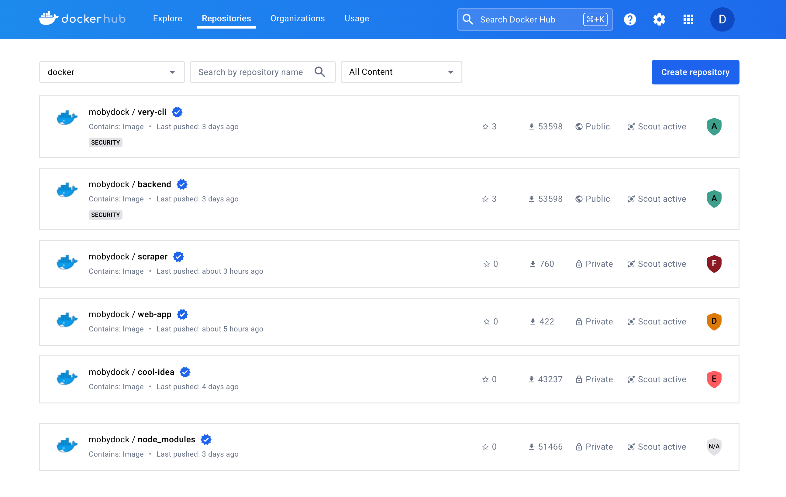
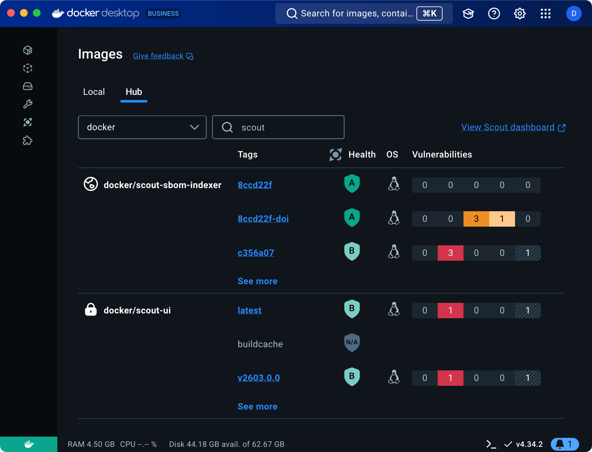



Docker Scout health scores provide a security assessment, and overall supply
chain health, of images on Docker Hub, helping you determine whether an image
meets established security best practices. The scores range from A to F, where
A represents the highest level of security and F the lowest, offering an
at-a-glance view of the security posture of your images.

Only users who are members of the organization that owns the repository, and
have at least “read” access to the repository, can view the health score. The
score is not visible to users outside the organization or members without
"read" access.

## Viewing health scores




To view the health score of an image in Docker Hub:

1. Go to Docker Hub and sign in.
2. Navigate to your organization's page.

In the list of repositories, you can see the health score of each repository
based on the latest pushed tag.






To view the health score of an image in Docker Desktop:

1. Open Docker Desktop and sign in to your Docker account.
2. Navigate to the **Images** view and select the **Hub** tab.

In the list of repositories, the **Health** column displays the scores of the
different tags that have been pushed to Docker Hub.






The health score badge is color-coded to indicate the overall health of the
repository:

- **Green**: A score of A or B.
- **Yellow**: A score of C.
- **Orange**: A score of D.
- **Red**: A score of E or F.
- **Gray**: An `N/A` score.

The score is also displayed on the Docker Hub page for a given repository,
along with each policy that contributed to the score.


## Scoring system

Health scores are determined by evaluating images against Docker Scout
[policies](./_index.md). These policies align with best practices for the
software supply chain.

If your image repositories are already enrolled with Docker Scout, the health
score is calculated automatically based on the policies that are enabled for
your organization. This also includes any custom policies that you have
configured.

If you're not using Docker Scout, the health scores show the compliance of your
images with the default policies, a set of supply chain rules recommended by
Docker as foundational standards for images. You can enable Docker Scout for
your organization and edit the policy configurations to get a more relevant
health score based on your specific policies.

### Scoring process

Each policy is assigned a points value based on its
[type](/manuals/scout/policy/_index.md#policy-types). If the image is compliant
with a policy, it is awarded the points value for that policy type. The health
score of an image is calculated based on the percentage of points achieved
relative to the total possible points.

1. Policy compliance is evaluated for the image.
2. Points are awarded based on compliance with policies.
3. The points achieved percentage is calculated:

   ```text
   Percentage = (Points / Total) * 100
   ```

4. The final score is assigned based on the percentage of points achieved, as
   shown in the following table:

   | Points percentage (awarded out of total) | Score |
   | ---------------------------------------- | ----- |
   | More than 90%                            | A     |
   | 71% to 90%                               | B     |
   | 51% to 70%                               | C     |
   | 31% to 50%                               | D     |
   | 11% to 30%                               | E     |
   | Less than 10%                            | F     |

### N/A scores

Images can also be assigned an `N/A` score, which can happen when:

- The image is larger than 4GB (compressed size).
- The image architecture is not `linux/amd64` or `linux/arm64`.
- The image is too old and does not have fresh data for evaluation.

If you see an `N/A` score, consider the following:

- If the image is too large, try reducing the size of the image.
- If the image has an unsupported architecture, rebuild the image for a
  supported architecture.
- If the image is too old, push a new tag to trigger a fresh evaluation.

### Policy weights

Different policy types carry varying weights, which impact the score assigned
to an image during evaluation, as shown in the following table.

| Policy type                                                                                  | Points |
| -------------------------------------------------------------------------------------------- | ------ |
| [Severity-Based Vulnerability](/manuals/scout/policy/_index.md#severity-based-vulnerability) | 20     |
| [High-Profile Vulnerabilities](/manuals/scout/policy/_index.md#high-profile-vulnerabilities) | 20     |
| [Supply Chain Attestations](/manuals/scout/policy/_index.md#supply-chain-attestations)       | 15     |
| [Approved Base Images](/manuals/scout/policy/_index.md#approved-base-images)                 | 15     |
| [Up-to-Date Base Images](/manuals/scout/policy/_index.md#up-to-date-base-images)             | 10     |
| [SonarQube Quality Gates](/manuals/scout/policy/_index.md#sonarqube-quality-gates) \*        | 10     |
| [Default Non-Root User](/manuals/scout/policy/_index.md#default-non-root-user)               | 5      |
| [Compliant Licenses](/manuals/scout/policy/_index.md#compliant-licenses)                     | 5      |

\* _This policy is not enabled by default and must be configured by the user._

### Evaluation

Health scores are calculated for new images pushed to Docker Hub after the
feature is enabled. The health scores help you maintain high security standards
and ensure your applications are built on secure and reliable images.

### Repository scores

In addition to individual image scores (per tag or digest), each repository
receives a health score based on the latest pushed tag, providing an overall
view of the repository's security status.

### Example

For an image with a total possible score of 100 points:

- If the image only deviates from one policy, worth 5 points, its score will be
  95 out of 100. Since this score is above the 90th percentile, the image
  receives an A health score.
- If the image is non-compliant with more policies and scores 65 out of 100, it
  receives a C health score, reflecting its lower compliance.

## Improving your health score

To improve the health score of an image, take steps to ensure that the image is
compliant with the Docker Scout recommended [policies](./_index.md).

1. Go to the [Docker Scout Dashboard](https://scout.docker.com/).
2. Sign in using your Docker ID.
3. Go to [Repository settings](https://scout.docker.com/settings/repos) and
   enable Docker Scout for your Docker Hub image repositories.
4. Analyze the [policy compliance](./_index.md) for your repositories,
   and take actions to ensure your images are policy-compliant.

Since policies are weighted differently, prioritize the policies with the
highest scores for a greater impact on your image's overall score.
