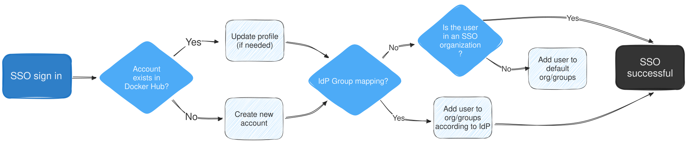
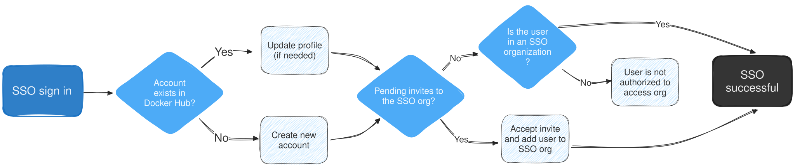



Just-in-Time (JIT) provisioning creates and updates user accounts during SSO
authentication. JIT verifies that users belong to the organization and assigns
them to teams based on your identity provider (IdP) configuration. JIT doesn't
deprovision users.

When you create an SSO connection, Docker turns on JIT provisioning by
default. Before adding SCIM, review
[how SCIM works with JIT](/manuals/security/provisioning/scim/_index.md#choose-how-scim-works-with-jit).

This page explains the SSO authentication flows with JIT turned on and off.

## Prerequisites

Before you begin, you must have:

- SSO configured for your organization
- Administrator access to Docker Home and your identity provider

## SSO authentication with JIT provisioning enabled

When a user signs in with SSO and you have JIT provisioning enabled, the following steps occur automatically:

1. The system checks if a Docker account exists for the user's email address.
   - If an account exists: The system uses the existing account and updates the user's full name if necessary.
   - If no account exists: A new Docker account is created using basic user attributes (email, name, and surname). A unique username is generated based on the user's email, name, and random numbers to ensure all usernames are unique across the platform.

2. The system checks for any pending invitations to the SSO organization.
   - Invitation found: The invitation is automatically accepted.
   - Invitation includes a specific group: The user is added to that group within the SSO organization.

3. The system verifies if the IdP has shared group mappings during authentication.
   - Group mappings provided: The user is assigned to the relevant organizations and teams.
   - No group mappings provided: The system checks if the user is already part of the organization. If not, the user is added to the default organization and team configured in the SSO connection.

The following graphic provides an overview of SSO authentication with JIT enabled:

## SSO authentication with JIT provisioning disabled

When JIT provisioning is disabled, the following actions occur during SSO authentication:

1. The system checks if a Docker account exists for the user's email address.
   - If an account exists: The system uses the existing account and updates the user's full name if necessary.
   - If no account exists: A new Docker account is created using basic user attributes (email, name, and surname). A unique username is generated based on the user's email, name, and random numbers to ensure all usernames are unique across the platform.

2. The system checks for any pending invitations to the SSO organization.
   - Invitation found: If the user is a member of the organization or has a pending invitation, sign-in is successful, and the invitation is automatically accepted.
   - No invitation found: If the user is not a member of the organization and has no pending invitation, the sign-in fails, and an `Access denied` error appears. The user must contact an administrator to be invited to the organization.

With JIT disabled, group mapping is only available if you have [SCIM enabled](scim/#enable-scim-in-docker). If SCIM is not enabled, users won't be auto-provisioned to groups.

The following graphic provides an overview of SSO authentication with JIT disabled:

## Disable JIT provisioning

> [!WARNING]
>
> Disabling JIT provisioning may disrupt your users' access and workflows. With
> JIT disabled, users aren't automatically added to your organization during
> SSO sign-in. Users must be organization members, have pending invitations, or
> be provisioned through SCIM to sign in successfully.

You may want to disable JIT provisioning for reasons such as the following:

- You have multiple organizations, have SCIM enabled, and want SCIM to be the source of truth for provisioning
- You want to control and restrict usage based on your organization's security configuration, and want to use SCIM to provision access

Users are provisioned with JIT by default. If you enable SCIM, you can disable JIT:

1. Go to [Docker Home](https://app.docker.com/) and select your organization from the top-left account drop-down.
1. Select **Identity & auth**, then **SSO and SCIM**.
1. In the **SSO connections** table, select the **Action** icon, then select **Disable JIT provisioning**.
1. Select **Disable** to confirm.

## Next steps

- Review [how SCIM works with JIT](/manuals/security/provisioning/scim/_index.md#choose-how-scim-works-with-jit)
  before you configure SCIM.
- Set up [group mapping](/manuals/security/provisioning/scim/group-mapping.md) to automatically assign users to teams.
- Review [Troubleshoot provisioning](/manuals/security/provisioning/troubleshoot-provisioning.md).
