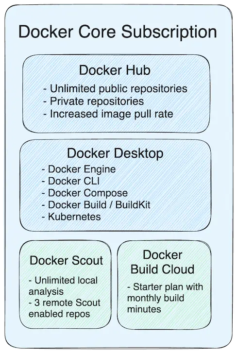

Docker subscription plans empower development teams by providing the tools they need to ship secure, high-quality apps — fast. These plans include access to Docker's suite of products:

- [Docker Desktop](../desktop/_index.md): The industry-leading container-first
  development solution that includes, Docker Engine, Docker CLI, Docker Compose,
  Docker Build/BuildKit, and Kubernetes.
- [Docker Hub](../docker-hub/_index.md): The world's largest cloud-based
  container registry.
- [Docker Build Cloud](../build-cloud/_index.md): Powerful cloud-based builders that accelerate build times by up to 39x.
- [Docker Scout](../scout/_index.md): Tooling for software supply chain security
  that lets you quickly assess image health and accelerate security improvements.
- [Testcontainers Cloud](https://testcontainers.com/cloud/docs): Container-based
  testing automation that provides faster tests, a unified developer experience,
  and more.

The following sections describe some of the key features included with your
Docker subscription plan or Legacy Docker plan.

> [!NOTE]
>
> Legacy Docker plans apply to Docker subscribers who last purchased or renewed their subscription before December 10, 2024. These subscribers will keep their current plan and pricing until their next renewal date that falls on or after December 10, 2024. To see purchase or renewal history, view your [billing history](../billing/history.md). For more details about Docker legacy plans, see [Announcing Upgraded Docker Plans](https://www.docker.com/blog/november-2024-updated-plans-announcement/). In addition to current features, Docker maintains a [public roadmap](https://github.com/docker/roadmap) so subscribers can see what new
features are in development, as well as request new capabilities.




## Docker Personal

**Docker Personal** is ideal for open source communities, individual developers,
education, and small businesses. It includes the free use of essential Docker
tools as well as trials for powerful tools that'll level up your development loops.

Docker Personal includes:

- 1 included repository with continuous vulnerability analysis in Docker Scout
- Unlimited public Docker Hub repositories
- 1 private Docker Hub repository with 2GB storage
- 40 pulls per hour Docker Hub image pull rate limit
- 7-day Docker Build Cloud trial
- 7-day Testcontainers Cloud trial

Docker Personal users who want to continue using Docker Build Cloud or Docker
Testcontainers Cloud after their trial can upgrade to a Docker Pro plan at any
time.

All unauthenticated user, including unauthenticated Docker Personal users, get
10 pulls per hour per IP address.

For a list of features available in each tier, see [Docker Pricing](https://www.docker.com/pricing/).

## Docker Pro

**Docker Pro** enables individual developers to get more control of their
development environment and provides an integrated and reliable developer
experience. It reduces the amount of time developers spend on mundane and
repetitive tasks and empowers developers to spend more time creating value for
their customers. A Docker Pro subscription includes access to all tools,
including Docker Desktop, Docker Hub, Docker Scout, Docker Build Cloud, and
Testcontainers Cloud.

Docker Pro includes:

- 200 Docker Build Cloud build minutes per month.
- 2 included repositories with continuous vulnerability analysis in Docker Scout.
- 100 Testcontainers Cloud runtime minutes per month for use either in Docker Desktop or for CI.
- No Docker Hub image pull rate limits.
- 25K Docker Hub pulls per month are included.

For a list of features available in each tier, see [Docker
Pricing](https://www.docker.com/pricing/).

## Docker Team

**Docker Team** offers capabilities for collaboration, productivity, and
security across organizations. It enables groups of developers to unlock the
full power of collaboration and sharing combined with essential security
features and team management capabilities. A Docker Team subscription includes
licensing for commercial use of Docker components including Docker Desktop,
Docker Hub, Docker Scout, Docker Build Cloud, and Testcontainers Cloud.

Docker Team includes:

- 500 Docker Build Cloud build minutes per month.
- Unlimited Docker Scout repositories with continuous vulnerability analysis.
- 500 Testcontainers Cloud runtime minutes per month for use either in Docker Desktop or for CI.
- No Docker Hub image pull rate limits.
- 100K Docker Hub pulls per month.

There are also advanced collaboration and management tools, including
organization and team management with [Role Based Access Control
(RBAC)](/security/for-admins/roles-and-permissions/), [activity logs](/admin/organization/activity-logs/), and more.

For a list of features available in each tier, see [Docker
Pricing](https://www.docker.com/pricing/).

## Docker Business

**Docker Business** offers centralized management and advanced security features
for enterprises that use Docker at scale. It empowers leaders to manage their
Docker development environments and speed up their secure software supply chain
initiatives. A Docker Business subscription includes licensing for commercial use of
Docker components including Docker Desktop, Docker Hub, Docker Scout, Docker
Build Cloud, and Testcontainers Cloud.

Docker Business includes:

- 1500 Docker Build Cloud build minutes per month.
- Unlimited Docker Scout repositories with continuous vulnerability analysis.
- 1500 Testcontainers Cloud runtime minutes per month for use either in Docker Desktop or
  for CI.
- No Docker Hub image pull rate limits.
- 1M Docker Hub pulls per month.

In addition, you gain access to enterprise-grade features, such as:
- [Hardened Docker Desktop](../security/for-admins/hardened-desktop/_index.md)
- [Image Access
  Management](../security/for-admins/hardened-desktop/image-access-management.md)
  which lets admins control what content developers can access
- [Registry Access
  Management](../security/for-admins/hardened-desktop/registry-access-management.md)
  which lets admins control what registries developers can access
- [Company layer](/admin/company/) to manage multiple organizations and settings
- [Single sign-on](/security/for-admins/single-sign-on/)
- [System for Cross-domain Identity
  Management](/security/for-admins/provisioning/scim/)

For a list of features available in each tier, see [Docker
Pricing](https://www.docker.com/pricing/).

## Self-serve

A self-serve Docker subscription is where everything is set up by you.
You can:

- Manage your own invoices
- Add or remove seats
- Update billing and payment information
- Downgrade your subscription at any time

## Sales-assisted

A sales-assisted plan refers to a Docker Business or Team subscription where everything is set up and
managed by a dedicated Docker account manager.




> [!IMPORTANT]
>
> As of December 10, 2024, Docker Core, Docker Build Cloud, and Docker Scout
> subscription plans are no longer available and have been replaced by Docker subscription
> plans that provide access to all tools. If you subscribed or renewed
> your subscriptions before December 10, 2024, your legacy Docker
> plans still apply to your account until you renew. For more details,
> see [Announcing Upgraded Docker
> Plans](https://www.docker.com/blog/november-2024-updated-plans-announcement/).
The following describes some of the key features included with your Legacy Docker plans:

## Legacy Docker plans

### Legacy Docker Pro

**Legacy Docker Pro** enables individual developers to get more control of their
development environment and provides an integrated and reliable developer
experience. It reduces the amount of time developers spend on mundane and
repetitive tasks and empowers developers to spend more time creating value for
their customers.

Legacy Docker Pro includes:
- Unlimited public repositories
- Unlimited [Scoped Access Tokens](/security/for-developers/access-tokens/)
- Unlimited [collaborators](/docker-hub/repos/manage/access/#collaborators) for public repositories at no cost per month.
- Access to [Legacy Docker Scout Free](#legacy-docker-scout-free) to get started with software supply chain security.
- Unlimited private repositories
- 5000 image [pulls per day](/manuals/docker-hub/usage/pulls.md)
- [Auto Builds](/docker-hub/builds/) with 5 concurrent builds
- 300 [Vulnerability Scans](/docker-hub/vulnerability-scanning/)

For a list of features available in each legacy tier, see [Legacy Docker Pricing](https://www.docker.com/legacy-pricing/).

#### Upgrade your Legacy Docker Pro plan

When you upgrade your Legacy Docker Pro plan to a Docker Pro subscription plan, your plan includes the following changes:

- Docker Build Cloud build minutes increased from 100/month to 200/month and no monthly fee.
- 2 included repositories with continuous vulnerability analysis in Docker Scout.
- 100 Testcontainers Cloud runtime minutes are now included for use either in Docker Desktop or for CI.
- Docker Hub image pull rate limits are removed.
- 25K Docker Hub pulls per month are included.

For a list of features available in each tier, see [Docker Pricing](https://www.docker.com/pricing/).

### Legacy Docker Team

**Legacy Docker Team** offers capabilities for collaboration, productivity, and
security across organizations. It enables groups of developers to unlock the
full power of collaboration and sharing combined with essential security
features and team management capabilities. A Docker Team subscription includes
licensing for commercial use of Docker components including Docker Desktop and
Docker Hub.

Legacy Docker Team includes:
- Everything included in legacy Docker Pro
- Unlimited teams
- [Auto Builds](/docker-hub/builds/) with 15 concurrent builds
- Unlimited [Vulnerability Scanning](/docker-hub/vulnerability-scanning/)
- 5000 image [pulls per day](/manuals/docker-hub/usage/pulls.md) for each team member

There are also advanced collaboration and management tools, including organization and team management with [Role Based Access Control (RBAC)](/security/for-admins/roles-and-permissions/), [activity logs](/admin/organization/activity-logs/), and more.

For a list of features available in each legacy tier, see [Legacy Docker Pricing](https://www.docker.com/legacy-pricing/).

#### Upgrade your Legacy Docker Team plan

When you upgrade your Legacy Docker Team plan to a Docker Team subscription plan, your plan includes the following changes:

- Instead of paying an additional per-seat fee, Docker Build Cloud is now available to all users in your Docker plan.
- Docker Build Cloud build minutes increase from 400/mo to 500/mo.
- Docker Scout now includes unlimited repositories with continuous vulnerability analysis, an increase from 3.
- 500 Testcontainers Cloud runtime minutes are now included for use either in Docker Desktop or for CI.
- Docker Hub image pull rate limits are removed.
- 100K Docker Hub pulls per month are included.
- The minimum number of users is 1 (lowered from 5).

For a list of features available in each tier, see [Docker Pricing](https://www.docker.com/pricing/).

### Legacy Docker Business

**Legacy Docker Business** offers centralized management and advanced security features
for enterprises that use Docker at scale. It empowers leaders to manage their
Docker development environments and speed up their secure software supply chain
initiatives. A Docker Business subscription includes licensing for commercial
use of Docker components including Docker Desktop and Docker Hub.

Legacy Docker Business includes:
- Everything included in legacy Docker Team
- [Hardened Docker Desktop](../security/for-admins/hardened-desktop/_index.md)
- [Image Access Management](../security/for-admins/hardened-desktop/image-access-management.md) which lets admins control what content developers can access
- [Registry Access Management](../security/for-admins/hardened-desktop/registry-access-management.md) which lets admins control what registries developers can access
- [Company layer](/admin/company/) to manage multiple organizations and settings
- [Single Sign-On](/security/for-admins/single-sign-on/)
- [System for Cross-domain Identity Management](/security/for-admins/provisioning/scim/) and more.

For a list of features available in each tier, see [Legacy Docker Pricing](https://www.docker.com/legacy-pricing/).

#### Upgrade your Legacy Docker Business plan

When you upgrade your Legacy Docker Business plan to a Docker Business subscription plan, your plan includes the following changes:

- Instead of paying an additional per-seat fee, Docker Build Cloud is now available to all users in your Docker plan.
- Docker Build Cloud included minutes increase from 800/mo to 1500/mo.
- Docker Scout now includes unlimited repositories with continuous vulnerability analysis, an increase from 3.
- 1500 Testcontainers Cloud runtime minutes are now included for use either in Docker Desktop or for CI.
- Docker Hub image pull rate limits are removed.
- 1M Docker Hub pulls per month are included.

For a list of features available in each tier, see [Docker Pricing](https://www.docker.com/pricing/).

#### Self-serve

A self-serve Docker Business subscription is where everything is set up by you. You can:

- Manage your own invoices
- Add or remove seats
- Update billing and payment information
- Downgrade your subscription at any time

#### Sales-assisted

A sales-assisted Docker Business subscription where everything is set up and managed by a dedicated Docker account manager.

## Legacy Docker Scout subscriptions

This section provides an overview of the legacy subscription plans for Docker
Scout.

> [!IMPORTANT]
>
> As of December 10, 2024, Docker Scout subscriptions are no longer available
> and have been replaced by Docker subscription plans that provide access to
> all tools. If you subscribed or renewed your subscriptions before December 10, 2024, your legacy Docker subscriptions still apply to your account until
> you renew. For more details, see [Announcing Upgraded Docker
> Plans](https://www.docker.com/blog/november-2024-updated-plans-announcement/).

### Legacy Docker Scout Free

Legacy Docker Scout Free is available for organizations. If you have a Legacy Docker plan, you automatically have access to legacy Docker Scout Free.

Legacy Docker Scout Free includes:

- Unlimited local image analysis
- Up to 3 Docker Scout-enabled repositories
- SDLC integration, including policy evaluation and workload integration
- On-prem and cloud container registry integrations
- Security posture reporting

### Legacy Docker Scout Team

Legacy Docker Scout Team includes:

- All the features available in legacy Docker Scout Free
- In addition to 3 Docker Scout-enabled repositories, add up to 100 repositories when you buy your subscription

### Legacy Docker Scout Business

Legacy Docker Scout Business includes:

- All the features available in legacy Docker Scout Team
- Unlimited Docker Scout-enabled repositories

### Upgrade your Legacy Docker Scout plan

When you upgrade your Legacy Docker Scout plan to a Docker subscription plan, your
plan includes the following changes:

- Docker Business: Unlimited repositories with continuous vulnerability analysis, an increase from 3.
- Docker Team: Unlimited repositories with continuous vulnerability analysis, an increase from 3
- Docker Pro: 2 included repositories with continuous vulnerability analysis.
- Docker Personal: 1 included repository with continuous vulnerability analysis.

For a list of features available in each tier, see [Docker Pricing](https://www.docker.com/pricing/).

## Legacy Docker Build Cloud subscriptions

 This section describes the features available for the different legacy Docker
 Build Cloud subscription tiers.

> [!IMPORTANT]
>
> As of December 10, 2024, Docker Build Cloud is only available with the
> new Docker Pro, Team, and Business plans. When your plan renews on or after
> December 10, 2024, you will see an increase in your included Build Cloud
> minutes each month. For more details, see [Announcing Upgraded Docker
> Plans](https://www.docker.com/blog/november-2024-updated-plans-announcement/).

### Legacy Docker Build Cloud Starter

If you have a Legacy Docker plan, a base level of Build Cloud
minutes and cache are included. The features available vary depending on your
Legacy Docker plan subscription tier.

#### Legacy Docker Pro

- 100 build minutes every month
- Available for one user
- 4 parallel builds

#### Legacy Docker Team

- 400 build minutes every month shared across your organization
- Option to onboard up to 100 members
- Can buy additional seats to add more minutes

#### Legacy Docker Business

- All the features listed for Docker Team
- 800 build minutes every month shared across your organization

### Legacy Docker Build Cloud Team

Legacy Docker Build Cloud Team offers the following features:

- 200 additional build minutes per seat
- Option to buy reserve minutes
- Increased shared cache

The legacy Docker Build Cloud Team subscription is tied to a Docker
[organization](/admin/organization/). To use the build minutes or
shared cache of a legacy Docker Build Cloud Team subscription, users must be a part of
the organization associated with the subscription. See Manage seats and invites.

### Legacy Docker Build Cloud Enterprise

For more details about your enterprise subscription, [contact sales](https://www.docker.com/products/build-cloud/#contact_sales).

### Upgrade your Legacy Docker Build Cloud plan

You no longer need to subscribe to a separate Docker Build Cloud plan to access
Docker Build Cloud or to scale your minutes. When you upgrade your Legacy Docker plan to
a Docker subscription plan, your plan includes the following changes:

- Docker Business: Included minutes are increased from 800/mo to 1500/mo with the option to scale more minutes.
- Docker Team: Included minutes are increased from 400/mo to 500/mo with the option to scale more minutes.
- Docker Pro: Included minutes are increased from 100/mo to 200/mo with the option to scale more minutes.
- Docker Personal: You receive a 7-day trial.




## Support for subscriptions

All Docker Pro, Team, and Business subscribers receive email support for their subscriptions.