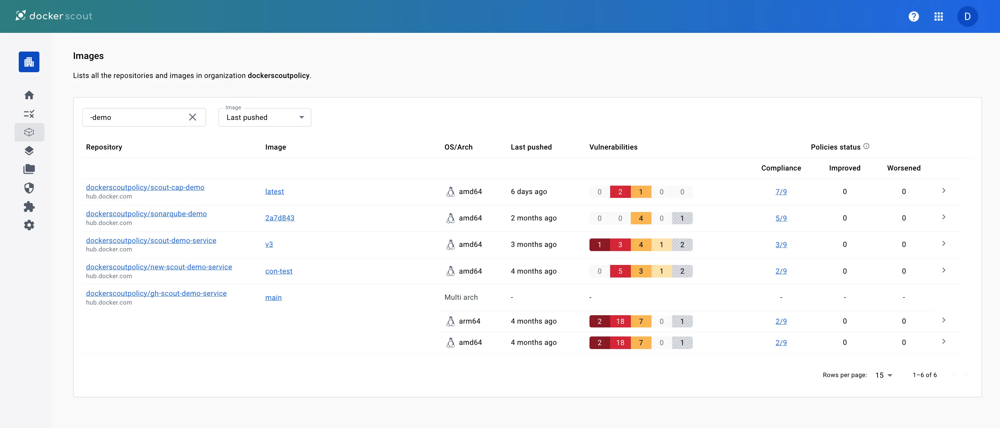

The [Docker Scout Dashboard](https://scout.docker.com/) helps you share the
analysis of images in an organization with your team. Developers can now see an
overview of their security status across all their images from both Docker Hub
and Artifactory, and get remediation advice at their fingertips. It helps team
members in roles such as security, compliance, and operations to know what
vulnerabilities and issues they need to focus on.

## Overview

The **Overview** tab provides a summary for the repositories in the selected
organization.

At the top of this page, you can select which **Environment** to view.
By default, the most recently pushed images are shown. To learn more about
environments, see [Environment monitoring](./integrations/environment/_index.md).

The **Policy** boxes show your current compliance rating for each policy, and a
trend indication for the selected environment. The trend describes the policy
delta for the most recent images compared to the previous version.
For more information about policies, see [Policy Evaluation](./policy/_index.md).

The vulnerability chart shows the total number of vulnerabilities for images in
the selected environment over time. You can configure the timescale for the
chart using the drop-down menu.

Use the header menu at the top of the website to access the different main
sections of the Docker Scout Dashboard:

- **Policies**: shows the policy compliance for the organization, see [Policies](#policies)
- **Images**: lists all Docker Scout-enabled repositories in the organization, see [Images](#images)
- **Base images**: lists all base images used by repositories in an organization
- **Packages**: lists all packages across repositories in the organization
- **Vulnerabilities**: lists all CVEs in the organization's images, see [Vulnerabilities](#vulnerabilities)
- **Integrations**: create and manage third-party integrations, see [Integrations](#integrations)
- **Settings**: manage repository and billing settings, see [Settings](#settings)

## Policies

The **Policies** view shows a breakdown of policy compliance for all of the
images in the selected organization and environment. You can use the **Image**
drop-down menu to view a policy breakdown for a specific environment.

For more information about policies, see [Policy Evaluation](./policy/_index.md).

## Images

The **Images** view shows all images in Scout-enabled repositories for the selected environment.
You can filter the list by selecting a different environment, or by repository name using the text filter.

For each repository, the list displays the following details:

- The repository name (image reference without the tag or digest)
- The most recent tag of the image in the selected environment
- Operating systems and architectures for the most recent tag
- Vulnerabilities status for the most recent tag
- Policy status for the most recent tag

Selecting a repository link takes you to a list of all images in that repository that have been analyzed.
From here you can view the full analysis results for a specific image,
and compare tags to view the differences in packages and vulnerabilities

Selecting an image link takes you to a details view for the selected tag or digest.
This view contains two tabs that detail the composition and policy compliance for the image:

- **Policy status** shows the policy evaluation results for the selected image.
  Here you also have links for details about the policy violations.

  For more information about policy, see [Policy Evaluation](./policy/_index.md).

- **Image layers** shows a breakdown of the image analysis results.
  You can get a complete view of the vulnerabilities your image contains
  and understand how they got in.

## Vulnerabilities

The **Vulnerabilities** view shows a list of all vulnerabilities for images in the organization.
This list includes details about CVE such as the severity and Common Vulnerability Scoring System (CVSS) score,
as well as whether there's a fix version available.
The CVSS score displayed here is the highest score out of all available [sources](./advisory-db-sources.md).

Selecting the links on this page opens the vulnerability details page,
This page is a publicly visible page, and shows detailed information about a CVE.
You can share the link to a particular CVE description with other people
even if they're not a member of your Docker organization or signed in to Docker Scout.

If you are signed in, the **My images** tab on this page lists all of your images
affected by the CVE.

## Integrations

The **Integrations** page lets you create and manage your Docker Scout
integrations, such as environment integrations and registry integrations. For
more information on how to get started with integrations, see
[Integrating Docker Scout with other systems](./integrations/_index.md).

## Settings

The settings menu in the Docker Scout Dashboard contains:

- **Billing** for managing your Docker Scout subscription and payments
- **Repository settings** for enabling and disabling repositories

When you enable Docker Scout for a repository,
Docker Scout analyzes new tags automatically when you push to that repository.
To enable repositories in Amazon ECR, Azure ACR, or other third-party registries,
you first need to integrate them.
See [Container registry integrations](./integrations/_index.md#container-registries)
