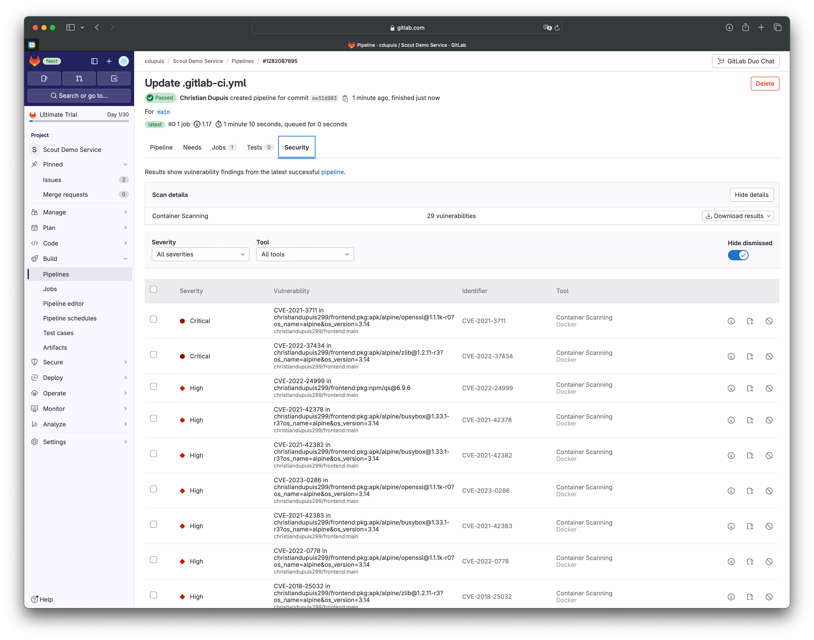

The following examples show how to run Docker Scout in GitLab CI, in a
repository containing the image's Dockerfile and build context.

## GitLab CI/CD component

The GitLab CI/CD catalog contains a [component for Docker Scout](https://gitlab.com/explore/catalog/docker-scout/ci),
which you can use to run Docker Scout in your GitLab CI/CD pipelines, and
generate a JSON report of the analysis result. The report is compatible with
the [GitLab Vulnerability Report](https://docs.gitlab.com/ee/user/application_security/vulnerability_report/)
format, which means that the results of the scans are integrated into the
GitLab UI if you're a GitLab Ultimate user.



If you're not a GitLab Ultimate user, you can still use the Docker Scout CI/CD
component to generate the JSON report and download it as a job artifact.

### Setup

Add the following snippet to your Gitlab CI/CD pipeline to enable Docker Scout in your project.




```yaml {title=".gitlab-ci.yml"}
include:
  - component: gitlab.com/docker-scout/ci/cves@main
    inputs:
      stage: test
      options: --only-severity=critical,high,medium --epss

docker-scout-cves:
  variables:
    CS_IMAGE: $CI_REGISTRY_IMAGE:$CI_COMMIT_REF_SLUG
```




```yaml {title=".gitlab-ci.yml"}
include:
  - component: gitlab.com/docker-scout/ci/cves@main
    inputs:
      stage: test
      options: --only-severity=critical,high,medium --epss

docker-scout-cves:
  variables:
    CS_IMAGE: $CI_REGISTRY_IMAGE:$CI_COMMIT_REF_SLUG
  artifacts:
    paths:
      - ds-container-scanning-report.json
```




### Authentication

Docker Scout requires that you authenticate using your Docker credentials.
The GitLab CI/CD component expects the following environment variables to be set:

- `DOCKER_HUB_USER`: Your Docker username.
- `DOCKER_HUB_PAT`: A personal access token (PAT) for the Docker user.

### Pipeline

The following example shows a full pipeline, including the setup of the Docker
Scout component, and the build and push of the Docker image.




```yaml {title=".gitlab-ci.yml"}
include:
  - component: gitlab.com/docker-scout/ci/cves@main
    inputs:
      stage: test
      options: --only-severity=critical,high,medium --epss

docker-scout-cves:
  variables:
    CS_IMAGE: $CI_REGISTRY_IMAGE:$CI_COMMIT_REF_SLUG

docker-build:
  # Use the official docker image.
  image: docker:cli
  stage: build
  services:
    - docker:dind
  variables:
    DOCKER_IMAGE_NAME: $CI_REGISTRY_IMAGE:$CI_COMMIT_REF_SLUG
  before_script:
    - docker login -u "$CI_REGISTRY_USER" -p "$CI_REGISTRY_PASSWORD" $CI_REGISTRY
  script:
    - docker build --pull -t "$DOCKER_IMAGE_NAME" .
    - docker push "$DOCKER_IMAGE_NAME"
    - |
      if [[ "$CI_COMMIT_BRANCH" == "$CI_DEFAULT_BRANCH" ]]; then
        docker tag "$DOCKER_IMAGE_NAME" "$CI_REGISTRY_IMAGE:latest"
        docker push "$CI_REGISTRY_IMAGE:latest"
      fi
  # Run this job in a branch where a Dockerfile exists
  rules:
    - if: $CI_COMMIT_BRANCH
      exists:
        - Dockerfile
```




```yaml {title=".gitlab-ci.yml"}
include:
  - component: gitlab.com/docker-scout/ci/cves@main
    inputs:
      stage: test
      options: --only-severity=critical,high,medium --epss

docker-scout-cves:
  variables:
    CS_IMAGE: $CI_REGISTRY_IMAGE:$CI_COMMIT_REF_SLUG
  artifacts:
    paths:
      - ds-container-scanning-report.json

docker-build:
  # Use the official docker image.
  image: docker:cli
  stage: build
  services:
    - docker:dind
  variables:
    DOCKER_IMAGE_NAME: $CI_REGISTRY_IMAGE:$CI_COMMIT_REF_SLUG
  before_script:
    - docker login -u "$CI_REGISTRY_USER" -p "$CI_REGISTRY_PASSWORD" $CI_REGISTRY
  script:
    - docker build --pull -t "$DOCKER_IMAGE_NAME" .
    - docker push "$DOCKER_IMAGE_NAME"
    - |
      if [[ "$CI_COMMIT_BRANCH" == "$CI_DEFAULT_BRANCH" ]]; then
        docker tag "$DOCKER_IMAGE_NAME" "$CI_REGISTRY_IMAGE:latest"
        docker push "$CI_REGISTRY_IMAGE:latest"
      fi
  # Run this job in a branch where a Dockerfile exists
  rules:
    - if: $CI_COMMIT_BRANCH
      exists:
        - Dockerfile
```



This creates the flow outlined previously. If the commit was to the default
branch, Docker Scout generates a CVE report. If the commit was to a different
branch, Docker Scout compares the new version to the current published version.
It only shows critical or high-severity vulnerabilities and ignores
vulnerabilities that haven't changed since the last analysis.

## Running Docker Scout manually

If for some reason you don't want to use the GitLab CI/CD component, you can
still run Docker Scout manually in your GitLab CI/CD pipeline, using
Docker-in-Docker and the Docker Scout CLI plugin. The setup is easier with the
CI/CD component, but this method gives you more control. For example, you might
want to run different commands, such as `docker scout compare`.

The following example workflow shows how to build an image, and then run Docker
Scout to compare the image with the `latest` tag of the same image, and exit if
the policy compliance has worsened (`-x policy`).

```yaml {title=".gitlab-ci.yml"}
docker-build:
  image: docker:latest
  stage: build
  services:
    - docker:dind
  variables:
    DOCKER_IMAGE_NAME: $CI_REGISTRY_IMAGE:$CI_COMMIT_REF_SLUG
    COMPARE_IMAGE: $CI_REGISTRY_IMAGE:latest
  rules:
    - if: $CI_COMMIT_BRANCH
      exists:
        - Dockerfile
  before_script:
    # Install curl and the Docker Scout CLI
    - |
      apk add --update curl
      curl -sSfL https://raw.githubusercontent.com/docker/scout-cli/main/install.sh | sh -s --
      apk del curl
      rm -rf /var/cache/apk/*

    # Sign in to Docker Hub (required for Docker Scout)
    - docker login -u "$DOCKER_HUB_USER" -p "$DOCKER_HUB_PAT"
  script:
    # Build the image
    - docker build --pull -t "$DOCKER_IMAGE_NAME" .
    # Compare with "latest"
    - docker scout compare "$DOCKER_IMAGE_NAME" --to "$COMPARE_IMAGE" -x policy
```
