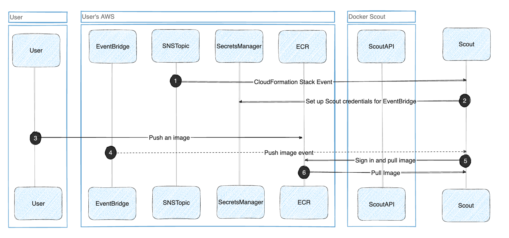

Integrating Docker Scout with Amazon Elastic Container Registry (ECR) lets you
view image insights for images hosted in ECR repositories. After integrating
Docker Scout with ECR and activating Docker Scout for a repository, pushing an
image to the repository automatically triggers image analysis. You can view
image insights using the Docker Scout Dashboard, or the `docker scout` CLI
commands.

## How it works

To help you integrate Docker Scout with ECR, you can use a CloudFormation stack
template that creates and configures the necessary AWS resources for
integrating Docker Scout with your ECR registry. For more details about the AWS
resources, see [CloudFormation stack template](#cloudformation-stack-template).

The following diagram shows how the Docker Scout ECR integration works.

After the integration, Docker Scout automatically pulls and analyzes images
that you push to the ECR registry. Metadata about your images are stored on the
Docker Scout platform, but Docker Scout doesn't store the container images
themselves. For more information about how Docker Scout handles image data, see
[Data handling](../../data-handling.md).

### CloudFormation stack template

The following table describes the configuration resources.

> **Note**
>
> Creating these resources incurs a small, recurring cost on the AWS account.
> The **Cost** column in the table represents an estimated monthly cost of the
> resources, when integrating an ECR registry that gets 100 images pushed per day.
>
> Additionally, an egress cost also applies when Docker Scout pulls the images
> from ECR. The egress cost is around $0.09 per GB.

| Resource type                 | Resource name                 | Description                                                                                | Cost  |
| ----------------------------- | ----------------------------- | ------------------------------------------------------------------------------------------ | ----- |
| `AWS::SNSTopic::Topic`        | `SNSTopic`                    | SNS topic for notifying Docker Scout when the AWS resources have been created.             | Free  |
| `AWS::SNS::TopicPolicy`       | `TopicPolicy`                 | Defines the topic for the initial setup notification.                                      | Free  |
| `AWS::SecretsManager::Secret` | `ScoutAPICredentials`         | Stores the credentials used by EventBridge to fire events to Scout.                        | $0.42 |
| `AWS::Events::ApiDestination` | `ApiDestination`              | Sets up the EventBridge connection to Docker Scout for sending ECR push and delete events. | $0.01 |
| `AWS::Events::Connection`     | `Connection`                  | EventBridge connection credentials to Scout.                                               | Free  |
| `AWS::Events::Rule`           | `DockerScoutEcrRule`          | Defines the rule to send ECR pushes and deletes to Scout.                                  | Free  |
| `AWS::Events::Rule`           | `DockerScoutRepoDeletedRule`  | Defines the rule to send ECR repository deletes to Scout.                                  | Free  |
| `AWS::IAM::Role`              | `InvokeApiRole`               | Internal role to grant the event access to `ApiDestination`.                               | Free  |
| `AWS::IAM::Role`              | `AssumeRoleEcrAccess`         | This role has access to `ScoutAPICredentials` for setting up the Docker Scout integration. | Free  |

## Integrate your first registry

Create the CloudFormation stack in your AWS account to enable the Docker Scout
integration.

Prerequisites:

- You must have access to an AWS account with permission to create resources.
- You have be an owner of the Docker organization.

To create the stack:

1. Go to the [ECR integration page](https://scout.docker.com/settings/integrations/ecr/)
   on the Docker Scout Dashboard.
2. Select the **Create on AWS** button.

   This opens the **Create stack** wizard in the AWS CloudFormation console in
   a new browser tab. If you're not already signed in to AWS, you're redirected
   to the sign-in page first.

   If the button is grayed-out, it means you're lacking the necessary
   permissions in the Docker organization.

3. Follow the steps in the **Create stack** wizard until the end. Choose the
   AWS region you want to integrate. Complete the procedure by creating the
   resources.

   The fields in the wizard are pre-populated by the CloudFormation template,
   so you don't need to edit any of the fields.

4. When the resources have been created (the CloudFormation status shows
   `CREATE_COMPLETE` in the AWS console), return to the ECR integrations page
   in the Docker Scout Dashboard.

   The **Integrated registries** list shows the account ID and region for the
   ECR registry that you just integrated. If successful, the integration status
   is **Connected**.

The ECR integration is now active. For Docker Scout to start analyzing images
in the registry, you need to activate it for each repository in
[Repository settings](https://scout.docker.com/settings/repos/).

After activating repositories, images that you push are analyzed by Docker
Scout. The analysis results appear in the Docker Scout Dashboard.
If your repository already contains images, Docker Scout pulls and analyzes the
latest image version automatically.

## Integrate additional registries

To add additional registries:

1. Go to the [ECR integration page](https://scout.docker.com/settings/integrations/ecr/)
   on the Docker Scout Dashboard.
2. Select the **Add** button at the top of the list.
3. Complete the steps for creating the AWS resources.
4. When the resources have been created, return to the ECR integrations page in
   the Docker Scout Dashboard.

   The **Integrated registries** list shows the account ID and region for the
   ECR registry that you just integrated. If successful, the integration status
   is **Connected**.

Next, activate Docker Scout for the repositories that you want to analyze in
[repository settings](https://scout.docker.com/settings/repos/).

## Remove integration

To remove an integrated ECR registry, you must be an owner of the Docker
organization.

1. Go to the [ECR integration page](https://scout.docker.com/settings/integrations/ecr/)
   on the Docker Scout Dashboard.
2. Find the registry that you want to remove in the list of integrated
   registries, and select the remove icon in the **Actions** column.

   If the remove icon is disabled, it means that you're lacking the necessary
   permissions in the Docker organization.

3. In the dialog that opens, confirm by selecting **Remove**.

> **Important**
>
> Removing the integration from the Docker Scout dashboard doesn't remove the
> AWS resources in your account.
>
> After removing the integration in Docker Scout, go to the AWS console and
> delete the **DockerScoutECRIntegration** CloudFormation stack for the integration
> that you want to remove.
{ .important }

## Troubleshooting

### Unable to integrate registry

Check the **Status** of the integration on the [ECR integration page](https://scout.docker.com/settings/integrations/ecr/)
in the Docker Scout Dashboard.

- If the status is **Pending** for a prolonged period of time, it's an
  indication that the integration was not yet completed on the AWS side. Select
  the **Pending** link to open the CloudFormation wizard, and complete all the
  steps.

- An **Error** status indicates that something's gone wrong in the back-end.
  You can try [removing the integration](#remove-integration) and recreating it
  again.

### ECR images not showing in the dashboard

If image analysis results for your ECR images aren't showing up in the Docker
Scout Dashboard:

- Ensure that you've activated Docker Scout for the repository. View and manage
  active repositories in [Repository settings](https://scout.docker.com/settings/repos/).

- Ensure that the AWS account ID and region for your registry is listed on the
  ECR integrations page.

  The account ID and region are included in the registry hostname:
  `<aws_account_id>.dkr.ecr.<region>.amazonaws.com/<image>`
