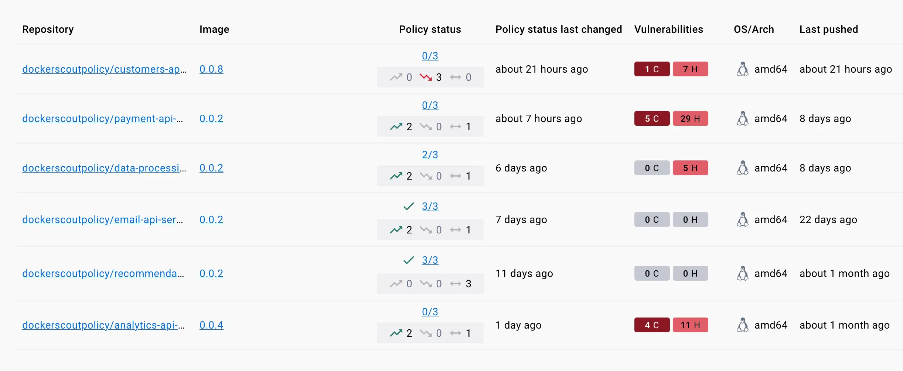

> **Beta**
>
> Policy Evaluation is a [Beta](/release-lifecycle/#beta) feature of Docker
> Scout. This feature is available to organizations participating in the
> limited preview program for policies.
>
> If you're interested in trying out this feature, reach out using the form on
> the [Docker Scout product page](https://docker.com/products/docker-scout)
{ .restricted }

In software supply chain management, maintaining the security and reliability
of artifacts is a top priority. Policy Evaluation in Docker Scout introduces a
layer of control, on top of existing analysis capabilities. It lets you define
supply chain rules for your artifacts, and helps you track how your artifacts
perform, relative to your rules and thresholds, over time.

Learn how you can use Policy Evaluation to ensure that your artifacts align
with established best practices.

## How it works

When you activate Docker Scout for a repository, images that you push are
[automatically analyzed](../advanced-image-analysis.md). The analysis gives you
insights about the composition of your images, including what packages they
contain, and what vulnerabilities they're exposed to. Policy Evaluation builds
on top of the image analysis feature, interpreting the analysis results against
the rules defined by policies.

A policy defines one or more criteria that your artifacts should fulfill. For
example, one of the default policies in Docker Scout is the **Critical
vulnerabilities** policy, which proclaims that your artifacts must not contain
any critical vulnerabilities. If an artifact contains one or more
vulnerabilities with a critical severity, that artifact fails the evaluation.

In Docker Scout, policies are designed to help you ratchet forward your
security and supply chain stature. Where other tools focus on providing a pass
or fail status, Docker Scout policies visualizes how small, incremental changes
affect policy status, even when your artifacts don't meet the policy
requirements (yet). By tracking how the fail gap changes over time, you more
easily see whether your artifact is improving or deteriorating relative to
policy.

Policies don't necessarily have to be related to application security and
vulnerabilities. You can use policies to measure and track other aspects of
supply chain management as well, such as base image dependencies and
open-source licenses.

## Default policies

Docker Scout ships the following three out-of-the-box policies:

- [Critical and high vulnerabilities with fixes](#critical-and-high-vulnerabilities-with-fixes)
- [Critical vulnerabilities](#critical-vulnerabilities)
- [Packages with GPL3+ licenses](#packages-with-gpl3-licenses)

These policies are turned on by default for Scout-enabled repositories. There's
currently no way to turn off or configure these policies.

### Critical and high vulnerabilities with fixes

This policy requires that your artifacts aren't exposed to known
vulnerabilities with a critical or high severity, and where there's a fix
version available. Essentially, this means that there's an easy fix that you
can deploy for images that fail this policy: upgrade the vulnerable package to
a version containing a fix for the vulnerability.

This policy only flags vulnerabilities that were published more than 30
days ago, with the rationale that newly discovered vulnerabilities
shouldn't cause your evaluations to fail until you've had a chance to
address them.

This policy is unfulfilled if an artifact is affected by one or more critical-
or high-severity vulnerability, where a fix version is available.

### Critical vulnerabilities

This policy requires that your artifacts contain no known critical
vulnerabilities. The policy is unfulfilled if your artifact contains one or
more critical vulnerabilities.

This policy flags all critical vulnerabilities, whether or not there's a fix
version available.

### Packages with GPL3+ licenses

This policy requires that your artifacts don't contain packages distributed
under a GPL3+ [copyleft](https://en.wikipedia.org/wiki/Copyleft) license.

This policy is unfulfilled if your artifacts contain one or more packages with
a violating license.

## View policy status

The **Overview** tab of the [Docker Scout Dashboard](https://scout.docker.com/)
displays a summary of recent changes in policy for your repositories.
This summary shows images that have seen the most change in their policy
evaluation between the most recent image and the previous image.

### Policy status per repository

The **Images** tab shows the current policy status, and recent policy trend,
for all images in the selected environment. The **Policy status** column in the
list shows:

- Number of fulfilled policies versus the total number of policies
- Recent policy trends

The policy trend, denoted by the directional arrows, indicates whether an image
is better, worse, or unchanged in terms of policy, compared to the previous
image in the same environment.

- The green arrow pointing upwards shows the number of policies that got better
  in the latest pushed image.
- The red arrow pointing downwards shows the number of policies that got worse
  in the latest pushed image.
- The bidirectional gray arrow shows the number of policies that were unchanged
  in the latest version of this image.

If you select a repository, you can open the **Policy** tab for a detailed
description of the policy delta for the most recently analyzed image and its
predecessor.

### Detailed evaluation results

To view the full results of an evaluation of an image, select the image in
the Docker Scout Dashboard and open the **Policy** tab. This shows a
breakdown for all policy violations for the current image.

## Remediate policy violations

To remediate issues in your artifacts that cause policy violations, you can use
the tag view in the Docker Scout Dashboard.

1. Go to the **Images** view in the Docker Scout Dashboard.
2. In the list of repositories, select the image that you want to improve.
3. Select an image.
4. Open the **Policy** tab.

The **Policy** tab shows you all of the policy violations for the current
image. Expand the policy menus to learn which packages in the image are
causing the evaluation to fail.

For vulnerability-related policies, if a package has an available fix version
that removes the vulnerability, that fix version is displayed in the policy
list. To remediate the issue, upgrade the package version to the fix version.

For licensing-related policies, the list shows all packages whose license
doesn't meet the policy criteria. To fix the issue, look for an alternative
package distributed under a more appropriate license, or cut the dependency by
reimplementing the functionality in your own code.
