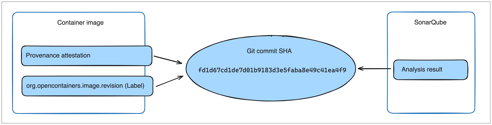

> **Early Access**
>
> Policy Evaluation is an [Early Access](/release-lifecycle/#early-access-ea)
> feature of Docker Scout.
{ .restricted }

In software supply chain management, maintaining the security and reliability
of artifacts is a top priority. Policy Evaluation in Docker Scout introduces a
layer of control, on top of existing analysis capabilities. It lets you define
supply chain rules for your artifacts, and helps you track how your artifacts
perform, relative to your rules and thresholds, over time.

Learn how you can use Policy Evaluation to ensure that your artifacts align
with established best practices.

## How Policy Evaluation works

When you activate Docker Scout for a repository, images that you push are
[automatically analyzed](../image-analysis.md). The analysis gives you insights
about the composition of your images, including what packages they contain and
what vulnerabilities they're exposed to. Policy Evaluation builds on top of the
image analysis feature, interpreting the analysis results against the rules
defined by policies.

A policy defines one or more criteria that your artifacts should fulfill. For
example, one of the default policies in Docker Scout is the **Critical
vulnerabilities** policy, which requires that your artifacts must not contain
any critical vulnerabilities. If an artifact contains one or more
vulnerabilities with a critical severity, that artifact fails the evaluation.

In Docker Scout, policies are designed to help you ratchet forward your
security and supply chain stature. Where other tools focus on providing a pass
or fail status, Docker Scout policies visualizes how small, incremental changes
affect policy status, even when your artifacts don't meet the policy
requirements (yet). By tracking how the fail gap changes over time, you more
easily see whether your artifact is improving or deteriorating relative to
policy.

Policies don't necessarily have to be related to application security and
vulnerabilities. You can use policies to measure and track other aspects of
supply chain management as well, such as open-source license usage and base
image up-to-dateness.

## Default policies

Docker Scout ships the following out-of-the-box policies:

- [Fixable critical and high vulnerabilities](#fixable-critical-and-high-vulnerabilities)
- [Critical vulnerabilities](#critical-vulnerabilities)
- [Copyleft licenses](#copyleft-licenses)
- [Outdated base images](#outdated-base-images)
- [High-profile vulnerabilities](#high-profile-vulnerabilities)
- [Supply chain attestations](#supply-chain-attestations)
- [Quality gates passed](#quality-gates-passed)

Policies are enabled by default for Scout-enabled repositories. If you want to
customize the criteria of a policy, you can create custom policies based on the
default, out-of-the-box policies. You can also disable a policy altogether if
it isn't relevant to you. For more information, see [Configure
policies](./configure.md).

### Fixable critical and high vulnerabilities

The **Fixable critical and high vulnerabilities** policy requires that your
artifacts aren't exposed to known vulnerabilities where there's a fix version
available. Essentially, this means that there's an easy fix that you can deploy
for images that fail this policy: upgrade the vulnerable package to a version
containing a fix for the vulnerability.

This policy only flags critical and high severity vulnerabilities that were
published more than 30 days ago. The rationale for only flagging
vulnerabilities of a certain age is that newly discovered vulnerabilities
shouldn't cause your evaluations to fail until you've had a chance to address
them.

This policy is unfulfilled if an artifact is affected by one or more critical-
or high-severity vulnerability, where a fix version is available.

You can configure the severity level and age thresholds by creating a custom
policy. For more information, see [Configure policies](./configure.md).

### Critical vulnerabilities

The **Critical vulnerabilities** policy requires that your artifacts contain no
known critical vulnerabilities. The policy is unfulfilled if your artifact
contains one or more critical vulnerabilities.

This policy flags all critical vulnerabilities, whether or not there's a fix
version available, and regardless of how long it's been since the vulnerability
was first disclosed.

You can configure the severity level by creating a custom policy, see
[Configure policies](./configure.md).

### Copyleft licenses

The **Copyleft licenses** policy requires that your artifacts don't contain
packages distributed under an AGPLv3 or GPLv3 license. These licenses are
protective [copyleft](https://en.wikipedia.org/wiki/Copyleft), and may be
unsuitable for use in your software because of the restrictions they enforce.

This policy is unfulfilled if your artifacts contain one or more packages with
a violating license.

You can configure the list of licenses by creating a custom policy, see
[Configure policies](./configure.md).

### Outdated base images

The **Outdated base images** policy requires that the base images you use are
up-to-date.

It's unfulfilled when the tag you used to build your image points to a
different digest than what you're using. If there's a mismatch in digests, that
means the base image you're using is out of date.

#### No base image data

There are cases when it's not possible to determine whether or not the base
image is up-to-date. In such cases, the **Outdated base images** policy
gets flagged as having **No data**.

This occurs when:

- Docker Scout doesn't know what base image tag you used
- The base image version you used has multiple tags, but not all tags are out
  of date

To make sure that Docker Scout always knows about your base image, you can
attach [provenance attestations](../../build/attestations/slsa-provenance.md)
at build-time. Docker Scout uses provenance attestations to find out the base
image version.

### High-profile vulnerabilities

The **High-profile vulnerabilities** policy requires that your artifacts don't
contain vulnerabilities from Docker Scout’s curated list. This list is kept
up-to-date with newly disclosed vulnerabilities that are widely recognized to
be risky.

The list includes the following vulnerabilities:

- [CVE-2014-0160 (OpenSSL Heartbleed)](https://scout.docker.com/v/CVE-2014-0160)
- [CVE-2021-44228 (Log4Shell)](https://scout.docker.com/v/CVE-2021-44228)
- [CVE-2023-38545 (cURL SOCKS5 heap buffer overflow)](https://scout.docker.com/v/CVE-2023-38545)
- [CVE-2023-44487 (HTTP/2 Rapid Reset)](https://scout.docker.com/v/CVE-2023-44487)

You can configure the CVEs included in this list by creating a custom policy.
For more information, see [Configure policies](./configure.md).

### Supply chain attestations

The **Supply chain attestations** policy requires that your artifacts have
[SBOM](../../build/attestations/sbom.md) and
[provenance](../../build/attestations/slsa-provenance.md) attestations.

This policy is unfulfilled if an artifact lacks either an SBOM attestation or a
provenance attestation, or if the provenance attestation lacks information
about the Git repository and base images being used. To ensure compliance,
update your build command to attach these attestations at build-time:

```console
$ docker buildx build --provenance=true --sbom=true -t <IMAGE> --push .
```

BuildKit automatically detects the Git repository and base images when this
information is available in the build context. For more information about
building with attestations, see
[Attestations](../../build/attestations/_index.md).

> **Note**
>
> Docker Scout is currently unable to discern the difference between using
> `scratch` as a base image and having no base image provenance. As a result,
> images based on `scratch` always fail the Supply chain attestations policy.

### Quality gates passed

The Quality gates passed policy builds on the [SonarQube
integration](../integrations/code-quality/sonarqube.md) to assess the quality
of your source code. This policy works by ingesting the SonarQube code analysis
results into Docker Scout.

You define the criteria for this policy using SonarQube's [quality
gates](https://docs.sonarsource.com/sonarqube/latest/user-guide/quality-gates/).
SonarQube evaluates your source code against the quality gates you've defined
in SonarQube. Docker Scout surfaces the SonarQube assessment as a Docker Scout
policy.

Docker Scout uses [provenance](../../build/attestations/slsa-provenance.md)
attestations or the `org.opencontainers.image.revision` OCI annotation to link
SonarQube analysis results with container images. In addition to enabling the
SonarQube integration, you must also make sure that your images has either the
attestation or the label.



Once you push an image and policy evaluation completes, the results from the
SonarQube quality gates display as a policy in the Docker Scout Dashboard, and
in the CLI.

> **Note**
>
> Docker Scout can only access SonarQube analyses created after the integration
> is enabled. Docker Scout doesn't have access to historic evaluations. Trigger
> a SonarQube analysis and policy evaluation after enabling the integration to
> view the results in Docker Scout.
