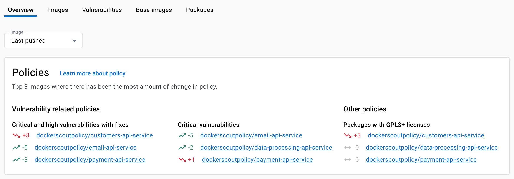
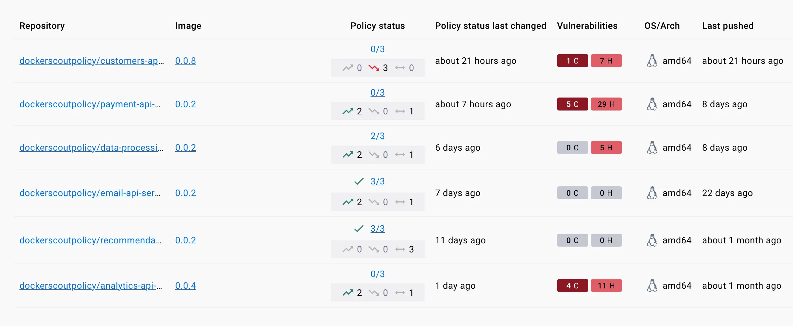
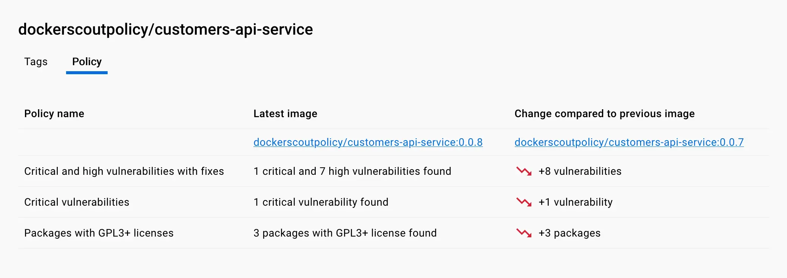
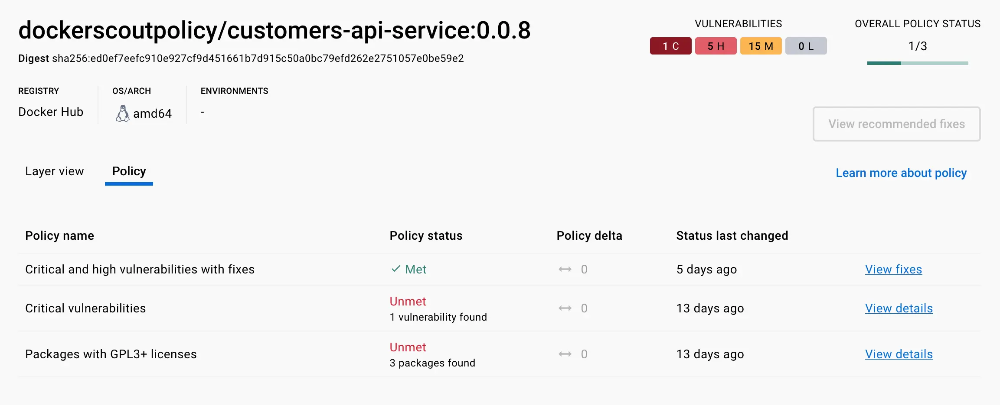

{}
Policy Evaluation is an [Early Access](/release-lifecycle/#early-access-ea)
feature of Docker Scout.
{}

You can track policy status for your artifacts from the [Docker Scout
Dashboard](#dashboard), or using the [CLI](#cli).

## Dashboard

The **Overview** tab of the [Docker Scout Dashboard](https://scout.docker.com/)
displays a summary of recent changes in policy for your repositories.
This summary shows images that have seen the most change in their policy
evaluation between the most recent image and the previous image.



### Policy status per repository

The **Images** tab shows the current policy status, and recent policy trend,
for all images in the selected environment. The **Policy status** column in the
list shows:

- Number of fulfilled policies versus the total number of policies
- Recent policy trends



The policy trend, denoted by the directional arrows, indicates whether an image
is better, worse, or unchanged in terms of policy, compared to the previous
image in the same environment.

- The green arrow pointing upwards shows the number of policies that got better
  in the latest pushed image.
- The red arrow pointing downwards shows the number of policies that got worse
  in the latest pushed image.
- The bidirectional gray arrow shows the number of policies that were unchanged
  in the latest version of this image.

If you select a repository, you can open the **Policy** tab for a detailed
description of the policy delta for the most recently analyzed image and its
predecessor.

### Detailed results and remediation

To view the full evaluation results for an image, navigate to the image tag in
the Docker Scout Dashboard and open the **Policy** tab. This shows a breakdown
for all policy violations for the current image.



This view also provides recommendations on how to improve improve policy status
for violated policies.



For vulnerability-related policies, the policy details view displays the fix
version that removes the vulnerability, when a fix version is available. To fix
the issue, upgrade the package version to the fix version.

For licensing-related policies, the list shows all packages whose license
doesn't meet the policy criteria. To fix the issue, find a way to remove the
dependency to the violating package, for example by looking for an alternative
package distributed under a more appropriate license.

## CLI

To view policy status for an image from the CLI, use the `docker scout policy`
command.

```console
$ docker scout policy \
  --org dockerscoutpolicy \
  --platform linux/amd64 \
  dockerscoutpolicy/email-api-service:0.0.2

    ✓ Pulled
    ✓ Policy evaluation results found


​## Overview
​
​             │               Analyzed Image
​─────────────┼──────────────────────────────────────────────
​  Target     │  dockerscoutpolicy/email-api-service:0.0.2
​    digest   │  17b1fde0329c
​    platform │ linux/amd64
​
​
​## Policies
​
​Policy status  FAILED  (2/8 policies met, 3 missing data)
​
​  Status │                  Policy                             │           Results
​─────────┼─────────────────────────────────────────────────────┼──────────────────────────────
​  ✓      │ No copyleft licenses                                │    0 packages
​  !      │ Default non-root user                               │
​  !      │ No fixable critical or high vulnerabilities         │    2C     1H     0M     0L
​  ✓      │ No high-profile vulnerabilities                     │    0C     0H     0M     0L
​  ?      │ No outdated base images                             │    No data
​         │                                                     │    Learn more ↗
​  ?      │ SonarQube quality gates passed                      │    No data
​         │                                                     │    Learn more ↗
​  !      │ Supply chain attestations                           │    2 deviations
​  ?      │ No unapproved base images                           │    No data

...
```

For more information about the command, refer to the [CLI
reference](../../reference/cli/docker/scout/policy.md).
