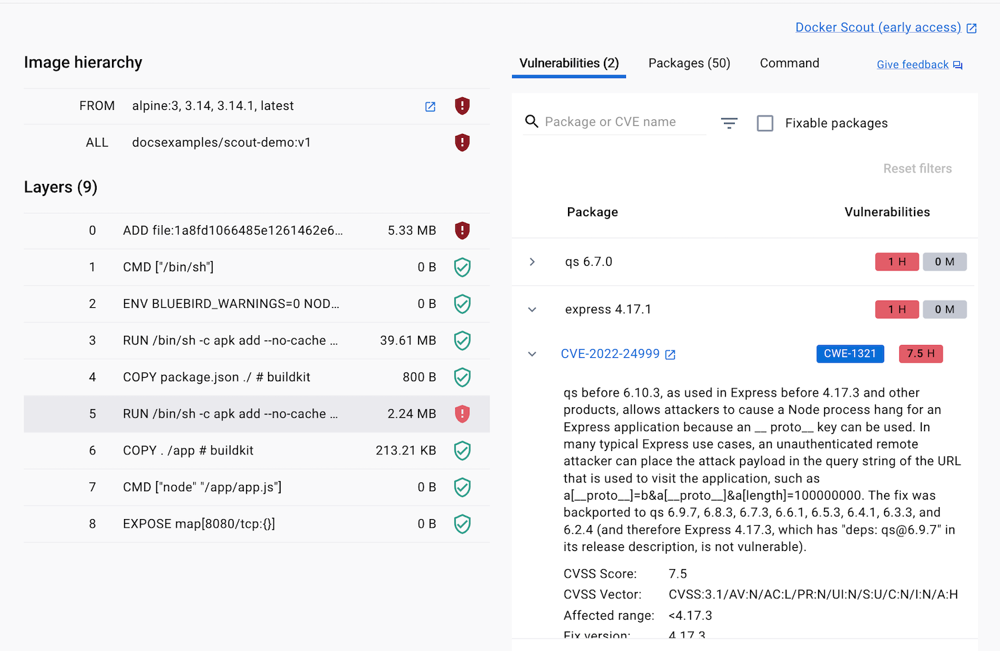

Docker Scout analyzes image contents and generates a detailed report of packages
and vulnerabilities that it detects. It can provide you with
suggestions for how to remediate issues discovered by image analysis.

This guide takes a vulnerable container image and shows you how to use Docker
Scout to identify and fix the vulnerabilities, compare image versions over time,
and share the results with your team.

The following video shows an end-to-end workflow of using Docker Scout to remediate a reported vulnerability.

<iframe class="border-0 w-full aspect-video mb-8" allow="fullscreen" src="https://www.loom.com/embed/e066986569924555a2546139f5f61349?sid=6e29be62-78ba-4aa7-a1f6-15f96c37d916"></iframe>

## Step 1: Setup

[This example project](https://github.com/docker/scout-demo-service) contains
a vulnerable Node.js application that you can use to follow along.

1. Clone its repository:

   ```console
   $ git clone https://github.com/docker/scout-demo-service.git
   ```

2. Move into the directory:

   ```console
   $ cd scout-demo-service
   ```

3. Build the image, naming it to match the organization you will push it to,
   and tag it as `v1`:

   ```console
   $ docker build -t <ORG_NAME>/scout-demo:v1 .
   ```

4. Create and push the repository on Docker Hub:

   ```console
   $ docker push <ORG_NAME>/scout-demo:v1
   ```

   > **Important**
   >
   > Make sure you log in to the Docker CLI or Docker Desktop before pushing.
   { .important }

## Step 2: Enable Docker Scout

Docker Scout analyzes all local images by default. To analyze images in
remote repositories, you need to enable it first.
You can do this from Docker Hub, the Docker Scout Dashboard, and CLI.
[Find out how in the overview guide](/scout).

1. Sign in to your Docker account with the `docker login` command or use the
   **Sign in** button in Docker Desktop.
2. Use the Docker CLI [`docker scout repo enable`](/engine/reference/commandline/scout_repo_enable)
   command to enable analysis on an existing repository:

   ```console
   $ docker scout repo enable --org <ORG_NAME> <ORG_NAME>/scout-demo
   ```

## Step 3: Analyze image vulnerabilities

After building, you can use Docker Desktop or the `docker scout` CLI command
to see vulnerabilities detected by Docker Scout.

1. Using Docker Desktop, select the image name in the **Images** view to see
   the image layer view. In the image hierarchy section, you can see which layers
   introduce vulnerabilities and the details of those.

2. Select layer 5 to focus on the vulnerability introduced in that layer.

3. Toggle the disclosure triangle next to **express 4.17.1** and then the CVE ID (in this case, `CVE-2022-24999`) to see details of the
   vulnerability.

   You can also use the Docker CLI to see the same results.

   ```console
   $ docker scout cves <ORG_NAME>/scout-demo:v1
   ```



Docker Scout creates and maintains its vulnerability database by ingesting and
collating vulnerability data from multiple sources continuously. These sources
include many recognizable package repositories and trusted security trackers.
You can find more details in the [advisory database](./advisory-db-sources.md) documentation.

> **Tip**
>
> Find out how to filter results using the CLI command [`scout cves`](/engine/reference/commandline/scout_cves).
> { .tip }

## Step 4: Fix application vulnerabilities

The fix suggested by Docker Scout is to update
the underlying vulnerable express version to 4.17.3 or later.

1. Update the `package.json` file with the new package version.

   ```json
   …
   "dependencies": {
        "express": "4.17.3"
        …
   }
   ```

2. Rebuild the image, giving it a new version tag:

   ```console
   $ docker build -t <ORG_NAME>/scout-demo:v2 .
   ```

3. Push the image to the same repository on Docker Hub using a new version tag:

   ```console
   $ docker push <ORG_NAME>/scout-demo:v2
   ```

Now, viewing the latest tag of the image in Docker Desktop, the Docker Scout
Dashboard, or CLI, you can see that you have fixed the vulnerability.

## Step 5: Fix vulnerabilities in base images

In addition to identifying application
vulnerabilities, Docker Scout also helps you identify and fix issues with the
base images your images use.

1. On the Docker Scout Dashboard, you can see these suggestions
   by selecting the **Recommended fixes** button in the image layer view.

2. Select the **Recommendations for base image** option from the button. In the
   dialog that appears, select the **Change base image** tab, the new version of
   the base image you want to use, and copy the suggestion into your `Dockerfile`.

3. Rebuild the image, again with a new tag:

   ```console
   $ docker build -t <ORG_NAME>/scout-demo:v3 .
   ```

4. Push it to Docker Hub using the new version tag:

   ```console
   $ docker push <ORG_NAME>/scout-demo:v3
   ```

5. Select the new image tag in Docker Desktop or the Docker Scout Dashboard and you
   can see that the base image has been updated, removing many vulnerabilities.

   You can see the same using the Docker CLI command:

   ```console
   $ docker scout cves <ORG_NAME>/scout-demo:v3
   ```

## Step 6: Collaborate on vulnerabilities

You can see and share the same vulnerability information about an image and
the other images in your organization in the [Docker Scout Dashboard](./dashboard.md).

All organization members can see an overview of all their images from integrated container registries,
and get remediation advice at their fingertips. This helps team members in
security, compliance, and operations to know what vulnerabilities and issues to focus on.

1. Select the **Images** tab on the [Docker Scout Dashboard](https://scout.docker.com).
2. Select any of the tags under
   the **Most Recent Image** column, and you can see the same vulnerability
   information as you saw in Docker Desktop and the Docker CLI and share this link with anyone else in your organization.

> **Tip**
>
> If you are a member of multiple organizations, make sure you select the
> correct organization from the drop-down in the top right.
> 
{ .tip }

## Step 7: Compare images

Over time as you build and push new tags of images, you can use the Docker Scout
CLI and Dashboard to compare the changes to vulnerabilities and packages in
different tags of the same image.




On the Docker Scout Dashboard, select the repository to compare from the
**Images** list. In this case, **scout-demo**.

Choose two of the tags you pushed in the last steps, for example, **v1** and
**v3**, and then select **Compare images**.

The **Image comparison** view shows you the differences between the two tags.
The page's top part summarizes the two tags, including the differences between
vulnerabilities and base image tags.

In the bottom part of the page, you can see the changes in packages and
vulnerabilities between the two tags. In the row for "express", you can see the
version change from 4.17.1 to 4.17.3. Switch to the **Vulnerabilities** tab to
see the changes in vulnerabilities between the two tags. You can see that
`CVE-2022-24999` isn't present under the **v3** tag.




Use the `docker scout compare` command to see the compare two image versions.
Pass the image that you want to compare as a positional argument to the
command, and specify the base image to compare with using the `--to` flag.

```console
$ docker scout compare --to <ORG_NAME>/scout-demo:v1 <ORG_NAME>/scout-demo:v3
```




## What's next?

- Explore the [Docker Scout Dashboard](/scout/dashboard) to see how you can
  collaborate with your team on vulnerabilities.
- [Learn how to integrate Docker Scout with other systems](./integrations/index.md).
- [Find out where Docker Scout gets its vulnerability data](/scout/advisory-db-sources).
