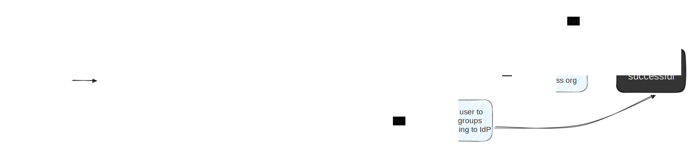

With directory group-to-team provisioning from your IdP, user updates will automatically sync with your Docker organizations and teams.

> **Tip**
>
> Group mapping is ideal for adding a user to multiple organizations or multiple teams within one organization. If you don't need to set up multi-organization or multi-team assignment, you can use [user-level attributes](scim.md#set-up-role-mapping).
{ .tip }

## How group mapping works

IdPs share with Docker the main attributes of every authorized user through SSO, such as email address, name, surname, and groups. Just-In-Time (JIT) Provisioning uses these attributes to create or update the user’s Docker profile and their associations with organizations and teams on Docker Hub.

Docker uses the email address of the user to identify them on the platform. Every Docker account must have a unique email address at all times.

### SSO authentication with JIT provisioning enabled

After every successful SSO sign-in authentication, the JIT provisioner performs the following actions:

1. Checks if there's an existing Docker account with the email address of the user that just authenticated.

   a) If no account is found with the same email address, it creates a new Docker account using basic user attributes (email, name, and surname). The JIT provisioner generates a new username for this new account by using the email, name, and random numbers to make sure that all account usernames are unique in the platform.

   b) If an account exists for this email address, it uses this account and updates the full name of the user’s profile if needed.

2. Checks for any pending invitations to the SSO organization to auto-accept the invitation. If the invitation is specific to a group, the user is added to the invited group along with group mappings in the following step.

3. Checks if the IdP shared group mappings while authenticating the user.

   a) If the IdP provided group mappings for the user, the user gets added to the organizations and teams indicated by the group mappings.

   b) If the IdP didn't provide group mappings, it checks if the user is already a member of the organization, or if the SSO connection is for multiple organizations (only at company level) and if the user is a member of any of those organizations. If the user isn't a member, it adds the user to the default team and organization configured in the SSO connection.

### SSO authentication with JIT provisioning disabled

> **Beta feature**
>
> Optional Just-in-Time (JIT) provisioning is available in Private Beta when you use the Admin Console. If you're participating in this program, you have the option to turn off this default provisioning and disable JIT. This configuration is recommended if you're using SCIM to auto-provision users.
{ .experimental }

When you opt to disable JIT provisioning in your SSO connection, the following actions occur:

1. Checks if there's an existing Docker account with the email address of the user that just authenticated.

   a) If no account is found with the same email address, it creates a new Docker account using basic user attributes (email, name, and surname). Authentication with SSO generates a new username for this new account by using the email, name, and random numbers to make sure that all account usernames are unique in the platform.

   b) If an account exists for this email address, it uses this account and updates the full name of the user’s profile if needed.

2. Checks if there are any pending invitations to the SSO organization (or, SSO organizations if the SSO connection is managed at the company level) in order to auto-accept the invitation.

   a) If the user isn't already a member of the organization, or doesn't have a pending invitation to join, sign in fails and the user encounters an `Access denied` error. This blocks the user from joining the organization. They need to contact an administrator to invite them to join.

   b) If the user is a member of the organization, or has a pending invitation to join, then sign in is successful.

If you disable JIT provisioning when you create or edit your SSO connection, you can still use group mapping as long as you have also [enabled SCIM](/security/for-admins/scim/#enable-scim-in-docker). When JIT provisioning is disabled and SCIM isn't enabled, users won't be auto-provisioned to groups. For instructions on disabling JIT provisioning, see [Manage how users are provisioned](/security/for-admins/single-sign-on/manage/#manage-how-users-are-provisioned).

## Use group mapping

To correctly assign your users to Docker teams, you must create groups in your IdP following the naming pattern `organization:team`. For example, if you want to manage provisioning for the team "developers", and your organization name is "moby", you must create a group in your IdP with the name `moby:developers`.

Once you enable group mappings in your connection, users assigned to that group in your IdP will automatically be added to the team "developers" in Docker.

You can use this format to add a user to multiple organizations. For example, if you want to add a user to the "backend" team in the "moby" organization as well as the "desktop" team in the "docker" organization, the format would be: `moby:backend` and `docker:desktop`.

>**Tip**
>
>Use the same names for the Docker teams as your group names in the IdP to prevent further configuration. When you sync groups, this creates a group if it doesn’t already exist.
{ .tip}

The following lists the supported group mapping attributes:

| Attribute | Description |
|:--------- | :---------- |
| id | Unique ID of the group in UUID format. This attribute is read-only. |
| displayName | Name of the group following the group mapping format: `organization:team`. |
| members | A list of users that are members of this group. |
| members(x).value | Unique ID of the user that is a member of this group. Members are referenced by ID. |




The user interface for your IdP may differ slightly from the following steps. You can refer to the [Okta documentation](https://help.okta.com/en-us/Content/Topics/users-groups-profiles/usgp-enable-group-push.htm) to verify.

To set up your groups:

1. Sign in to the Okta Console.
2. Select **Applications > Provisioning > Integration**.
3. Select **Edit** to enable groups on your connection, then select **Push groups**.
4. Select **Save**. Saving this configuration will add the **Push Groups** tab to your application.
5. Create your groups by navigating to **Directory > Groups**.
6. Add your groups using the format `organization:team` that matches the names of your organization(s) and team(s) in Docker.
7. Assign people to the group(s) that you create.
8. Return to **Applications > Provisioning> Integration**, then select the **Push Groups** tab to open the view where you can control and manage how groups are provisioned.
9. Select **Push Groups > Find groups by rule**.
10. Configure the groups by rule like the following:
    - Enter a rule name, for example `Sync groups with Docker Hub`
    - Match group by name, for example starts with `docker:` or contains `:` or multi-organization
    - If you enable **Immediately push groups by rule**, sync will happens as soon as there's a change on the group or assignments on the group. Enable this if you don't want to manually push groups.

Find your new rule under **By rule** in the **Pushed Groups** column. The groups that match that rule are listed in the groups table on the right-hand side.

To push the groups from this table:

1. Select **Group in Okta**.
2. Select the **Push Status** drop-down.
3. Select **Push Now**.




The user interface for your IdP may differ slightly from the following steps. You can refer to the [Entra ID documentation](https://learn.microsoft.com/en-us/azure/active-directory/app-provisioning/customize-application-attributes) to verify.

Complete the following before configuring group mapping:

1. Sign in to Entra ID and go to your application.
2. In your application, go to **Provisioning > Mappings**.
3. Select **Provision Microsoft Entra ID Groups**.
4. Select **Show advanced options**, then **Edit attribute list**.
5. Update the `externalId` type to `reference`, then select the **Multi-Value** checkbox and choose the referenced object attribute `urn:ietf:params:scim:schemas:core:2.0:Group`.
6. Select **Save**, then **Yes** to confirm.
7. Go to **Provisioning**.
8. Toggle **Provision Status** to **On**, then select **Save**.

Next, set up group mapping:

1. Go to the application overview page.
2. Under **Provision user accounts**, select **Get started**.
3. Select **Add user/group**.
4. Create your group(s) using the `organization:team` format.
5. Assign the group to the provisioning group.
6. Select **Start provisioning** to start the sync.

To verify, go to **Monitor > Provisioning logs** to see that your groups were provisioned successfully. In your Docker organization, you can check that the groups were correctly provisioned and the members were added to the appropriate teams.




Once complete, a user who signs in to Docker through SSO is automatically added to the organizations and teams mapped in the IdP.

> **Tip**
>
> [Enable SCIM](scim.md) to take advantage of automatic user provisioning and de-provisioning. If you don't enable SCIM users are only automatically provisioned. You have to de-provision them manually.
{ .tip }

## More resources

The following videos demonstrate how to use group mapping with your IdP.

- [Video: Group mapping with Okta](https://youtu.be/c56YECO4YP4?feature=shared&t=3023)
- [Video: Attribute and group mapping with Entra ID (Azure)](https://youtu.be/bGquA8qR9jU?feature=shared&t=2039)
