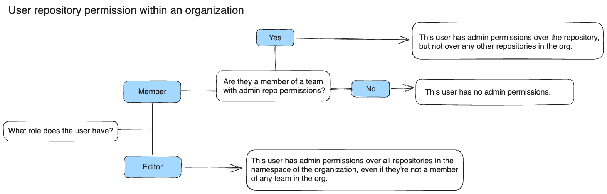

Organization and company owners can assign roles to individuals giving them different permissions in the organization. This section is for owners who want to learn about the defined roles and their permission scopes.

## Roles

When you invite users to your organization, you assign a role. A role is a collection of permissions. Roles define access to perform actions like creating repositories, pulling images, creating teams, and configuring organization settings.

The following roles are available to assign:

- **Member** - Non-administrative role. Members can view other members that are in the same organization.
- **Editor** - Partial administrative access to the organization. Editors can create, edit, and delete repositories. They can also edit an existing team's access permissions.
- **Organization owner** - Full organization administrative access. Organization owners can manage organization repositories, teams, members, settings, and billing.
- **Company owner** - In addition to the permissions of an organization owner, company owners can configure settings for their associated organizations.

Owners can manage roles for members of an organization on [Docker Hub](/docker-hub/members/#update-a-member-role), as well members of an [organization](/admin/organization/members/#update-a-member-role) or a [company](/admin/company/users/#update-a-member-role) on [Docker Admin](/admin/).

## Permissions

The following sections describe the permissions for each role.

### Content and registry permissions

The following outlines content and registry permissions for member, editor, and organization owner roles. These permissions and roles apply to the entire organization, including all the repositories in the namespace for the organization.

Company owners have the same access as organization owners for all associated organizations. See [Company overview](/admin/company/).

| Permission                                            | Member | Editor | Organization owner |
| :---------------------------------------------------- | :----- | :----- | :----------------- |
| Explore images and extensions                         | ✅     | ✅     | ✅                 |
| Star, favorite, vote, and comment on content          | ✅     | ✅     | ✅                 |
| Pull images                                           | ✅     | ✅     | ✅                 |
| Create and publish an extension                       | ✅     | ✅     | ✅                 |
| Become a Verified, Official, or Open Source publisher | ❌     | ❌     | ✅                 |
| Observe content engagement as a publisher             | ❌     | ❌     | ✅                 |
| Create public and private repositories                | ❌     | ✅     | ✅                 |
| Edit and delete repositories                          | ❌     | ✅     | ✅                 |
| Manage tags                                           | ❌     | ✅     | ✅                 |
| View repository activity                              | ❌     | ❌     | ✅                 |
| Set up Automated builds                               | ❌     | ❌     | ✅                 |
| Edit build settings                                   | ❌     | ❌     | ✅                 |
| View teams                                            | ❌     | ✅     | ✅                 |
| Assign team permissions to repositories               | ❌     | ✅     | ✅                 |

When you add members to a team, you can manage their repository permissions. For team repository permissions, see [Create and manage a team permissions reference](/docker-hub/manage-a-team/#permissions-reference).

See the following diagram for an example of how permissions may work for a user. In this example, the first permission check is for the role: member or editor. Editors have administrative permissions for repositories across the namespace of the organization. Members may have administrative permissions for a repository if they're a member of a team that grants those permissions.

### Organization management permissions

The following outlines organization management permissions for member, editor, organization owner, and company owner roles.

| Permission                                                        | Member | Editor | Organization owner | Company owner |
| :---------------------------------------------------------------- | :----- | :----- | :----------------- | :------------ |
| Create teams                                                      | ❌     | ❌     | ✅                 | ✅            |
| Manage teams (including delete)                                   | ❌     | ❌     | ✅                 | ✅            |
| Configure the organization's settings (including linked services) | ❌     | ❌     | ✅                 | ✅            |
| Add organizations to a company                                    | ❌     | ❌     | ✅                 | ✅            |
| Invite members                                                    | ❌     | ❌     | ✅                 | ✅            |
| Manage members                                                    | ❌     | ❌     | ✅                 | ✅            |
| Manage member roles and permissions                               | ❌     | ❌     | ✅                 | ✅            |
| View member activity                                              | ❌     | ❌     | ✅                 | ✅            |
| Export and reporting                                              | ❌     | ❌     | ✅                 | ✅            |
| Image Access Management                                           | ❌     | ❌     | ✅                 | ✅            |
| Registry Access Management                                        | ❌     | ❌     | ✅                 | ✅            |
| Set up Single Sign-On (SSO) and SCIM                              | ❌     | ❌     | ✅ \*              | ✅            |
| Require Desktop login                                             | ❌     | ❌     | ✅ \*              | ✅            |
| Manage billing information (e.g. billing address)                 | ❌     | ❌     | ✅                 | ✅            |
| Manage payment methods (e.g. credit card or invoice)              | ❌     | ❌     | ✅                 | ✅            |
| View billing history                                              | ❌     | ❌     | ✅                 | ✅            |
| Manage subscriptions                                              | ❌     | ❌     | ✅                 | ✅            |
| Manage seats                                                      | ❌     | ❌     | ✅                 | ✅            |
| Upgrade and downgrade plans                                       | ❌     | ❌     | ✅                 | ✅            |

_\* If not part of a company_

### Docker Scout

The following outlines Docker Scout management permissions for member, editor, and organization owner roles.

| Permission                                            | Member | Editor | Organization owner |
| :---------------------------------------------------- | :----- | :----- | :----------------- |
| View and compare analysis results                     | ✅     | ✅     | ✅                 |
| Upload analysis records                               | ✅     | ✅     | ✅                 |
| Activate and deactivate Docker Scout for a repository | ❌     | ✅     | ✅                 |
| Create environments                                   | ❌     | ❌     | ✅                 |
| Manage registry integrations                          | ❌     | ❌     | ✅                 |
