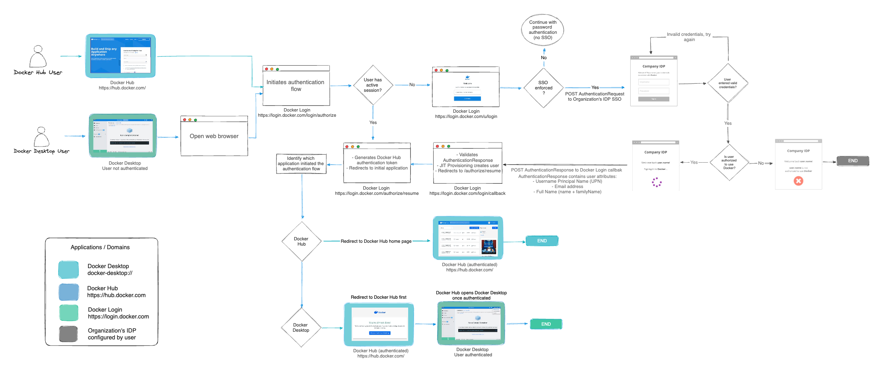

Single sign-on (SSO) allows users to authenticate using their identity providers (IdPs) to access Docker. SSO is available for a whole company, and all associated organizations, or an individual organization that has a Docker Business subscription. To upgrade your existing account to a Docker Business subscription, see [Upgrade your subscription](/subscription/upgrade/).

## How it works

When you enable SSO, your users can't authenticate using their Docker login credentials (Docker ID and password). Docker supports Service Provider Initiated SSO flow. Instead, they are redirected to your IdP's authentication page to sign in. Your users must sign in to Docker Hub or Docker Desktop to initiate the SSO authentication process.

The following diagram shows how SSO operates and is managed in Docker Hub and Docker Desktop. In addition, it provides information on how to authenticate between your IdP.

[fixme: this url is broken]::

## How to set it up

1. Configure SSO by adding and verify your domain for your organization, then create an SSO connection with your IdP. Docker provides the Assertion Consumer Service (ACS) URL and Entity ID needed to establish a connection between your IdP server and Docker Hub.
2. Test your connection by attempting to sign in to Docker Hub using your domain email address.
3. Optionally, you can [enforce SSO](/security/for-admins/single-sign-on/connect/#optional-enforce-sso) sign-in.
4. Complete SSO enablement. A first-time user can sign in to Docker Hub using their company's domain email address. They're then added to your company, assigned to an organization, and optionally assigned to a team.

## Prerequisites

* You must first notify your company about the new SSO login procedures.
* Verify that your members have Docker Desktop version 4.4.2, or later, installed on their machines.
* If your organization has SSO enforced, members using the Docker CLI will be required to [create a Personal Access Token (PAT)](/docker-hub/access-tokens/) to sign in instead of with a username and password. Docker plans to deprecate signing in to the CLI with a username and password in the future, so using a PAT will be required to prevent issues with authentication. For more details see the [security announcement](/security/security-announcements/#deprecation-of-password-logins-on-cli-when-sso-enforced)).
* Ensure all email addresses of allowed users are added to your IdP.
* Confirm that all CI/CD pipelines have replaced their passwords with PATs.
* For your service accounts, add your additional domains or enable it in your IdP.

## What's next?

- Start [configuring SSO](configure/_index.md) in Docker
- Explore the [FAQs](../../../security/faqs/single-sign-on/faqs.md)
