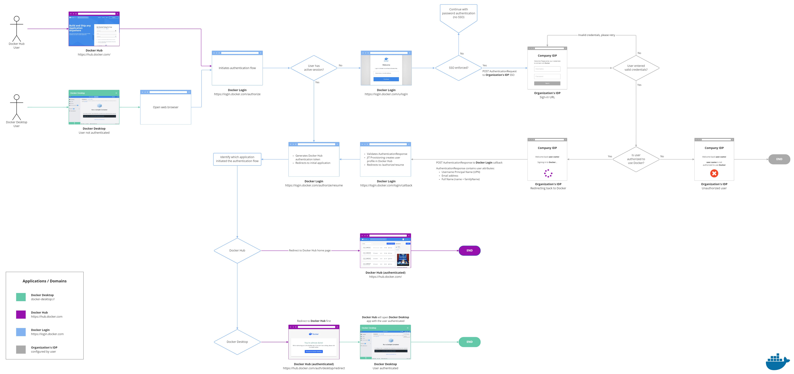

This section is for administrators who want to enable Docker Single Sign-on (SSO) for their businesses. Docker SSO allows users to authenticate using their identity providers (IdPs)  to access Docker. You can enable SSO on organizations that are part of the Docker Business subscription. To upgrade your existing account to a Docker Business subscription, see [Upgrade your subscription](../subscription/upgrade/){:target="blank" rel="noopener" class=""}.

When SSO is enabled, users are redirected to your provider’s authentication page to sign in. They cannot authenticate using their Docker login credentials  (Docker ID and password). Docker currently supports Service Provider Initiated SSO flow. Your users must sign in to Docker Hub or Docker Desktop to initiate the SSO authentication process.

Before enabling SSO in Docker Hub, administrators must configure their identity provider to configure their IdP to work with Docker Hub. Docker provides the Assertion Consumer Service (ACS) URL and the Entity ID. Administrators use this information to establish a connection between their IdP server and Docker Hub.

After establishing the connection between the IdP server and Docker Hub, administrators sign in to the organization in Docker Hub and complete the SSO enablement process. See the section **Enable SSO in Docker Hub** for detailed instructions.

To enable SSO in Docker Hub, you need the following information from your identity provider:

* **SAML 2.0**: Single Sign-On URL and the X.509 signing certificate
* **Azure AD**: Client ID (a unique identifier for your registered AD application), Client Secret (a string used to gain access to your registered Azure AD application), and AD Domain details

Currently, enabling SSO on a single organization is supported. However, single logout isn't supported. If you have any users in your organization with a different domain (including social domains), they will be added to the organization as guests. Guests will continue to authenticate through Docker with their Docker login credentials (Docker ID and password).

## Single Sign-on architecture flow

The following diagram shows how Single Sign-on (SSO) operates and is managed in Docker Hub and Docker Desktop. In addition, it provides information on how to authenticate between your IdPs.

{: target="_blank" rel="noopener" class="_"}
