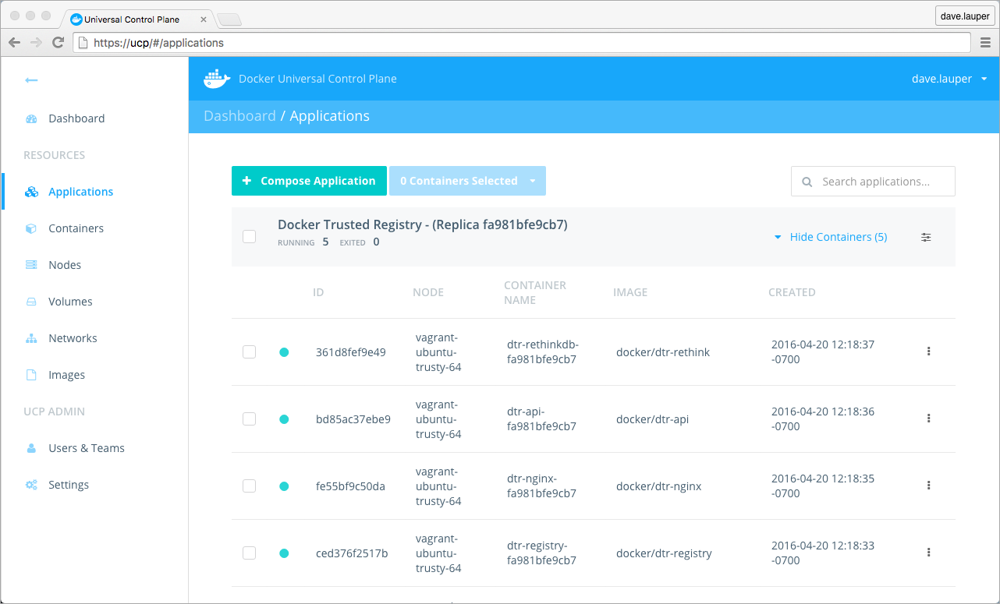
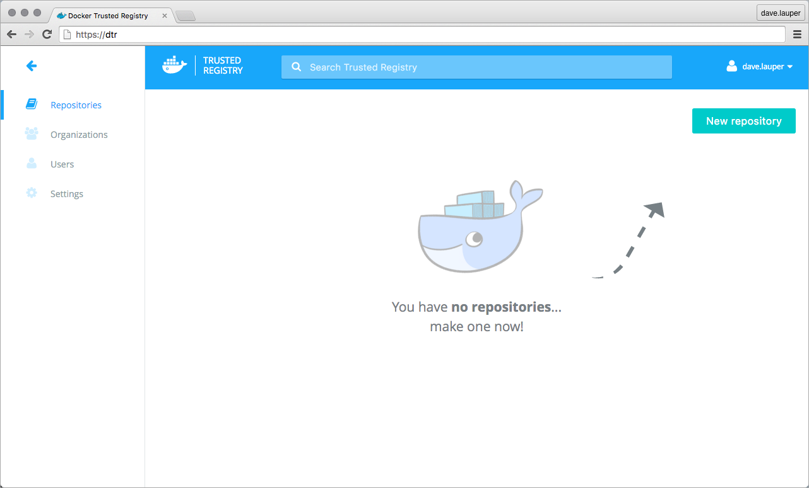

Docker Trusted Registry (DTR) is a containerized application that runs on a
Docker Universal Control Plane (UCP) cluster. It can be installed on-premises
or on a cloud infrastructure.

Use these instructions to install DTR.

## Step 1. Validate the system requirements

The first step in installing DTR, is ensuring your
infrastructure has all the [requirements DTR needs to run](system-requirements.md).

## Step 2. Install UCP

Since DTR requires a Docker Universal Control Plane (UCP) cluster
to run, you need to install UCP first.
[Learn how to install UCP](/datacenter/ucp/1.1/installation/install-production.md). Make sure that the node you install DTR on is already joined to the UCP cluster.

## Step 3. Install DTR

To install DTR you use the `docker/dtr` image. This image has commands to
install, configure, and backup DTR.

To install DTR:

1.  Download a UCP client bundle.

    Having a UCP client bundle allows you to run Docker commands on a UCP
    cluster.
    [Download a UCP client bundle](/datacenter/ucp/1.1/access-ucp/cli-based-access.md)
    and set up your CLI client to use it.

2.  Run the following command to install DTR.

    ```bash
    # Get the certificates used by UCP
    $ curl -k https://$UCP_HOST/ca > ucp-ca.pem

    # Install DTR
    $ docker run -it --rm \
      docker/dtr install \
      --ucp-url $UCP_URL \
      --ucp-node $NODE_HOSTNAME \
      --dtr-external-url $DTR_PUBLIC_IP \
      --ucp-username $USER --ucp-password $PASSWORD \
      --ucp-ca "$(cat ucp-ca.pem)"
    ```

    Where:

    * ucp-url, is the URL of the UCP controller,
    * ucp-node, is the hostname of the UCP node where DTR will be installed,
    * dtr-external-url, is the public IP or domain name where DTR can be reached,
    * ucp-username, and ucp-password are the credentials of a UCP administrator,
    * ucp-ca, is the certificate authority used by UCP.


3.  Check that DTR is running.

    In your browser, navigate to the Docker **Universal Control Plane**
    web UI, and navigate to the **Applications** screen. DTR should be listed
    as an application.

    

    You can also access the **DTR web UI**, to make sure it is working. In your
    browser, navigate to the address where you installed DTR.

    


## Step 4. Configure DTR

After installing DTR, you should configure:

  * The Domain Name used to access DTR,
  * The certificates used for TLS communication,
  * The storage backend to store the Docker images.

  To perform these configurations, navigate to the **Settings** page of DTR.

  

## Step 5. Test pushing and pulling

Now that you have a working installation of DTR, you should test that you can
push and pull images to it.
[Learn how to push and pull images](../repos-and-images/index.md).

## Step 6. Join replicas to the cluster

This step is optional.

To set up DTR for [high availability](../high-availability/index.md), you can
add more replicas to your DTR cluster. Adding more replicas allows you to
load-balance requests across all replicas, and keep DTR working if a replica
fails. Each replica must be located on a node already joined to the UCP cluster.

To add replicas to a DTR cluster, use the `docker/dtr join` command. To add
replicas:


1.  Load you UCP user bundle.

2.  Run the join command.

    When you join a replica to a DTR cluster, you need to specify the
    ID of a replica that is already part of the cluster. You can find an
    existing replica ID by going to the **Applications** page on UCP.

    Then run:

    ```bash
    # Get the certificates used by UCP
    $ curl -k https://$UCP_HOST/ca > ucp-ca.pem

    $ docker run -it --rm \
      docker/dtr join \
      --ucp-url $UCP_URL \
      --ucp-node $UCP_NODE \
      --existing-replica-id $REPLICA_TO_JOIN \
      --ucp-username $USER --ucp-password $PASSWORD \
      --ucp-ca "$(cat ucp-ca.pem)"
    ```

    Where:

    * ucp-url, is the URL of the UCP controller,
    * ucp-node, is the node on the ucp cluster where the DTR  replica will be installed,
    * existing-replica-id, is the ID of the DTR replica you want to replicate,
    * ucp-username, and ucp-password are the credentials of a UCP administrator,
    * ucp-ca, is the certificate used by UCP.

3.  Check that all replicas are running.

    In your browser, navigate to the Docker **Universal Control Plane**
    web UI, and navigate to the **Applications** screen. All replicas should
    be displayed.

    

4.  Follow steps 1 to 3, to add more replicas to the DTR cluster.

    When configuring your DTR cluster for high-availability, you should install
    3, 5, or 7 replicas.
    [Learn more about high availability](../high-availability/index.md)

## See also

* [Install DTR offline](install-dtr-offline.md)
* [Upgrade DTR](upgrade/upgrade-major.md)
