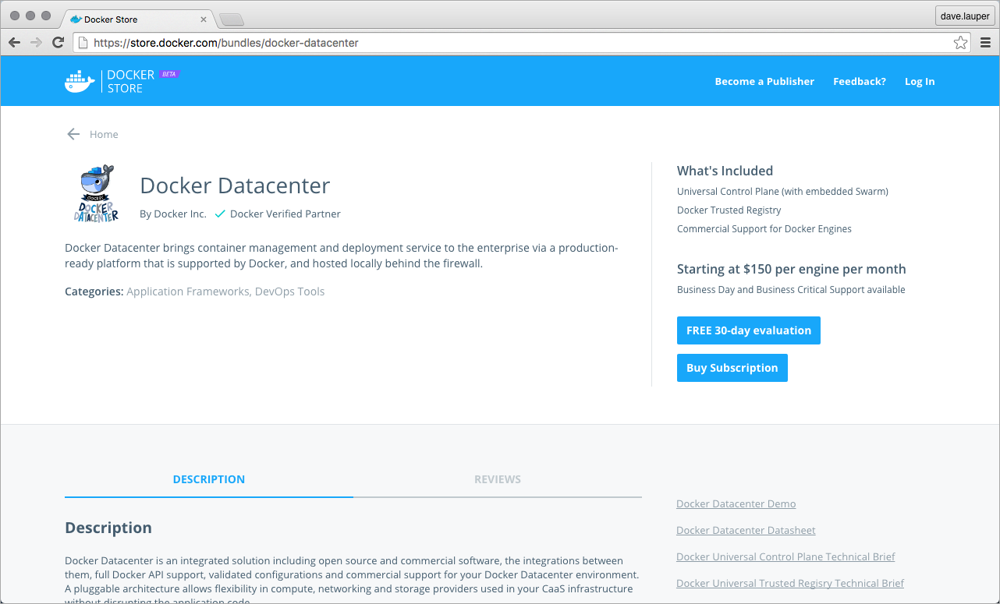
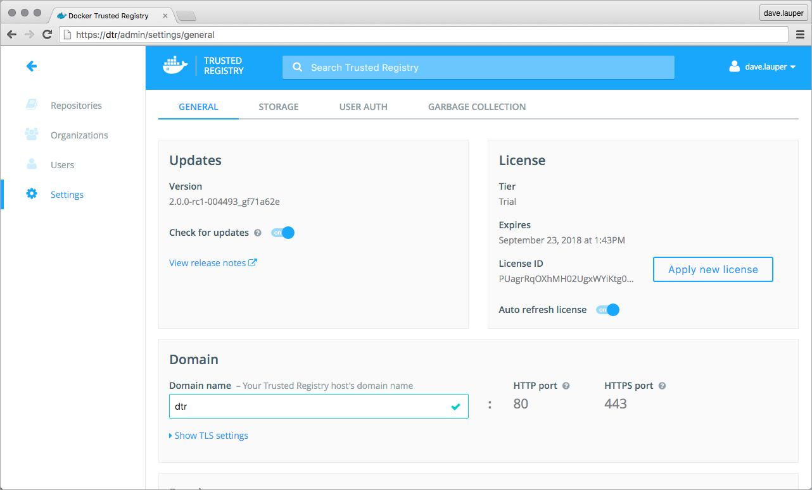

By default, you don't need to license your Docker Trusted Registry. When
installing DTR, it automatically starts using the same license file used on
your Docker Universal Control Plane cluster.

However, there are some situations when you need to manually license your
DTR installation:

* When upgrading to a new major version,
* When your current license expires.

## Download your license

Go to [Docker Store](https://store.docker.com/bundles/docker-datacenter) and
download your license.

## License your installation

Once you've downloaded the license file, you can apply it to your DTR
installation. Navigate to the **DTR web UI**, and then go to the **Settings
page**.

Click the **Apply new license** button, and upload your new license file.

## Where to go next

* [Install DTR](index.md)
* [Install DTR offline](install-dtr-offline.md)