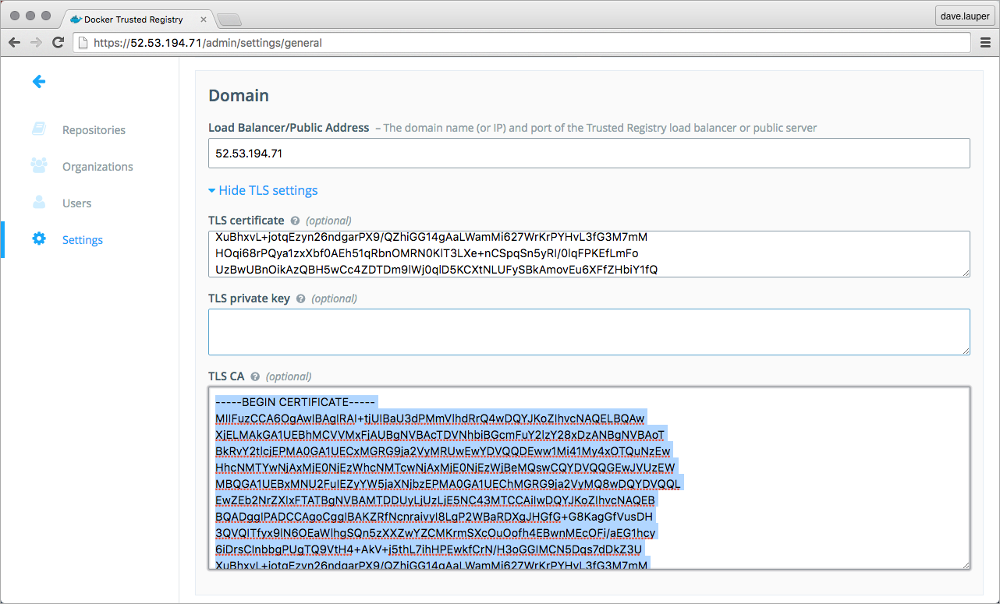
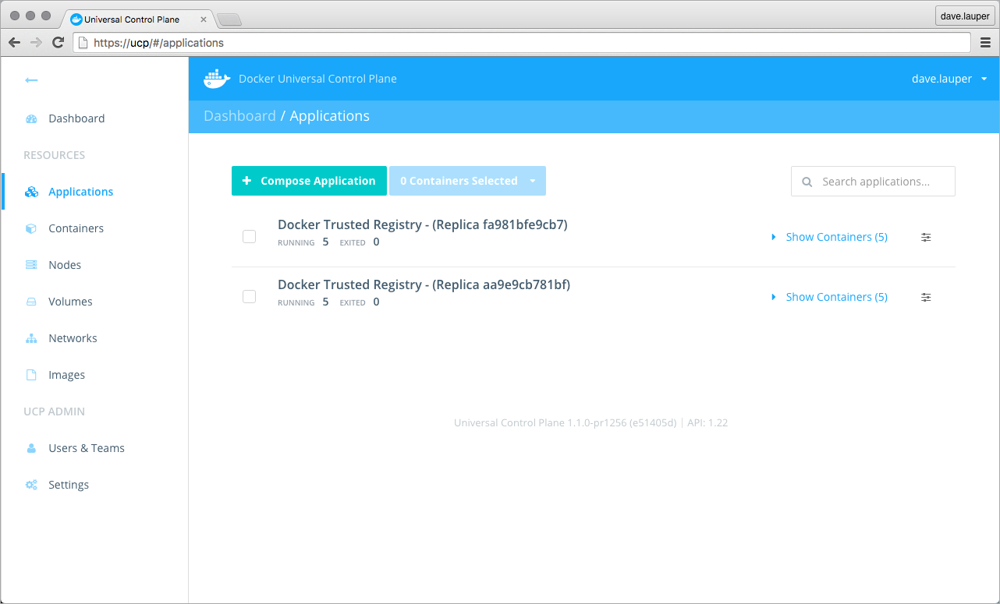

The first step in upgrading to Docker Trusted Registry (DTR) 2.0, is ensuring
you are running DTR 1.4.3. If that's not the case, start by upgrading your
installation to version 1.4.3, and then upgrade to DTR 2.0.

To upgrade from DTR 1.4.3 to 2.0 you first need to do a fresh installation of
DTR 2.0. Then you migrate the data from your DTR 1.4.3 installation to the 2.0
installation. Finally, you decommission your 1.4.3 by uninstalling it.

## Step 1. Upgrade DTR to 1.4.3

Make sure you're running DTR 1.4.3. If that's not the case, upgrade your
installation to the 1.4.3 version.

## Step 2. Install DTR 2.0

To upgrade to DTR 2.0, you first need to do a fresh installation of DTR 2.0.
This can be done on the same node where DTR 1.4.3 is already running or on a
new node.

If you decide to install the new DTR on the same node, you need
to install it on a port other than 443, since DTR 1.4.3 is already using it.
Use these instructions to install DTR 2.0:

* [Release notes](../../release-notes/index.md)
* [System requirements](../system-requirements.md)
* [DTR architecture](../../architecture.md)
* [Install DTR 2.0](../index.md)


## Step 3. Migrate metadata

Once you have your DTR 1.4.3 and the new DTR 2.0 running, you can migrate
configurations, accounts, and repository metadata from one installation to
another.

For this, you can use the `docker/dtr migrate` command. This command
migrates configurations, accounts, and repository metadata. It doesn't migrate
the images that are on the storage backend used by DTR 1.4.3.

Before running the migration, get the DTR 2.0 CA certificate used for the `--dtr-ca` parameter:

1. Log into the **DTR 2.0 web UI**, and navigate to the **Settings** screen.

2. In the **Domain** section, click the **Show TLS settings** link.

3. Copy the content of the **TLS CA** field.

    

To start the migration:

1.  Log into the host running DTR 1.4.3 using ssh.

2.  Use the docker/dtr migrate command.

    When you run the docker/dtr migrate command, Docker pulls the necessary
    images from Docker Hub. If the host where DTR 1.4.3 is not connected
    to the internet, you need to
    [download the images to the host](../install-dtr-offline.md).

    Then run the migrate command:

    ```bash
    # Get the certificates used by UCP
    $ curl https://$UCP_HOST/ca > ucpca.crt

    # Migrate configurations, accounts, and repository metadata
    docker run -it --rm \
      -v /var/run/docker.sock:/var/run/docker.sock \
      docker/dtr migrate \
      --ucp-url $UCP_HOST --ucp-ca "$(cat ucpca.crt)" \
      --dtr-external-url $DTR_HOST \
      --dtr-ca "$(cat dtrca.crt)"
    ```

## Step 4. Validate your configurations

After the migration finishes, test your DTR 2.0 installation to make sure it is
properly configured.
In your browser navigate to the DTR 2.0 **Settings page**, and check that DTR:

* Is correctly licensed,
* The storage backend is correctly configured,
* The user authentication method is correctly configured.

You need to manually configure the following settings:

* Domain name,
* Certificates.

You can find the certificates of DTR 1.4.3 under `/usr/local/etc/dtr/ssl`.

## Step 5. Transfer image data to DTR 2.0

If utilizing local filesystem storage, the image data is not copied during by
the migrate command and should be transferred manually.

To transfer the images:

1.  Log into the host running DTR 2.0 using ssh.

2.  Get the filesystem volume path DTR 2.0 stores images:

    ```bash
    $ docker volume inspect --format '{{ .Mountpoint }}' $(docker volume ls -q | grep dtr-registry)
    ```

    The path returned will be similar to: `/var/lib/docker/volumes/dtr-registry-fa61225dc006/_data`

3.  Log into the host running DTR 1.4.3 using ssh.

4.  Copy the image data:

    ```bash
    $ scp -r /var/local/dtr/image-storage/local/* $DTR_HOST:$DTR_2_FS_VOLUME_PATH
    ```

    For example:

    ```bash
    $ scp -r /var/local/dtr/image-storage/local/* \
      dtr2:/var/lib/docker/volumes/dtr-registry-4fb637dbbecc/_data/
    ```

## Step 6. Test your installation

Now that you have a working installation of DTR 2.0, you should test that you
can push and pull images to it.
[Learn how to push and pull images](../../repos-and-images/pull-an-image.md).

## Step 7. Join replicas to your cluster

This step is optional.

To set up DTR for [high availability](../../high-availability/index.md),
you can add more replicas to your DTR cluster. Adding more replicas allows you
to load-balance requests across all replicas, and keep DTR working if a
replica fails.

To add replicas to a DTR cluster, use the `docker/dtr join` command. To add
replicas:


1.  Load you UCP user bundle.

2.  Run the join command.

    When you join a replica to a DTR cluster, you need to specify the
    ID of a replica that is already part of the cluster. You can find an
    existing replica ID by going to the **Applications** page on UCP.

    Then run:

    ```bash
    # Get the certificates used by UCP
    $ curl -k https://$UCP_HOST/ca > ucp-ca.pem

    $ docker run -it --rm \
      docker/dtr join \
      --ucp-url $UCP_URL \
      --ucp-node $UCP_NODE \
      --existing-replica-id $REPLICA_TO_JOIN \
      --ucp-username $USER --ucp-password $PASSWORD \
      --ucp-ca "$(cat ucp-ca.pem)"
    ```

    Where:

    * ucp-url, is the URL of the UCP controller,
    * ucp-node, is the node on the ucp cluster where the DTR  replica will be installed,
    * existing-replica-id, is the ID of the DTR replica you want to replicate,
    * ucp-username, and ucp-password are the credentials of a UCP administrator,
    * ucp-ca, is the certificate used by UCP.

3.  Check that all replicas are running.

    In your browser, navigate to the Docker **Universal Control Plane**
    web UI, and navigate to the **Applications** screen. All replicas should
    be displayed.

    

4.  Follow steps 1 to 3, to add more replicas to the DTR cluster.

    When configuring your DTR cluster for high-availability, you should install
    3, 5, or 7 replicas.
    [Learn more about high availability](../../high-availability/index.md)

## Step 8. Decommission DTR 1.4.3

Once you've fully tested your new installation, you can uninstall DTR 1.4.3
by deleting `/usr/local/etc/dtr` and `/var/local/dtr` and removing all dtr
containers.

## Where to go next

* [Upgrade to DTR 2.x](index.md)
* [Monitor DTR](../../monitor-troubleshoot/index.md)
