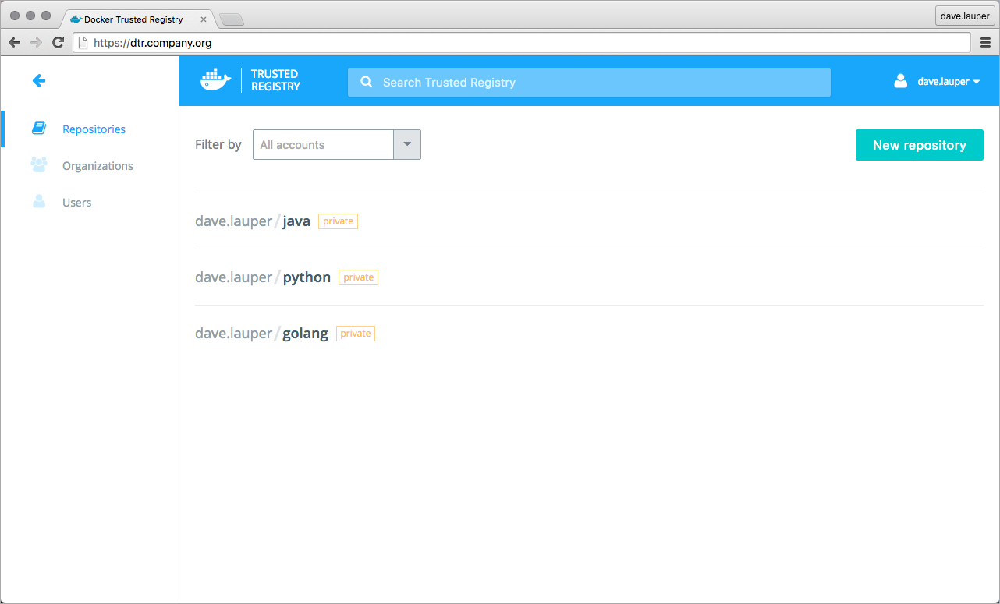
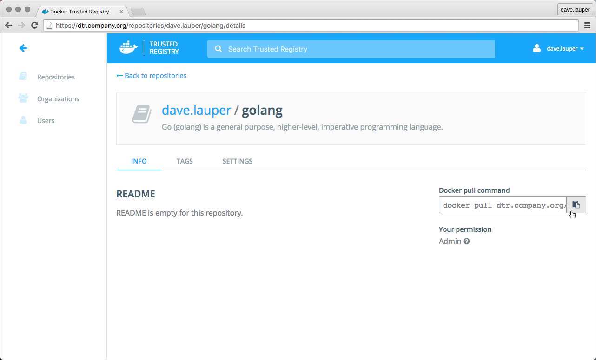

Pulling an image from Docker Trusted Registry is the same as pulling an image
from Docker Hub. Since DTR is secure by default, you always need to authenticate
before pulling images.

In this example, DTR can be accessed at dtr.company.org, and the user
was granted permissions to access the Java, Python, and Golang repositories.



Click on the repository to see its details.



To pull the 1.7 tag of the dave.lauper/golang image, run:

```bash
$ docker login dtr.company.org
$ docker pull dtr.company.org/dave.lauper/golang:1.7
```

## Where to go next

* [Push an image to DTR](push-an-image.md)
* [Configure your Docker Engine](index.md)