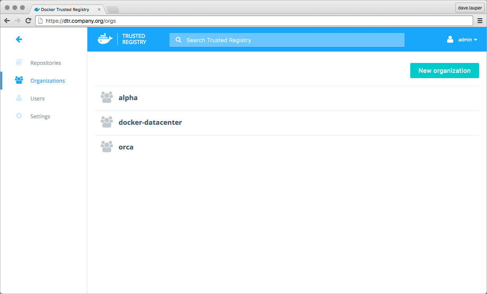
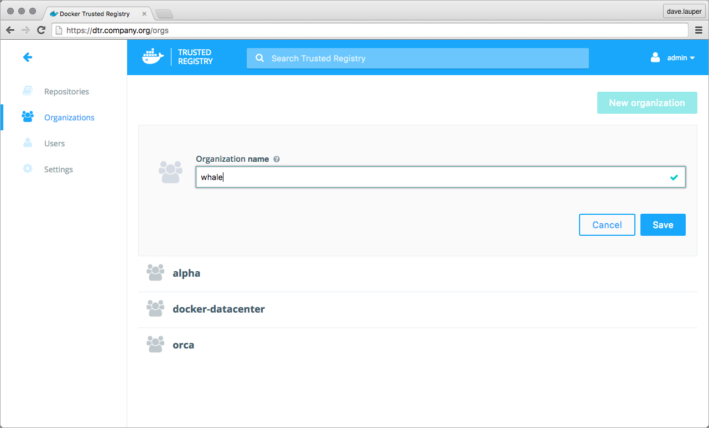
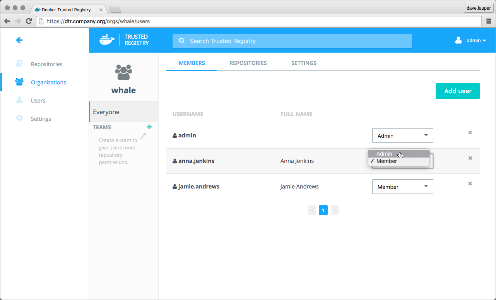

When a user creates a repository, only that user has permissions to make changes
to the repository.

For team workflows, where multiple users have permissions to manage a set of
common repositories, create an organization. By default, DTR has one organization
called 'docker-datacenter', that is shared between DTR and UCP.

To create a new organization, navigate to the **DTR web UI**, and go to the
**Organizations** page.



Click the **New organization** button, and choose a meaningful name for the
organization.



Repositories owned by this organization will contain the organization name, so
to pull an image from that repository, use:

```bash
$ docker pull <dtr-domain-name>/<organization>/<repository>:<tag>
```

Click **Save** to create the organization, and then **click the organization**
to define which users are allowed to manage this
organization. These users can edit the organization settings, edit
all repositories owned by the organization, and define the user permissions for
this organization.

For this, click the **Add user** button, **select the users** that you want to
grant permissions to manage the organization, and click
**Save**. Then change their permissions from 'Member' to **Admin**.



## Where to go next

* [Create and manage users](create-and-manage-users.md)
* [Create and manage teams](create-and-manage-teams.md)