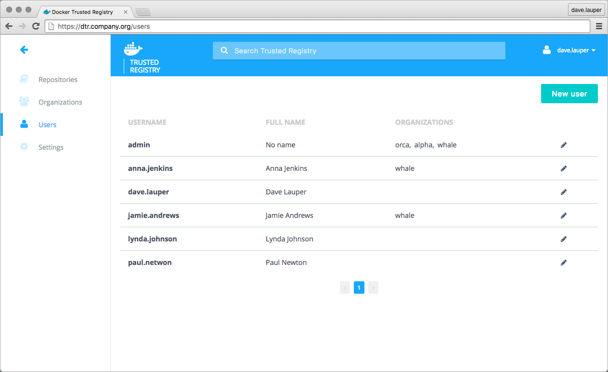
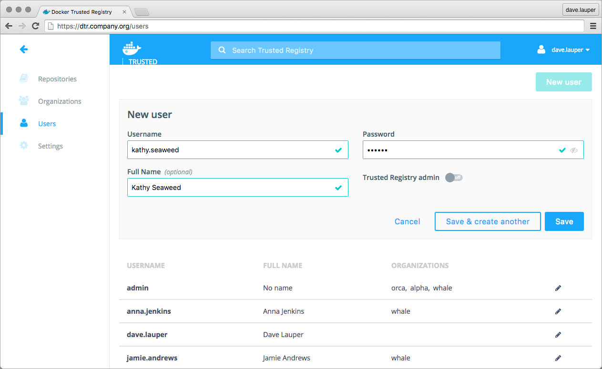

When using the Docker Datacenter built-in authentication, you can create users
to grant them fine-grained permissions.
Users are shared across Docker Datacenter. When you create a new user in
Docker Universal Control Plane, that user becomes available in DTR and vice
versa.

To create a new user, go to the **DTR web UI**, and navigate to the **Users**
page.

Click the **New user** button, and fill-in the user information.

Check the **Trusted Registry admin** option, if you want to grant permissions
for the user to change Docker Datacenter configurations.

## Where to go next

* [Create and manage organizations](create-and-manage-orgs.md)
* [Create and manage teams](create-and-manage-teams.md)