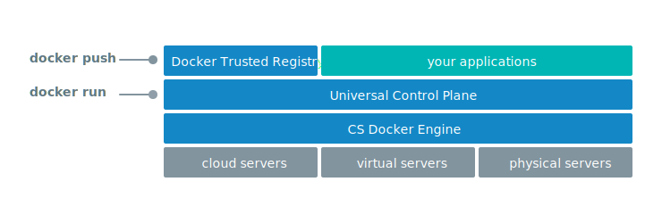
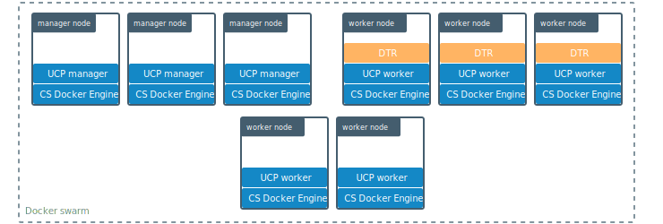
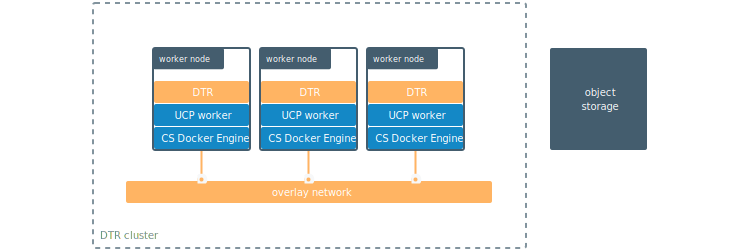
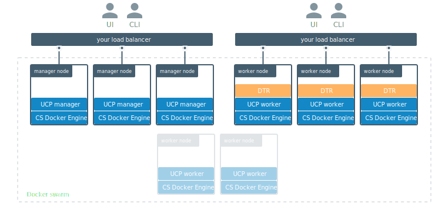

Docker Trusted Registry is a containerized application that runs on-premises
or on the cloud and allows you to store and manage your Docker images. It
needs to be deployed on a worker node managed by UCP.

Since DTR exposes the standard Docker API you can continue using the
Docker CLI client to push and pull images to DTR.
Universal Control Plane integrates out of the box with DTR so that you can
deploy services and applications to your UCP cluster, using the Docker images
you store in DTR.

## Under the hood

DTR needs to be deployed in a worker node managed by UCP.

For high-availability you can join multiple replicas to a DTR cluster.
[Learn more about high availability](high-availability/index.md).

## DTR internal components

When you install DTR on a node, the following containers are started:

| Name                                 | Description                                                                                                                        |
|:-------------------------------------|:-----------------------------------------------------------------------------------------------------------------------------------|
| dtr-api-&lt;replica_id&gt;           | Executes the DTR business logic. It serves the DTR web application, and API                                                        |
| dtr-etcd-&lt;replica_id&gt;          | A key-value store for persisting DTR configuration settings                                                                        |
| dtr-jobrunner-&lt;replica_id&gt;     | Runs cleanup jobs in the background                                                                                                |
| dtr-nginx-&lt;replica_id&gt;         | Receives http and https requests and proxies them to other DTR components. By default it listens to ports 80 and 443 of the host   |
| dtr-notary-server-&lt;replica_id&gt; | Receives, validates, and serves content trust metadata, and is consulted when pushing or pulling to DTR with content trust enabled |
| dtr-notary-signer-&lt;replica_id&gt; | Performs server-side timestamp and snapshot signing for content trust metadata                                                     |
| dtr-registry-&lt;replica_id&gt;      | Implements the functionality for pulling and pushing Docker images. It also handles how images are stored                          |
| dtr-rethinkdb-&lt;replica_id&gt;     | A database for persisting repository metadata                                                                                      |

All these components are for internal use of DTR. Don't use them in your applications.

## Volumes used by DTR

DTR uses these named volumes for persisting data:

| Volume name                         | Description                                                                      |
|:------------------------------------|:---------------------------------------------------------------------------------|
| dtr-ca-&lt;replica_id&gt;           | Root key material for the DTR root CA that issues certificates                   |
| dtr-etcd-&lt;replica_id&gt;         | DTR configuration data                                                           |
| dtr-notary-&lt;replica_id&gt;       | Certificate and keys for the Notary components                                   |
| dtr-registry-&lt;replica_id&gt;     | Docker images data, if DTR is configured to store images on the local filesystem |
| dtr-rethink-&lt;replica_id&gt;      | Repository metadata                                                              |
| dtr-nfs-registry-&lt;replica_id&gt; | Docker images data, if DTR is configured to store images on NFS                  |

You can customize the volume driver used for these volumes, by creating the
volumes before installing DTR. During the installation, DTR checks which volumes
don't exist in the node, and creates them using the default volume driver.

By default, the data for these volumes can be found at
`/var/lib/docker/volumes/<volume-name>/_data`.

## Networks used by DTR

To allow containers to communicate, when installing DTR the following networks
are created:

| Name   | Type    | Description                                                                            |
|:-------|:--------|:---------------------------------------------------------------------------------------|
| dtr-br | bridge  | Allows DTR components on the same node to communicate with each other in a secure way  |
| dtr-ol | overlay | Allows DTR components running on different nodes to communicate, to replicate DTR data |

## Where DTR stores images

By default, Docker Trusted Registry stores images on the filesystem of the node
where it is running, but you can configure it to use an external storage system.

You can also configure DTR to use these storage backends:

* NFS
* Amazon S3
* Cleversafe
* OpenStack Swift
* Microsoft Azure

For highly available installations, you should use a cloud storage system
instead of an NFS mount, since they usually have better performance.

## How you interact with DTR

Since DTR exposes the standard Docker API you can continue using the
Docker CLI client to push and pull images to DTR.

Universal Control Plane integrates out of the box with DTR so that you can
deploy services and applications to your UCP cluster, using the Docker images
you store in DTR.

## Where to go next

* [System requirements](install/system-requirements.md)
* [Install DTR](install/index.md)
