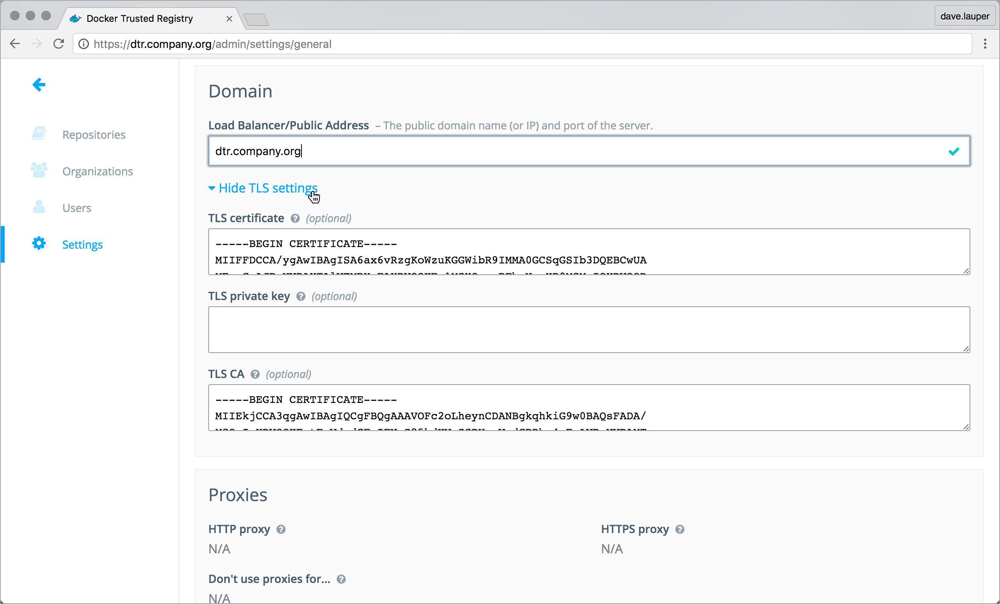

By default the DTR services are exposed using HTTPS, to ensure all
communications between clients and DTR is encrypted. Since DTR
replicas use self-signed certificates for this, when a client accesses
DTR, their browsers don't trust this certificate, so the browser displays a
warning message.

You can configure DTR to use your own certificates, so that it is automatically
trusted by your users' browser and client tools.

## Replace the server certificates

To configure DTR to use your own certificates and keys, go to the
**DTR web UI**, navigate to the **Settings** page, and scroll down to the
**Domain** section.

Set the DTR domain name and upload the certificates and key:

* Load balancer/public address, is the domain name clients will use to access DTR.
* TLS certificate, is the server certificate and any intermediate CA public
certificates. This certificate needs to be valid for the DTR public address,
and have SANs for all addresses used to reach the DTR replicas, including load
balancers.
* TLS private key is the server private key.
* TLS CA is the root CA public certificate.

Finally, click **Save** for the changes to take effect.

If you're using certificates issued by a globally trusted certificate authority,
any web browser or client tool should now trust DTR. If you're using an internal
certificate authority, you need to [configure your system to trust that
certificate authority](../repos-and-images/index.md).

## Where to go next

* [Configure your Docker Engine](../repos-and-images/index.md)
* [Pull an image](../repos-and-images/pull-an-image.md)
