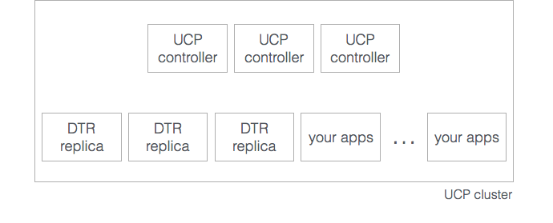

Docker Trusted Registry (DTR) is designed for high availability.

When you first install DTR, you create a cluster with a single DTR replica.
Replicas are single instances of DTR that can be joined together to form a
cluster.
When joining new replicas to the cluster, you create new DTR instances
that are running the same set of services. Any change to the state of an
instance is replicated across all other instances.

Having a DTR cluster with multiple replicas, allows you to:

* Load-balance user requests across the DTR replicas,
* Keep the DTR cluster working if a replica fails.

To make a DTR installation tolerant to failures, add additional replicas to
the DTR cluster.

| DTR replicas | Failures tolerated |
|:------------:|:------------------:|
|      1       |         0          |
|      3       |         1          |
|      5       |         2          |
|      7       |         3          |

When sizing your DTR installation for high-availability,
follow these rules of thumb:

* Don't create a DTR cluster with an even number replicas. Your cluster
won't tolerate any failures if the cluster splits in half. This is
very difficult to recover from.
* When a replica fails, the number of failures tolerated by your cluster
decreases. Don't leave that replica offline for long.
* When you want to fix your DTR cluster, make certain that you remove any
broken replicas before you try to add a new replica.  The DTR bootstrapper
will try to prevent you from doing this, as it could lead to multiple
failed nodes and failure of the entire DTR cluster.
* Adding too many replicas to the cluster might also lead to performance
degradation, as data needs to be replicated across all replicas.

## Size your cluster

When installing DTR for production, you should have dedicated nodes for running:

* Docker Universal Control Plane (UCP) controller nodes,
* DTR replicas,
* Your own applications.

Having dedicated nodes ensures all applications will remain performant since
they have dedicated resources for them.
It also makes it easier to implement backup policies and disaster recovery
plans for UCP and DTR.

To have high-availability on UCP and DTR, you need a minimum of:

* 3 dedicated nodes to install UCP with high availability,
* 3 dedicated nodes to install DTR with high availability,
* As many nodes as you want for running your containers and applications.

## Storage considerations

DTR does not provide clustering for the storage which underlies your image
repositories.  In order for DTR to work correctly in HA mode, you will either
need to use object storage or NFS.

Supported object stores include:

* AWS S3
* Azure Cloud Storage
* OpenStack Swift
* Google Cloud Storage
* S3 Compatible storage (Scality, Minio, etc.)

Object storage can be configured directly through the Admin screen in the
DTR UI, and NFS can be configured during installation through the CLI.

## Load balancing

DTR does not provide a load balancing service. You can use an on-premises
or cloud-based load balancer to balance requests across multiple DTR replicas.

Make sure you configure your load balancer to:

* Load-balance TCP traffic on ports 80 and 443,
* Not terminate HTTPS connections,
* Use the `/health` endpoint on each DTR replica, to check if
the replica is healthy and if it should remain on the load balancing pool or
not.

## Where to go next

* [Backups and disaster recovery](backups-and-disaster-recovery.md)
* [DTR architecture](../architecture.md)
