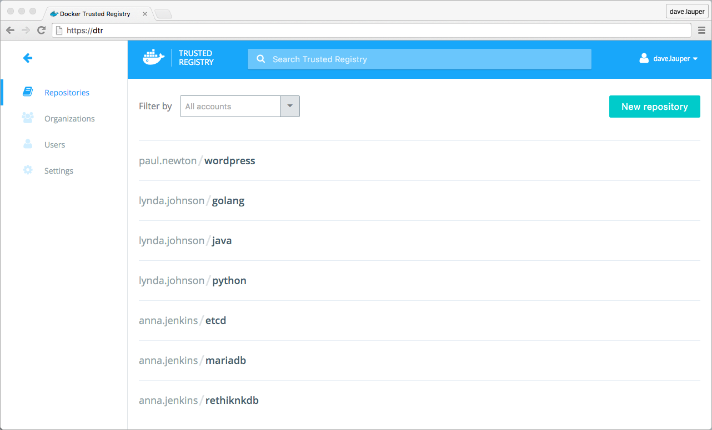
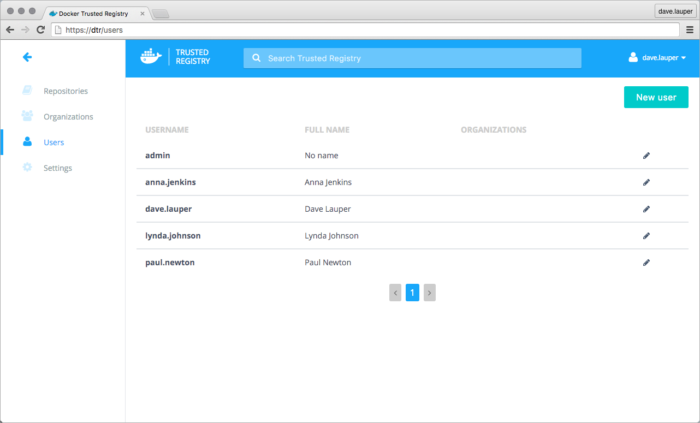

Docker Trusted Registry (DTR) is the enterprise-grade image storage solution
from Docker. You install it behind your firewall so that you can securely store
and manage the Docker images you use in your applications.

## Image management

Docker Trusted Registry can be installed on-premises, or on a virtual private
cloud. And with it, you can store your Docker images securely, behind your
firewall.

You can use DTR as part of your continuous integration, and continuous
delivery processes to build, run, and ship your applications.

## Built-in security and access control

DTR uses the same authentication mechanism as Docker Universal Control Plane.
It has a built-in authentication mechanism, and also integrates with LDAP
and Active Directory. It also supports Role Based Access Control (RBAC).

This allows you to implement fine-grain access control policies on who has
access to your Docker images.

## Where to go next

* [DTR architecture](architecture.md)
* [Install DTR](install/index.md)
