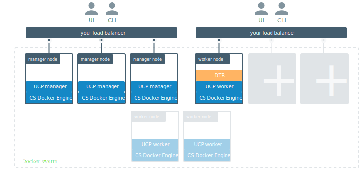

Docker Trusted Registry is designed to scale horizontally as your usage
increases. You can add or remove replicas to make DTR scale to your needs
or for high availability.



To set up DTR for [high availability](../high-availability/index.md),
you can add more replicas to your DTR cluster. Adding more replicas allows you
to load-balance requests across all replicas, and keep DTR working if a
replica fails.

For high-availability you should set 3, 5, or 7 DTR replicas. The nodes where
you're going to install these replicas also need to be managed by UCP.

## Join more DTR replicas

To add replicas to an existing DTR deployment:

1. Use ssh to log into a node that is already part of UCP.

2.  Run the DTR join command:

    ```none
    docker run -it --rm \
      docker/dtr join \
      --ucp-node <ucp-node-name> \
      --ucp-insecure-tls
    ```

    Where the `--ucp-node` is the hostname of the UCP node where you want to
    deploy the DTR replica. `--ucp-insecure-tls` tells the command to trust the
    certificates used by UCP.

3. If you have a load balancer, add this DTR replica to the load balancing pool.

## Remove existing replicas

To remove a DTR replica from your deployment:

1. Use ssh to log into a node that is already part of UCP.
2.  Run the DTR remove command:

```none
docker run -it --rm \
  docker/dtr remove \
  --ucp-insecure-tls
```

You will be prompted for:

* Existing replica id: the id of any healthy DTR replica of that cluster
* Replica id: the id of the DTR replica you want to remove. It can be the id of an
unhealthy replica
* UCP username and password: the administrator credentials for UCP

If you're load-balancing user requests across multiple DTR replicas, don't
forget to remove this replica from the load balancing pool.

## Where to go next

* [Install DTR](index.md)
* [Uninstall DTR](uninstall.md)
