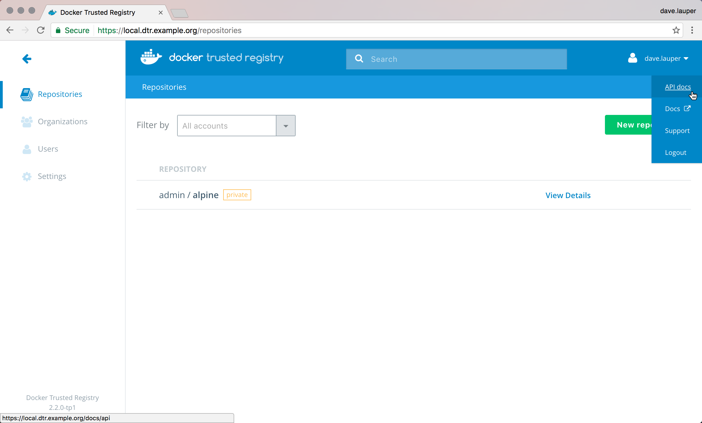
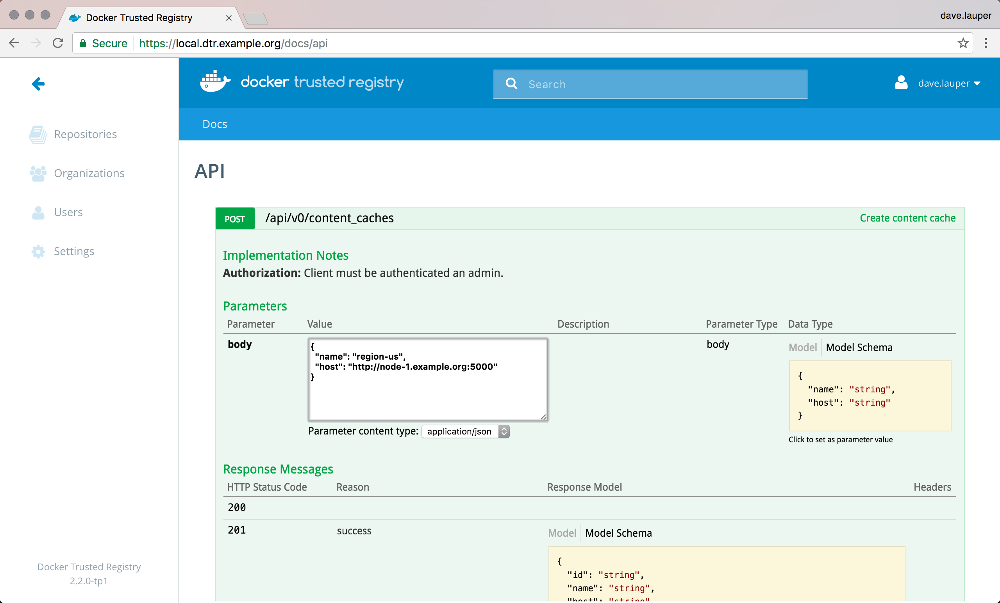
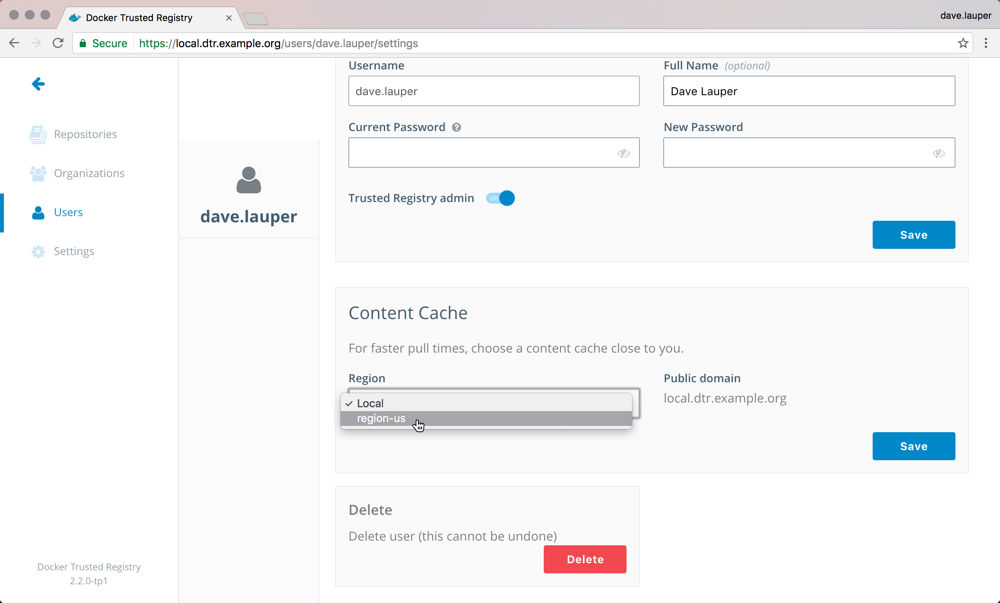

## What is Docker Content Cache

Docker Content Cache is a service that is deployed separately from DTR, and
can be configured to securely cache images from DTR. Users can configure
their DTR user accounts to specify which cache to pull from. Then, when a
user pulls from DTR, they will be redirected to pull from their chosen
Content Cache. By deploying caches geographically closer to remote offices
and low connectivity areas, users can benefit from faster pulls.

## Authentication and Freshness

Pulling from Content Cache still enforces authentication, ensuring that
images users don't have access to on DTR remain protected on the cache.
In addition, pulling by tag still guarantees freshness of the image as DTR
remains the source of truth for image manifests, avoiding problems with
stale images.

## Cache Chaining

Here is an example of a DTR deployed with several Docker Content Caches.


Content Caches can be a cache for DTR and other caches, allowing for
chained cache topologies like the one you see above.

When a user pulls from DTR, the request is redirected to a specific cache,
and then the image is pulled through a route connected through its
intermediaries, caching the image at each hop. Requests for the same image
that redirect to a different cache but shares intermediate caches now
benefit from warm caches.

However, there are caveats associated with this. You should avoid creating
a topology that has chained caches of more than two levels as the total
round trip time between the caches may become higher than the time saved
from caching the image.

## How it works

After you've deployed the caches, user can configure which cache to
pull from on their DTR user settings page. Then, when using the
`docker pull <dtr-url>/<org>/<repository>` command to pull an image, the
following happens:

1. The Docker client makes a request to DTR which in turn authenticates the
request
2. The Docker client requests the image manifest to DTR. This ensures that
users will always pull the correct image, and not an outdated version
3. The Docker client requests the layer blobs to DTR, which becomes signed
and redirected to the cache configured by the user
4. If the blob exists on the cache it is sent to the user. Otherwise, the cache
pulls it from DTR and sends it to the user

When a user pushes an image, that image is only available in DTR. A cache
will only store the image when a user tries to pull the image using that cache.

## Configure the cache

Docker Content Cache is based on Docker Registry, and uses the same configuration
file format.
[Learn more about the configuration options](/registry/configuration.md).

The DTR cache extends the Docker Registry configuration file format by
introducing a new middleware called `downstream` that has three configuration
options: `blobttl`, `upstreams`, and `cas`:

```none
# Settings that you would include in a
# Docker Registry configuration file followed by

middleware:
  registry:
      - name: downstream
        options:
          blobttl: 24h
          upstreams:
            - originhost: <Externally-reachable address for the origin registry>
              upstreamhosts:
                - <Externally-reachable address for upstream content cache A>
                - <Externally-reachable address for upstream content cache B>
          cas:
            - <Absolute path to upstream content cache A certificate>
            - <Absolute path to upstream content cache B certificate>
```

Below you can find the description for each Content Cache parameter.

<table>
  <tr>
    <th>Parameter</th>
    <th>Required</th>
    <th>Description</th>
  </tr>
  <tr>
    <td>
      <code>blobttl</code>
    </td>
    <td>
      no
    </td>
    <td>
The TTL for blobs in the cache. This field takes a positive integer and an optional suffix indicating the unit of time. If
this field is configured, "storage.delete.enabled" must be configured to true. Possible units are:
      <ul>
        <li><code>ns</code> (nanoseconds)</li>
        <li><code>us</code> (microseconds)</li>
        <li><code>ms</code> (milliseconds)</li>
        <li><code>s</code> (seconds)</li>
        <li><code>m</code> (minutes)</li>
        <li><code>h</code> (hours)</li>
      </ul>
    If you omit the suffix, the system interprets the value as nanoseconds.
    </td>
  </tr>
  <tr>
    <td>
      <code>cas</code>
    </td>
    <td>
      no
    </td>
    <td>
      A list of absolute paths to PEM-encoded CA certificates of upstream registries.
    </td>
  </tr>
<tr>
  <td>
    <code>originhost</code>
  </td>
  <td>
    yes
  </td>
  <td>
      An externally-reachable address for the origin registry, as a fully qualified URL.
  </td>
</tr>
<tr>
  <td>
    <code>upstreamhosts</code>
  </td>
  <td>
    no
  </td>
  <td>
    A list of externally-reachable addresses for upstream registries for cache chaining. If more than one host is specified, pulls from upstream content caches will be done in round-robin order.
  </td>
</tr>
</table>

## Deploying a simple Docker Content Cache

You can deploy a Docker Content Cache on any host that has Docker installed.
The only requirements are that:

* Users need to have access to both DTR and the cache
* The cache needs access to DTR

On the host where the cache will be deployed, create a `config.yml` file with
the following content:

```
version: 0.1
storage:
  delete:
    enabled: true
  filesystem:
    rootdirectory: /var/lib/registry
http:
  addr: :5000
middleware:
  registry:
      - name: downstream
        options:
          blobttl: 24h
          upstreams:
            - originhost: https://<dtr-url>
          cas:
            - /certs/dtr-ca.pem
```

This configures the cache to store the images in the directory
`/var/lib/registry`, exposes the cache service on port 5000, and configures the
cache to delete images that are not pulled in the last 24 hours. It also
defines where DTR can be reached, and which CA certificates should be trusted.

Now we need to download the CA certificate used by DTR. For this, run:

```
curl -k https://<dtr-url>/ca > dtr-ca.pem
```

Now that we've got the cache configuration file and DTR CA certificate, we can
deploy the cache by running:

```none
docker run --detach --restart always \
  --name content-cache \
  --publish 5000:5000 \
  --volume $(pwd)/dtr-ca.pem:/certs/dtr-ca.pem \
  --volume $(pwd)/config.yml:/config.yml \
  docker/dtr-content-cache:<version> /config.yml
```

You can also run the command in interactive mode instead of detached by
replacing `--detached` with `--interactive`. This allows you to
see the logs generated by the container and troubleshoot misconfigurations.

Now that you've deployed a cache, you need to configure DTR to know about it.
This is done using the `POST /api/v0/content_caches` API. You can use the
DTR interactive API documentation to use this API.

In the DTR web UI, click the top-right menu, and choose **API docs**.

{: .with-border}

Navigate to the `POST /api/v0/content_caches` line and click it to expand.
In the **body** field include:

```
{
  "name": "region-us",
  "host": "http://<cache-public-ip>:5000"
}
```

Click the **Try it out!** button to make the API call.

{: .with-border}

Now that DTR knows about the cache we've created, we just need to configure
our DTR user settings to start using that cache.

In the DTR web UI, navigate to your **user profile**, click the **Settings**
tab, and change the **Content Cache** settings to use the **region-us** cache.

{: .with-border}

Now when you pull images, you'll be using the cache. To test this, try pulling
an image from DTR. You can inspect the logs of the cache service, to validate
that the cache is being used, and troubleshoot problems.

In the host where you've deployed the `region-us` cache, run:

```
docker logs content-cache
```

## Deploying a Docker Content Cache with TLS

In the previous step, we deployed Content Cache without TLS. While this is
useful for testing, in production we will want to encrypt our connections with
TLS.

### Configuring TLS

The configuration options for TLS is same as Docker Registry. [Learn more from
the registry TLS docs](/registry/configuration.md#tls).

Following the same instructions as the simple deployment, create a `config.yml`
file with the following contents:

```
version: 0.1
storage:
  delete:
    enabled: true
  filesystem:
    rootdirectory: /var/lib/registry
http:
  addr: :5000
  tls:
    certificate: /certs/content-cache-ca.pem
    key: /certs/content-cache-key.pem
middleware:
  registry:
      - name: downstream
        options:
          blobttl: 24h
          upstreams:
            - originhost: https://<dtr-url>
          cas:
            - /certs/dtr-ca.pem
```

And assuming that you have a certificate at `/certs/content-cache.crt` and key
at `/certs/content-cache.key` mounted on the Content Cache container, it will
be now serving only HTTPS requests.

### Let's Encrypt

Content Cache also supports using Let's Encrypt to automatically obtain a
browser-trusted certificate.  For more information on Let's Encrypt, see
[https://letsencrypt.org/how-it-works/](https://letsencrypt.org/how-it-works/)
and the relevant section of the [registry configuration](/registry/configuration.md#letsencrypt).

### Alternatives

While rarely advisable, you may want to use self-signed certificates instead,
or use your Content Cache in an insecure fashion. You will find instructions
[here](/registry/insecure.md).

## Deploying a chained Docker Content Caches with TLS

If you have geographically distributed set of users, you can consider chaining
Content Caches to increase pull speeds. There's no golden rule in deploying
a Content Cache for any use case, so it's always best to benchmark the pull
times in order to figure out the right configuration.

> **Warning**: Too many levels of chaining may end up hurting your pull time
if the round trip times add up to more than the time you saved by caching.

### Configuring chaining

When deploying each Content Cache, you have to configure it considering the
next hop in the overall topology. In this example, we will deploy two Content
Caches; `san-francisco` and `los-angeles`. `san-francisco` will be pulling
directly from DTR, and `los-angeles` will pull from `san-francisco`.

### Deploying `san-francisco`

Following the same instructions as the simple deployment, create a `config.yml`
file with the following contents:

```
version: 0.1
storage:
  delete:
    enabled: true
  filesystem:
    rootdirectory: /var/lib/registry
http:
  addr: :5000
  tls:
    certificate: /certs/san-francisco-ca.pem
    key: /certs/san-francisco-key.pem
middleware:
  registry:
      - name: downstream
        options:
          blobttl: 24h
          upstreams:
            - originhost: https://<dtr-url>
          cas:
            - /certs/dtr-ca.pem
```

### Deploying `los-angeles`

Following the same instructions as the simple deployment, create a `config.yml`
file with the following contents:

```
version: 0.1
storage:
  delete:
    enabled: true
  filesystem:
    rootdirectory: /var/lib/registry
http:
  addr: :5000
  tls:
    certificate: /certs/los-angeles-ca.pem
    key: /certs/los-angeles-key.pem
middleware:
  registry:
      - name: downstream
        options:
          blobttl: 24h
          upstreams:
            - originhost: https://<dtr-url>
              upstreamhosts:
                - https://<san-francisco-url>
          cas:
            - /certs/san-francisco-ca.pem
```

> **Gotcha**: Since `los-angeles` Content Cache does not need to talk to
DTR directly, it only has to trust the CA certificates of its next hop,
i.e. `san-francisco` Content Cache's CA certificate.
