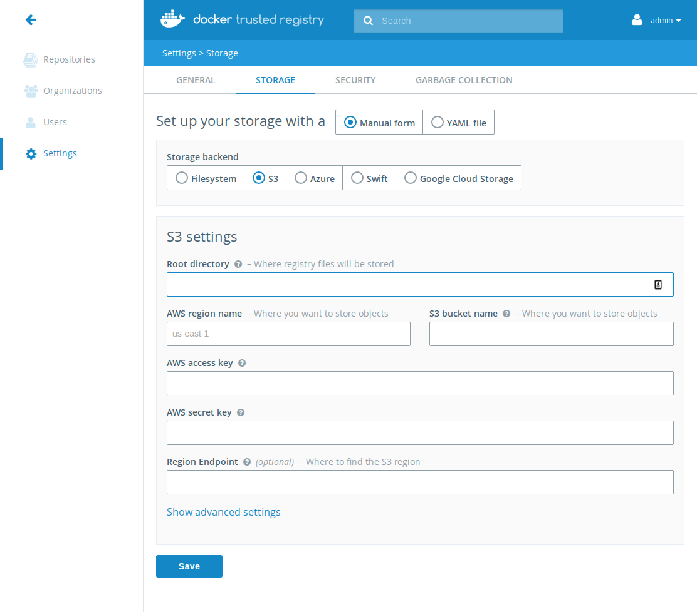

DTR supports AWS S3 to store your images, plus other file servers that have an
S3 compatible API such as Minio.  Other blobstores that are S3 compatible
generally use the same terminology, though setup may be slightly different.

### About S3

S3 stores data as objects within “buckets” where you read, write, and delete
objects in that bucket.  All read and write operations will be sent to S3 (or
your S3-compatible server), ensuring availability and durability of your images.

### Configuring S3 itself

This section deals with creating and configuring bucket policies within AWS; if
you're using an S3-compatible server you may skip this section.

Prior to configuring DTR you need to make a "bucket" within S3.  Buckets are
uniquely named containers in which S3 stores files.

You must:

1. Create a bucket within S3, choosing a region which is closest to your DTR
2. Note the bucket and region name for configuring DTR

You then need to configure authorization for your bucket.  You can choose to use
an [access and secret key combination](
http://docs.aws.amazon.com/general/latest/gr/managing-aws-access-keys.html) for
the entirety of DTR (simple, but potentially less secure) or configure an [IAM
policy for the bucket and DTR](
http://docs.aws.amazon.com/AmazonS3/latest/dev/example-policies-s3.html) (more
complex to configure but also more secure, as access is restricted to only the
bucket).

If using an access key and secret key you should copy these and begin
configuring your storage settings within DTR

**Creating an IAM policy for your bucket**

You can set a policy through your AWS console to manage permissions for DTR.
For more information about setting IAM policies using the command line or the
console, review the AWS [Overview of IAM Policies](
http://docs.aws.amazon.com/IAM/latest/UserGuide/access_policies.html) article
or visit the console Policies page.

The following example describes the minimum permissions set which allows
Trusted Registry users to access, push, pull, and delete images.

```json
{
    "Version": "2012-10-17",
    "Statement": [
        {
            "Effect": "Allow",
            "Action": "s3:ListAllMyBuckets",
            "Resource": "arn:aws:s3:::*"
        },
        {
            "Effect": "Allow",
            "Action": [
                "s3:ListBucket",
                "s3:GetBucketLocation"
            ],
            "Resource": "arn:aws:s3:::<INSERT YOUR BUCKET HERE>"
        },
        {
            "Effect": "Allow",
            "Action": [
                "s3:PutObject",
                "s3:GetObject",
                "s3:DeleteObject"
            ],
            "Resource": "arn:aws:s3:::<INSERT YOUR BUCKET HERE>/*"
        }
    ]
}

```

To set a policy through the AWS command line, save the policy into a file,
for example `TrustedRegistryUserPerms.json`, and pass it to the
put-user-policy AWS command:

```
$ aws iam put-user-policy --user-name MyUser --policy-name TrustedRegistryUserPerms --policy-document file://C:\Temp\TrustedRegistryUserPerms.json
```

You can also save this policy using the AWS console online.


### Configuring your storage settings 

To configure your storage settings you must be a DTR administrator, and you must
have a bucket created within S3 with the 

You first need to create a bucket within Amazon S3

1. First navigate to the storage settings tab, within "settings"
2. Choose "S3" from the storage list (even when using an S3-compatible backend):
   {: .with-border}
3. Fill out the form using your bucket name, region, and optionally access keys.
   If you're using an IAM policy the secret key and access key can be
   left blank.  Also, when using an S3-compatible server these are likely your
   username and password.
4. If using an S3 compatible server, change the region endpoint to the URL of
   your server
5. Within "Advanced Settings" you can choose to use V4 auth and HTTPS.  By
   default HTTPS is on and V4 auth is off.

When hitting "Save" DTR validates that it can read and write to your new
settings and saves them once validated.
