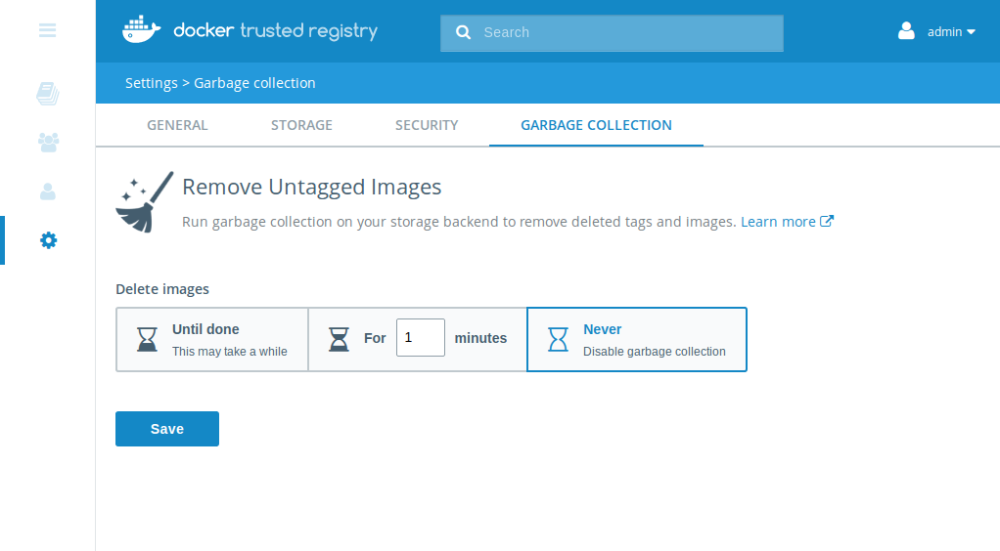
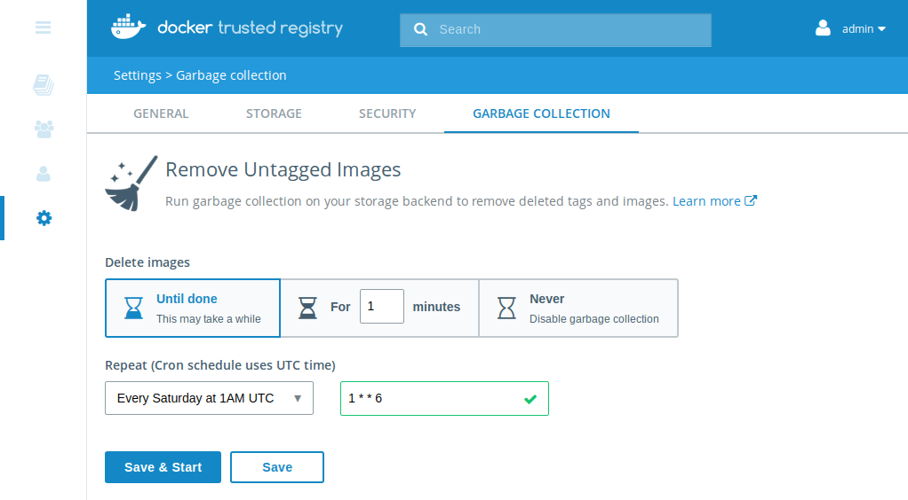
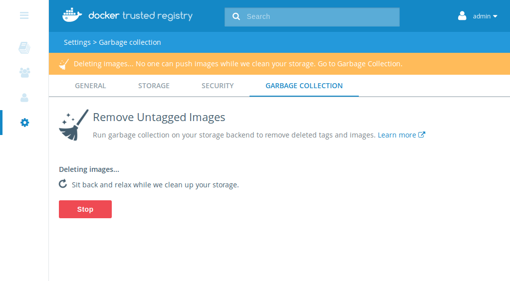

#### TL;DR

1. Garbage Collection (GC) reclaims disk space from your storage by deleting
unused layers
2. GC can be configured to run automatically with a cron schedule, and can also
be run manually. Only admins can configure these
3. When GC runs DTR will be placed in read-only mode. Pulls will work but
pushes will fail
4. The UI will show when GC is running, and an admin can stop GC within the UI

**Important notes**

The GC cron schedule is set to run in **UTC time**. Containers typically run in
UTC time (unless the system time is mounted), therefore remember that the cron
schedule will run based off of UTC time when configuring.

GC puts DTR into read-only mode; pulls succeed while pushes fail. Pushing an
image while GC runs may lead to undefined behavior and data loss, therefore
this is disabled for safety. For this reason, it's generally best practice to
ensure GC runs in the early morning on a Saturday or Sunday night.

## Setting up garbage collection

You can set up GC if you're an admin by hitting "Settings" in the UI then
choosing "Garbage Collection". By default, GC will be disabled, showing this
screen:

{: .with-border}

Here you can configure GC to run **until it's done** or **with a timeout**.
The timeout ensures that your registry will be in read-only mode for a maximum
amount of time.

Select an option (either "Until done" or "For N minutes") and you have the
option to configure GC to run via a cron job, with several default crons
provided:

{: .with-border}

You can also choose "Do not repeat" to disable the cron schedule entirely.

Once the cron schedule has been configured (or disabled), you have the option to
the schedule ("Save") or save the schedule *and* start GC immediately ("Save
&amp; Start").

## Stopping GC while it's running

When GC runs the garbage collection, the settings page looks as follows:

{: .with-border}

Note the global banner visible to all users, ensuring everyone knows that GC is
running.

An admin can stop the current GC process by hitting "Stop". This safely shuts
down the running GC job and moves the registry into read-write mode, ensuring
pushes work as expected.

## How does garbage collection work?

### Background: how images are stored

Each image stored in DTR is made up of multiple files:

- A list of "layers", which represent the image's filesystem
- The "config" file, which dictates the OS, architecture, and other image
metadata
- The "manifest", which is pulled first and lists all layers and the config file
for the image.

All of these files are stored in a content-addressable manner. We take the
sha256 hash of the file's content and use the hash as the filename. This means
that if tag `example.com/user/blog:1.11.0` and `example.com/user/blog:latest`
use the same layers we only store them once.

### How this impacts GC

Let's continue from the above example, where `example.com/user/blog:latest` and
`example.com/user/blog:1.11.0` point to the same image and use the same layers.
If we delete `example.com/user/blog:latest` but *not*
`example.com/user/blog:1.11.0` we expect that `example.com/user/blog:1.11.0`
can still be pulled.

This means that we can't delete layers when tags or manifests are deleted.
Instead, we need to pause writing and take reference counts to see how many
times a file is used. If the file is never used only then is it safe to delete.

This is the basis of our "mark and sweep" collection:

1. Iterate over all manifests in registry and record all files that are
referenced
2. Iterate over all file stored and check if the file is referenced by any
manifest
3. If the file is *not* referenced, delete it
