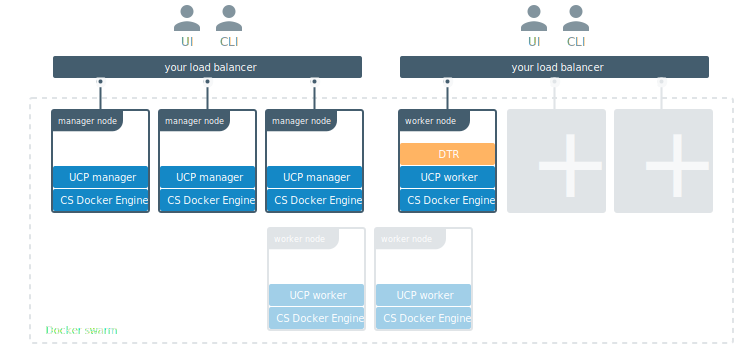

Once you’ve joined multiple DTR replicas nodes for
[high-availability](set-up-high-availability.md), you can configure your own
load balancer to balance user requests across all replicas.




This allows users to access DTR using a centralized domain name. If a replica
goes down, the load balancer can detect that and stop forwarding requests to
it, so that the failure goes unnoticed by users.

## Load balancing DTR

DTR does not provide a load balancing service. You can use an on-premises
or cloud-based load balancer to balance requests across multiple DTR replicas.

Make sure you configure your load balancer to:

* Load balance TCP traffic on ports 80 and 443
* Not terminate HTTPS connections
* Use the unauthenticated `/health` endpoint (note the lack of an `/api/v0/` in
the path) on each DTR replica, to check if the replica is healthy and if it
should remain in the load balancing pool or not

## Health check endpoints

The `/health` endpoint returns a JSON object for the replica being queried of
the form:

```json
{
  "Error": "error message",
  "Health": true
}
```

A response of `"Healthy": true` means the replica is suitable for taking
requests. It is also sufficient to check whether the HTTP status code is 200.

An unhealthy replica will return 503 as the status code and populate `"Error"`
with more details on any one of these services:

* Storage container (registry)
* Authorization (garant)
* Metadata persistence (rethinkdb)
* Content trust (notary)

Note that this endpoint is for checking the health of a *single* replica. To get
the health of every replica in a cluster, querying each replica individiually is
the preferred way to do it in real time.

The `/api/v0/meta/cluster_status`
[endpoint](https://docs.docker.com/datacenter/dtr/2.2/reference/api/)
returns a JSON object for the entire cluster *as observed* by the replica being
queried, and it takes the form:

```json
{
  "replica_health": {
    "replica id": "OK",
    "another replica id": "error message"
  },
  "replica_timestamp": {
    "replica id": "2006-01-02T15:04:05Z07:00",
    "another replica id": "2006-01-02T15:04:05Z07:00"
  },
  // other fields
}
}
```

Health statuses for the replicas is available in the `"replica_health"` object.
These statuses are taken from a cache which is last updated by each replica
individually at the time specified in the `"replica_timestamp"` object.

The response also contains information about the internal DTR storage state,
which is around 45 KB of data. This, combined with the fact that the endpoint
requires admin credentials, means it is not particularly appropriate for load
balance checks. Use `/health` instead for those kinds of checks.


## Where to go next

* [Backups and disaster recovery](../backups-and-disaster-recovery.md)
* [DTR architecture](../../architecture.md)
