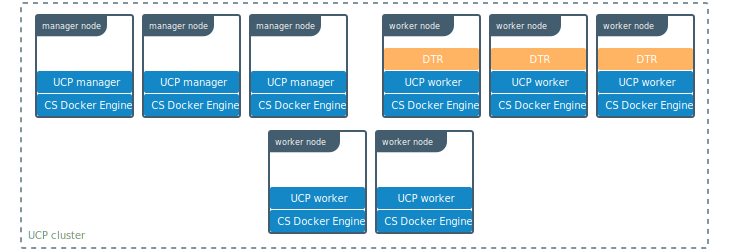
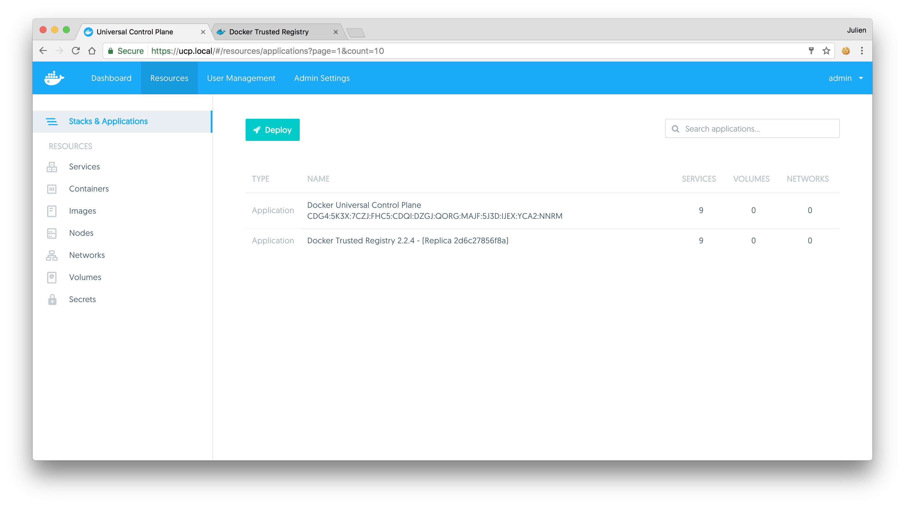
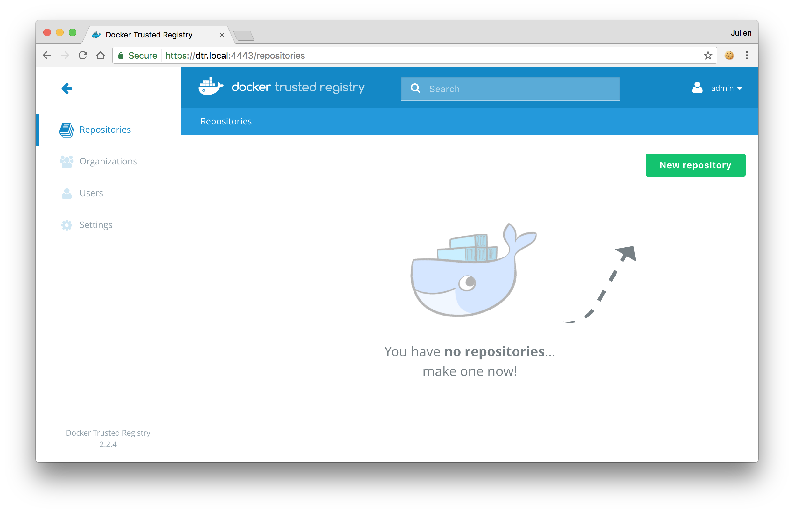
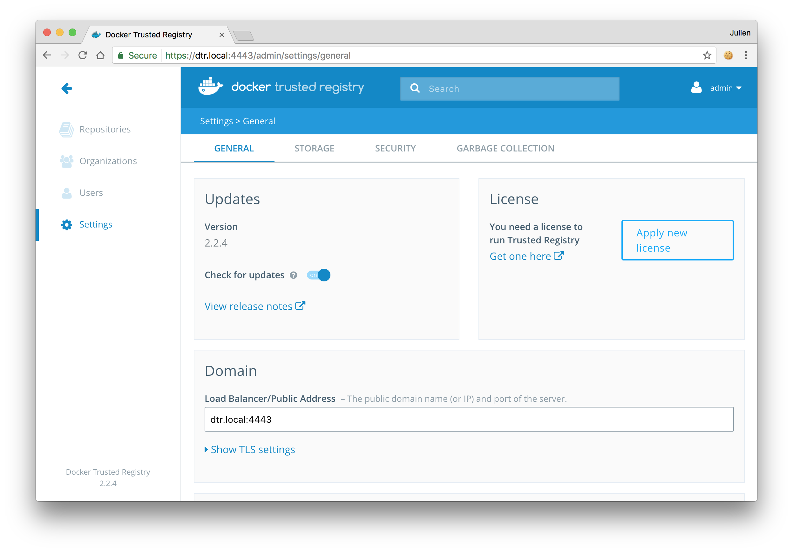
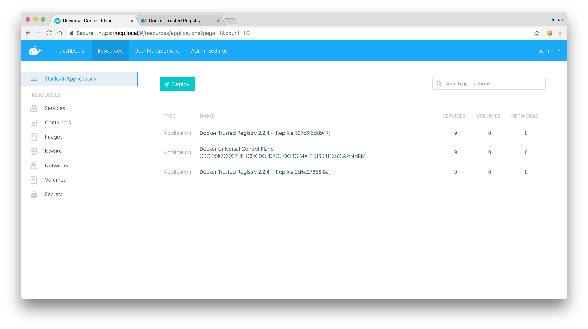

Docker Trusted Registry (DTR) is a containerized application that runs on a
swarm managed by Docker Universal Control Plane (UCP). It can be installed
on-premises or on a cloud infrastructure.

Use these instructions to install DTR.

## Step 1. Validate the system requirements

The first step in installing DTR, is ensuring your
infrastructure has all the [requirements DTR needs to run](system-requirements.md).

## Step 2. Install UCP

Since DTR requires Docker Universal Control Plane (UCP)
to run, you need to install UCP on all the nodes where you plan to install DTR.
[Learn how to install UCP](/datacenter/ucp/2.1/guides/admin/install.md).

DTR needs to be installed on a worker node that is being managed by UCP.
You can't install DTR on a standalone Docker Engine.




## Step 3. Install DTR

To install DTR you use the `docker/dtr` image. This image has commands to
install, configure, and backup DTR.

Run the following command to install DTR:

```none
# Pull the latest version of DTR
$ docker pull {{ page.docker_image }}

# Install DTR
$ docker run -it --rm \
  {{ page.docker_image }} install \
  --ucp-node <ucp-node-name> \
  --ucp-insecure-tls
```

Where the `--ucp-node` is the hostname of the UCP node where you want to deploy
DTR. `--ucp-insecure-tls` tells the installer to trust the TLS certificates used
by UCP.

By default the install command runs in interactive mode and prompts for
additional information like:

* DTR external url: the url clients use to read DTR. If you're using a load
balancer for DTR, this is the IP address or DNS name of the load balancer
* UCP url: the url clients use to reach UCP
* UCP username and password: administrator credentials for UCP

You can also provide this information to the installer command so that it
runs without prompting.
Check the [reference documentation to learn more](../../../reference/cli/install.md).

## Step 4. Check that DTR is running

In your browser, navigate to the Docker **Universal Control Plane**
web UI, and navigate to the **Applications** screen. DTR should be listed
as an application.



You can also access the **DTR web UI**, to make sure it is working. In your
browser, navigate to the address where you installed DTR.




## Step 5. Configure DTR

After installing DTR, you should configure:

  * The certificates used for TLS communication. [Learn more](../configure/use-your-own-tls-certificates.md).
  * The storage backend to store the Docker images. [Lean more](../configure/external-storage/index.md).

  To perform these configurations, navigate to the **Settings** page of DTR.

  


## Step 6. Test pushing and pulling

Now that you have a working installation of DTR, you should test that you can
push and pull images to it.
[Learn how to push and pull images](../../user/manage-images/pull-and-push-images.md).

## Step 7. Join replicas to the cluster

This step is optional.

To set up DTR for high availability,
you can add more replicas to your DTR cluster. Adding more replicas allows you
to load-balance requests across all replicas, and keep DTR working if a
replica fails.

For high-availability you should set 3, 5, or 7 DTR replicas. The nodes where
you're going to install these replicas also need to be managed by UCP.

To add replicas to a DTR cluster, use the `docker/dtr join` command:

1. Load your UCP user bundle.

2.  Run the join command.

    When you join a replica to a DTR cluster, you need to specify the
    ID of a replica that is already part of the cluster. You can find an
    existing replica ID by going to the **Applications** page on UCP.

    Then run:

    ```none
    docker run -it --rm \
      {{ page.docker_image }} join \
      --ucp-node <ucp-node-name> \
      --ucp-insecure-tls
    ```

3. Check that all replicas are running.

    In your browser, navigate to the Docker **Universal Control Plane**
    web UI, and navigate to the **Applications** screen. All replicas should
    be displayed.

    

## See also

* [Install DTR offline](install-offline.md)
* [Upgrade DTR](../upgrade/index.md)
