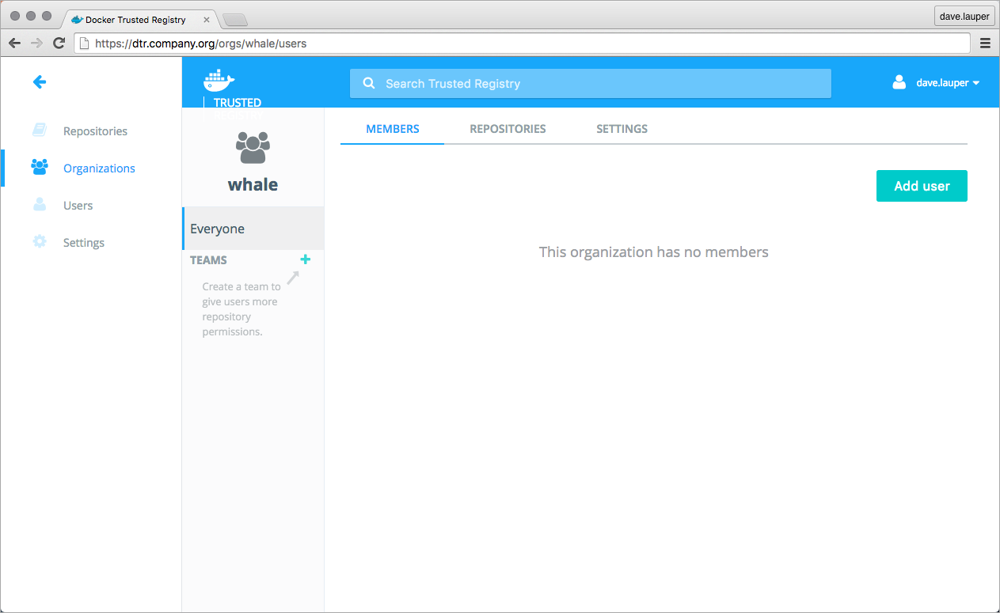
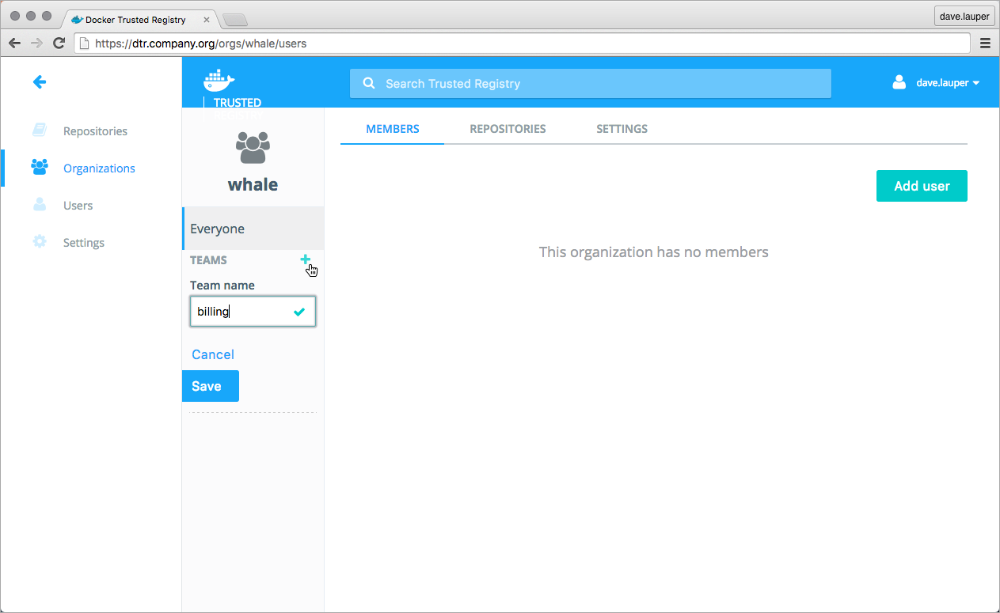
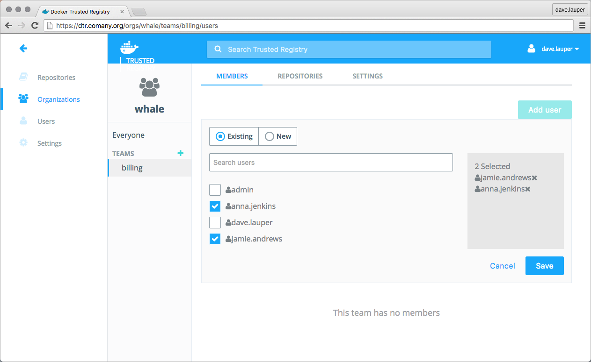
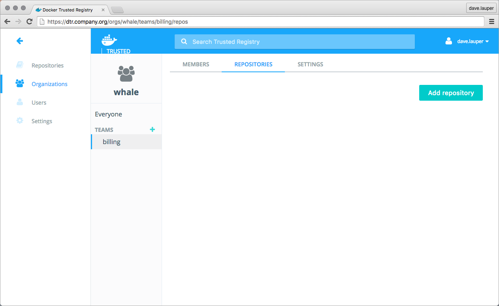
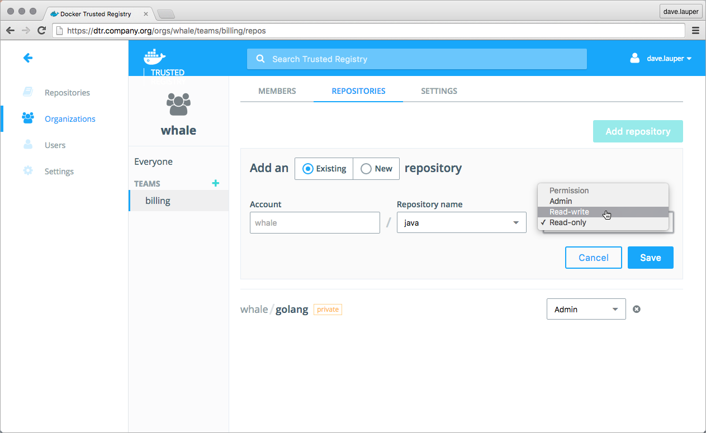

You can extend a user's default permissions by granting them individual
permissions in other image repositories, by adding the user to a team. A team
defines the permissions a set of users have for a set of repositories.

To create a new team, go to the **DTR web UI**, and navigate to the
**Organizations** page.
Then **click the organization** where you want to create the team. In this
example, we create the 'billing' team under the 'whale' organization.

Click '**+**' to create a new team, and give it a name.

## Add users to a team

Once you have created a team, **click the team** name, to manage its settings.
The first thing we need to do is add users to the team. Click the **Add user**
button and add users to the team.

## Manage team permissions

The next step is to define the permissions this team has for a set of
repositories. Navigate to the **Repositories** tab, and click the
**Add repository** button.

Choose the repositories this team has access to, and what permission levels the
team members have.

There are three permission levels available:

| Permission level | Description                                                      |
|:-----------------|:-----------------------------------------------------------------|
| Read only        | View repository and pull images.                                 |
| Read & Write     | View repository, pull and push images.                           |
| Admin            | Manage repository and change its settings, pull and push images. |

## Where to go next

* [Create and manage users](create-and-manage-users.md)
* [Permission levels](permission-levels.md)
