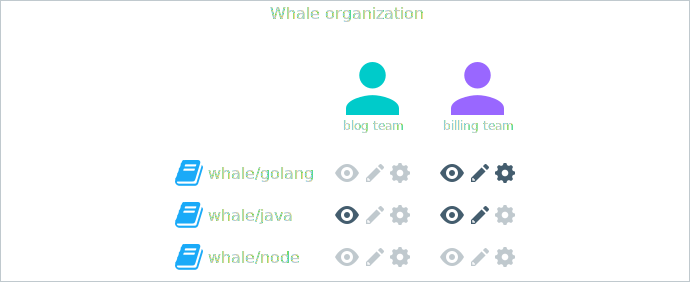

With DTR you get to control which users have access to your image repositories.

By default, anonymous users can only pull images from public repositories.
They can't create new repositories or push to existing ones.
You can then grant permissions to enforce fine-grained access control to image
repositories. For that:

* Start by creating a user.

    Users are shared across Docker Datacenter. When you create a new user in
    Docker Universal Control Plane, that user becomes available in DTR and vice
    versa. Registered users can create and manage their own repositories.

    You can also integrate with an LDAP service to manage users from a single
    place.

* Extend the permissions by adding the user to a team.

    To extend a user's permission and manage the user's permissions over repositories,
    you add the user to a team.
    A team defines the permissions users have for a set of repositories.

## Organizations and teams

When a user creates a repository, only that user can make changes to the
repository settings, and push new images to it.

Organizations take permission management one step further, since they allow
multiple users to own and manage a common set of repositories. This
is useful when implementing team workflows. With organizations you can
delegate the management of a set of repositories and user permissions to the
organization administrators.

An organization owns a set of repositories, and defines a set of teams. With
teams you can define fine-grained permissions that a team of
user has for a set of repositories.

In this example, the 'Whale' organization has three repositories and two teams:

* Members of the blog team can only see and pull images from the whale/java
repository,
* Members of the billing team can manage the whale/golang repository, and push
and pull images from the whale/java repository.

## Where to go next

* [Create and manage users](create-and-manage-users.md)
