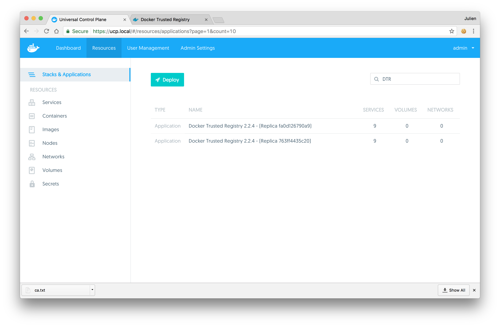
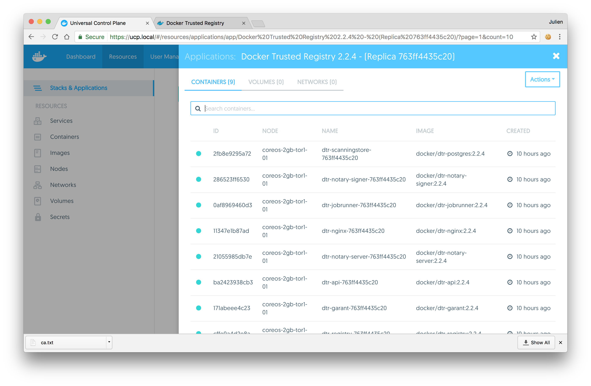

Docker Trusted Registry is a Dockerized application. To monitor it, you can
use the same tools and techniques you're already using to monitor other
containerized applications running on your cluster. One way to monitor
DTR is using the monitoring capabilities of Docker Universal Control Plane.

In your browser, log in to **Docker Universal Control Plane** (UCP), and
navigate to the **Applications** page.

To make it easier to find DTR, use the search box to **search for the
DTR application**. If you have DTR set up for high-availability, then all the
DTR nodes are displayed.

**Click on the DTR application** to see all of its containers, and if they're
running. **Click on a container** to see its details, like configurations,
resources, and logs.

## Health checks

DTR also exposes several endpoints you can use to assess if a DTR replica
is healthy or not:

* `/health`: Checks if the several components of a DTR replica are healthy, and
returns a simple json response. This is useful for load balancing or other
automated health check tasks.
* `/nginx_status`: Returns the number of connections being handled by the
NGINX front-end used by DTR.
* `/api/v0/meta/cluster_status`: Returns extensive information about all DTR
replicas.

## Where to go next

* [Troubleshoot with logs](troubleshoot-with-logs.md)
