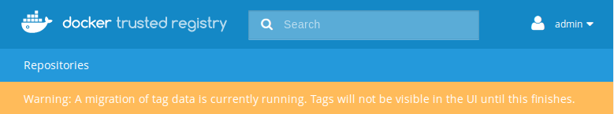

Here you can learn about new features, bug fixes, breaking changes, and
known issues for each DTR version.

You can then use [the upgrade instructions](../admin/upgrade.md),
to upgrade your installation to the latest release.

## Version 2.2.11

(13 February 2018)

**Security notice**

The log driver is now disabled for containers started by backup and HA cluster
join operations. This is a critical security fix for customers that rely on
Docker Trusted Registry 2.2, 2.3 and 2.4 with a log driver to capture logs from
all containers across the platform.

Caution is advised when applying this update, make sure you redeploy DTR, and in
the process you will create new credentials because the previous ones were
potentially disclosed due to the vulnerability.

Use the `--log-driver=none` option for `docker run` when running a DTR backup, HA
cluster join or dumpcerts.

## 2.2.10

(20 November 2017)

**Bugs fixed**

* Fixed a bug that caused certain vulnerabilities to not be found during scanning.
* Fixed a bug in distribution that caused pull timeouts under load if using NFS
or local storage.
* Fixed a bug with downloading storage yaml file on Firefox.
* Fixed a bug where garbage collection ran in a suboptimal mode if scheduled as
a cron from the UI.
* Fixed a potential issue with the way we untar files in uploads of the
vulnerability database.
* Fixed a bug with not backing up repository team permissions correctly.

**General improvements**

* Improved resilience of garbage collection.
* Improved logging of garbage collection.
* Improved memory usage during backup.
* Improved error handling when uploading invalid vulnerability databases.
* Improved resilience of DTR `join` operations.
* Hide secrets on storage config pages.

## DTR 2.2.9

(13 September 2017)

**Bugs fixed**

* High severity:
  * Fixed issue with RethinkDB not starting correctly after restarting a DTR
  replica.
  * Fixed GCS storage driver configuration page.
* Low severity:
  * Improved error handling in the vulnerability scanner.

## DTR 2.2.8

(24 August 2017)

**New features**

* Added UI support to configure if users should be redirected to the storage
backend when pulling and pushing images.

**Bugs fixed**

* High severity:
  * Fixed issue with bootstrapper operations on UCP 2.2.0 (the issue is fixed in
  UCP 2.2.1 as well).
  * Fixed issue where containers would stop watching for new configuration and
  needed to be manually restarted.
* Low severity:
  * Improved validations when installing DTR, to prevent installing DTR on
  old kernels with known bugs.

## DTR 2.2.7

(17 July 2017)

**Bugs fixed**

* Fixed registry DoS vulnerability.  CVE-2017-11468.  Severity: high
* Fix issue with `docker/dtr` operations in UCP clusters with failed nodes.
This prevented DTR from being installed or reconfigured.  Severity: medium
* Silenced incorrect error log in registry container.  Severity: low
* Remove unused permissions dropdown on teams pages.  Severity: low

## DTR 2.2.6

(3 July 2017)

**Bugs fixed**

* High impact
  * Updated security scanner to reduce false positives for Red Hat Enterprise Linux.  This change introduces a new vulnerability database format.
* Low impact
  * Fixed displaying the correct scanning database version in the admin page.
  * Fixed issue with returning the wrong error code when a user doesn't have access to a repository.
  * Fixed handling carriage returns in certificates pasted from Windows clients.
  * Fixed certificate issue when reusing replica IDs after restoring from a backup.

## DTR 2.2.5

(6 June 2017)

**Bugs fixed**

* High impact
  * Fixed issue with multi-level cache chaining not working with content cache
  * Fixed pulling by a user whose content cache was deleted
  * Add support for us-east-2 and other new AWS regions
* Low impact
  * Fixed jobrunner crash when RethinkDB is restarted
  * Removed spurious warnings about RethinkDB using swap

## DTR 2.2.4

(13 April 2017)

**Bugs fixed**

* High impact
  * Fixed memory leaks causing DTR to use all RAM available
  * Fixed concurrency problems that might cause the registry and api server to
  restart
  * Improved performance of search on the web UI. To improve performance
  the search now only returns accounts and repositories that match the search
  input. It no longer shows repositories belonging to the accounts returned in
  the search result
  * The web UI now displays all members of an organization
* Low impact
  * When installing or joining replicas with `--nfs-storage-url` and the
  installation fails, DTR now deletes the `.dtr-nfs-test` file
  * The web UI now shows if a team is managed in LDAP or not
  * After updating the vulnerability database, a rescan button only shows
  if the user has permissions for that action

## DTR 2.2.3

(9 March 2017)

**New features**

* The tags list API now supports pagination

**General improvements**

* Several improvements to the installer to make it more resilient
* Improved the installer to better detect port conflicts when installing or joining DTR replicas
* Security scans can now be canceled
* DTR job logs are now stored in the DTR datastore but also sent to Docker Engine

**Bugs fixed**

* Fixed an issue introduced in 2.2.2 that caused the scanning button to not be
displayed for images that had never been scanned
* Fixed memory leaks in the DTR API server and Registry containers

## DTR 2.2.2

(27 Feb 2017)

**New features**

* The web UI now displays a banner to administrators when a tag migration job
is running

  

**General improvements**

* Upgraded DTR security scanner
* Security scanner now generates less verbose logs
* Made `docker/dtr join` more resilient when using an NFS storage backend
* Made tag migrations more stable
* Made updates to the vulnerability database more stable

**Bugs fixed**

* Fixed a problem when trying to use Scality as storage backend. This problem
affected DTR 2.2.0 and 2.2.1
* You can now use the web UI to create and manage teams that have slashes in
their name
* Fixed an issue causing RethinkDB to not start due to DNS errors when
the RethinkDB containers were not restarted at the same time
* The web UI now shows the security scanning button if the vulnerability database
or security scanner have been updated

## DTR 2.2.1

(9 Feb 2017)

**Bugs fixed**

* Webhooks triggered on a security scan now have information about vulnerabilities
* The web UI now displays tag details and security scanning information for
images pushed before the upgrade
* When multiple tags shared the same manifest, the UI only displayed a single
tag. This has been fixed
* Fixed the UI not correctly showing the Dockerfile for tags in migrated
repositories

## DTR 2.2.0

(9 Feb 2017)

**New features**

* DTR can now scan the binaries contained in the image layers, and report
security vulnerabilities
* You can now configure multiple caches, so that users can pull images faster
* You can now configure webhooks to run automated tasks that are triggered by
events like image push, repository creation, and others

**General improvements**

* UI/UX
  * Improved error messages to be more meaningful and help troubleshoot the problem
  * Several UI/UX improvements to the DTR configuration page and user settings page
  * Several improvements to the search bar used in the UI

* docker/dtr image
  * The `docker/dtr install` command now shows all the nodes that are part of a
  UCP cluster for you to choose on which node to deploy DTR
  * The install command was improved to avoid deploying DTR to a node where it
  cannot run due to port collisions
  * The `docker/dtr install --ucp-node` flag is now mandatory
  * The install command no longer allows deploying replicas with duplicate IDs
  * The upgrade command now validates if all tags were migrated to the latest
  version before trying to migrate blob links

**Bugs fixed**

* When creating a repository, the length of the repository now is consistent
between the UI and API
* The UI now validate and doesn't allow creating repository names with uppercase
letters
* You can now create organizations with dashes in the name
* Fixed a bug that didn't allow deleting users immediately after they were
created
* The copy to clipboard button on the repository page now works on Firefox
* The repository page now renders properly the repository permissions
* You can now delete a user's full name from the UI
* Organization administrators can now see the repositories owned by the organization
* The garbage collection settings now show the correct cron values
* You can now specify DTR to use port 443 when installing DTR
* When you don't have permissions to see the repository details, the UI now
shows that you don't have permissions instead of saying it has no manifests
* Jobs are retried if the worker running them stops unexpectedly

**Deprecation**

The `/load_balancer_status` is deprecated and is going to be removed in future
versions. Use the `/health` endpoint instead.
