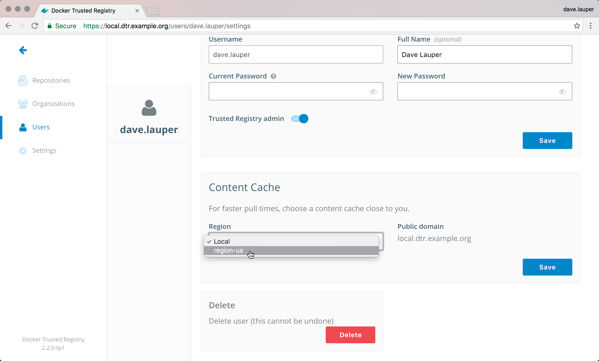

Docker Trusted Registry can be configured to have one or more caches. This
allows you to choose from which cache to pull images from for faster
download times.

If an administrator has set up caches, you can choose which cache to use when
pulling images. In the **DTR web UI**, navigate to your **user profile**,
and check the **Content Cache** options.

{: .with-border}

Once you save, your images are pulled from the cache instead of the central DTR.
