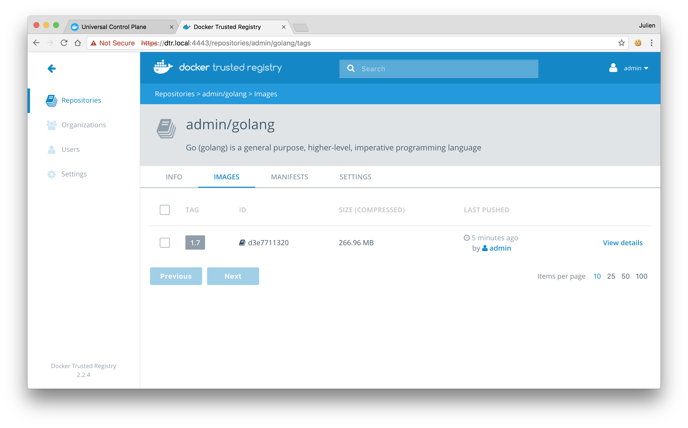

You interact with Docker Trusted Registry in the same way you interact with
Docker Hub or any other registry:

* `docker login <dtr-url>`: authenticates you on DTR
* `docker pull <image>:<tag>`: pulls an image from DTR
* `docker push <image>:<tag>`: pushes an image to DTR

## Pull an image

Pulling an image from Docker Trusted Registry is the same as pulling an image
from Docker Hub or any other registry. Since DTR is secure by default, you
always need to authenticate before pulling images.

In this example, DTR can be accessed at dtr.company.org, and the user
was granted permissions to access the Java, Python, and Golang repositories.


Click on the repository to see its details.


To pull the 1.7 tag of the admin/golang image, run:

```bash
$ docker login dtr.local:4443
$ docker pull dtr.local:4443/admin/golang:1.7
```

## Push an image

Before you can push an image to DTR, you need to [create a repository](index.md)
to store the image. In this example the full name of our repository is
`dtr.local/admin/golang`.

### Tag the image

In this example we pull the Golang image from Docker Hub and tag with
the full DTR and repository name. A tag defines where the image was pulled
from, and where it will be pushed to.

```bash
# Pull from Docker Hub the 1.7 tag of the golang image
$ docker pull golang:1.7

# Tag the golang:1.7 image with the full repository name we've created in DTR
$ docker tag golang:1.7 dtr.local:4443/admin/golang:1.7
```

### Push the image

Now that you have tagged the image, you only need to authenticate and push the
image to DTR.

```bash
$ docker login dtr.local:4443
$ docker push dtr.local:4443/admin/golang:1.7
```

Go back to the **DTR web UI** to validate that the tag was successfully pushed.



## Where to go next

* [Delete images](delete-images.md)
