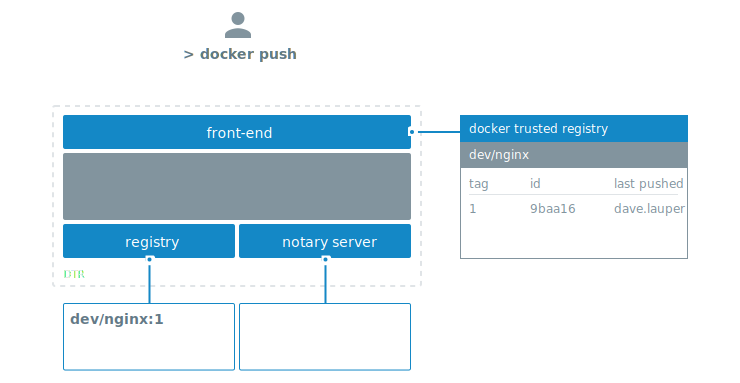
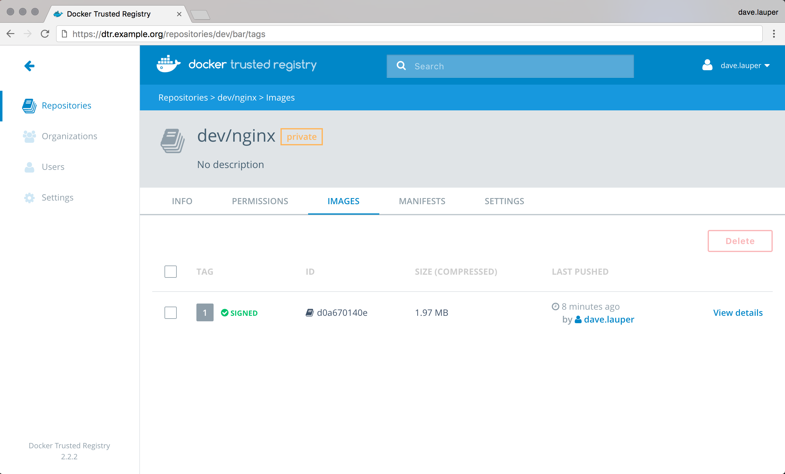

By default, when you push an image to DTR, the Docker CLI client doesn't
sign the image.



You can configure the Docker CLI client to sign the images you push to DTR.
This allows whoever pulls your image to validate if they are getting the image
you created, or a forged one.

To sign an image you can run:

```none
export DOCKER_CONTENT_TRUST=1
docker push <dtr-domain>/<repository>/<image>:<tag>
```

This pushes the image to DTR and creates trust metadata. It also creates
public and private key pairs to sign the trust metadata, and push that metadata
to the Notary Server internal to DTR.


## Sign images that UCP can trust

With the command above you can sign your DTR images, but UCP doesn't
trust them because it can't tie the private key you're using to sign the images
to your UCP account.

To sign images in a way that UCP trusts them you need to:

* Configure your Notary client
* Initialize trust metadata for the repository
* Delegate signing to the keys in your UCP client bundle

In this example we're going to pull an NGINX image from Docker Store,
re-tag it as `dtr.example.org/dev/nginx:1`, push the image to DTR and sign it
in a way that is trusted by UCP. If you manage multiple repositories, you
need to do the same procedure for every one of them.

### Configure your Notary client

Start by [configuring your Notary client](../../access-dtr/configure-your-notary-client.md).
This ensures the Docker and Notary CLI clients know about your UCP private keys.

### Initialize the trust metadata

Then you need to initialize the trust metadata for the new repository, and
the easiest way to do it is by pushing an image to that repository. Navigate to
the **DTR web UI**, and create a repository for your image.
In this example we've created the `dev/nginx` repository.

From the Docker CLI client, pull an NGINX image from Docker Store,
re-tag it, sign and push it to DTR.

```bash
# Pull NGINX from Docker Store
docker pull nginx:latest

# Re-tag NGINX
docker tag nginx:latest dtr.example.org/dev/nginx:1

# Log into DTR
docker login dtr.example.org

# Sign and push the image to DTR
export DOCKER_CONTENT_TRUST=1
docker push dtr.example.org/dev/nginx:1
```

This pushes the image to DTR and initializes the trust metadata for that
repository.

{: .with-border}

DTR shows that the image is signed, but UCP doesn't trust the image
because it doesn't have any information about the private keys used to sign
the image.

### Delegate trust to your UCP keys

To sign images in a way that is trusted by UCP, you need to delegate trust, so
that you can sign images with the private keys in your UCP client bundle.

When delegating trust you associate a public key certificate with a role name.
UCP requires that you delegate trust to two different roles:

* `targets/releases`
* `targets/<role>`, where `<role>` is the UCP team the user belongs to

In this example we delegate trust to `targets/releases` and `targets/admin`:

```none
# Delegate trust, and add that public key with the role targets/releases
notary delegation add --publish \
  dtr.example.org/dev/nginx targets/releases \
  --all-paths <ucp-cert.pem>

# Delegate trust, and add that public key with the role targets/admin
notary delegation add --publish \
  dtr.example.org/dev/nginx targets/admin \
  --all-paths <ucp-cert.pem>
```

To push the new signing metadata to the Notary server, you need to push
the image again:

```none
docker push dtr.example.org/dev/nginx:1
```

## Under the hood

Both Docker and Notary CLI clients interact with the Notary server to:

* Keep track of the metadata of signed images
* Validate the signatures of the images you pull

This metadata is also kept locally in `~/.docker/trust`.

```none
.
|-- private
|   |-- root_keys
|   |   `-- 993ad247476da081e45fdb6c28edc4462f0310a55da4acf1e08404c551d94c14.key
|   `-- tuf_keys
|       `-- dtr.example.org
|           `-- dev
|               `-- nginx
|                   |-- 98a93b2e52c594de4d13d7268a4a5f28ade5fc1cb5f44cc3a4ab118572a86848.key
|                   `-- f7917aef77d0d4bf8204af78c0716dac6649346ebea1c4cde7a1bfa363c502ce.key
`-- tuf
    `-- dtr.example.org
        `-- dev
            `-- nginx
                |-- changelist
                `-- metadata
                    |-- root.json
                    |-- snapshot.json
                    |-- targets.json
                    `-- timestamp.json
```

The `private` directory contains the private keys the Docker CLI client uses
to sign the images. Make sure you create backups of this directory so that
you don't lose your signing keys.

The Docker and Notary CLI clients integrates with Yubikey. If you have a Yubikey
plugged in when initializing trust for a repository, the root key is stored on
the Yubikey instead of in the trust directory.
When you run any command that needs the `root` key, Docker and Notary CLI
clients look on the Yubikey first, and uses the trust directory as a fallback.

The `tuf` directory contains the trust metadata for the images you've
signed. For each repository there are four files.

| File             | Description                                                                                                               |
|:-----------------|:--------------------------------------------------------------------------------------------------------------------------|
| `root.json`      | Has data about other keys and their roles. This data is signed by the root key.                                           |
| `targets.json`   | Has data about the digest and size for an image. This data is signed by the target key.                                   |
| `snapshot.json`  | Has data about the version number of the root.json and targets.json files. This data is signed by the snapshot key.       |
| `timestamp.json` | Has data about the digest, size, and version number for the snapshot.json file. This data is signed by the timestamp key. |

[Learn more about trust metadata](/notary/service_architecture.md).
