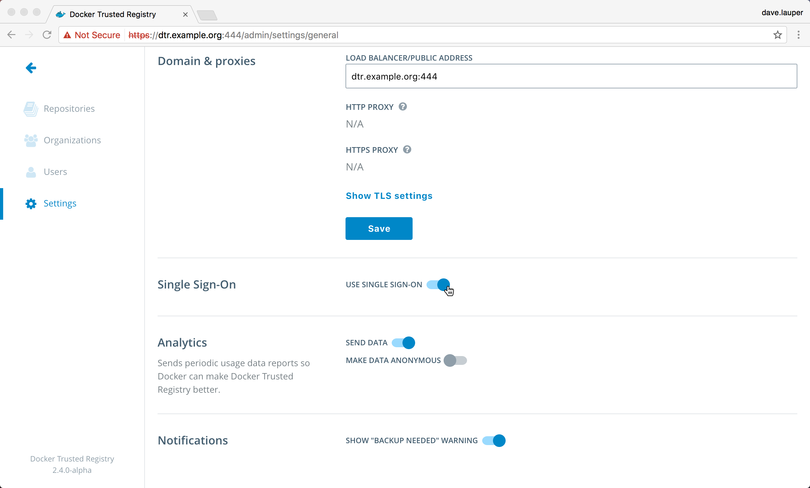

By default, users are shared between UCP and DTR, but you need to authenticate
separately on the web UI of both applications.

You can configure DTR to have single sign-on (SSO) with UCP, so that users only
need to authenticate once.

## At installation time

When installing DTR, use the `docker/dtr install --dtr-external-url <url>`
option to enable SSO. When accessing the DTR web UI, users are redirected to the
UCP login page, and once they are authenticated, they're redirected to the URL
you provided to `--dtr-external-url`.

Use the domain name of DTR, or the domain name of a load balancer, if you're
using one, to load-balance requests across multiple DTR replicas.

## After install

In your browser, navigate to the DTR web UI, and choose **Settings**. In the
**General** tab, scroll to **Domain & proxies**.

Update the **Load balancer / public address** field to the url where users
should be redirected once they are logged in.
Use the domain name of DTR, or the domain name of a load balancer, if you're
using one, to load-balance requests across multiple DTR replicas.

Then enable **Use single sign-on**.

{: .with-border}

Once you save, users are redirected to UCP for logging in, and redirected back to
DTR once they are authenticated.

## Where to go next

* [Use your own TLS certificates](use-your-own-tls-certificates.md)
