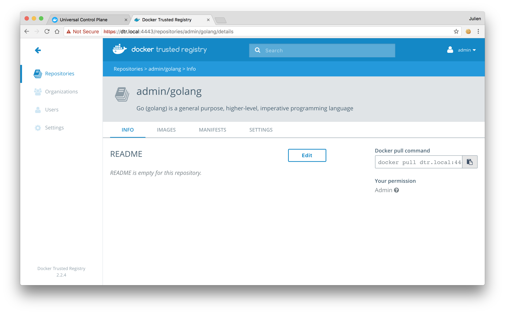
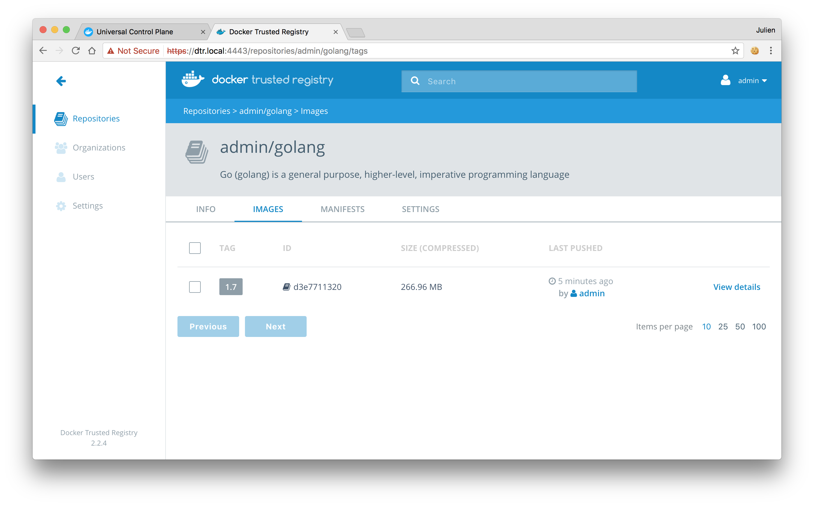






You interact with Docker Trusted registry in the same way you interact with
Docker Hub or any other registry:

* `docker login <dtr-url>`: authenticates you on DTR
* `docker pull <image>:<tag>`: pulls an image from DTR
* `docker push <image>:<tag>`: pushes an image to DTR

## Pull an image

Pulling an image from Docker Trusted Registry is the same as pulling an image
from Docker Hub or any other registry. Since DTR is secure by default, you
always need to authenticate before pulling images.

In this example, DTR can be accessed at {{ domain }}, and the user
was granted permissions to access the NGINX, and Wordpress repositories.

{: .with-border}

Click on the repository to see its details.

{: .with-border}

To pull the {{ tag }} tag of the {{ org }}/{{ repo }} image, run:

```bash
$ docker login {{ domain }}
$ docker pull {{ domain }}/{{ org }}/{{ repo }}:{{ tag }}
```

## Push an image

Before you can push an image to DTR, you need to [create a repository](index.md)
to store the image. In this example the full name of our repository is
`{{ domain }}/{{ org }}/{{ repo }}`.

### Tag the image

In this example we pull the {{ repo }} image from Docker Hub and tag with
the full DTR and repository name. A tag defines where the image was pulled
from, and where it will be pushed to.

```bash
# Pull from Docker Hub the {{ tag }} tag of the {{ repo }} image
$ docker pull {{ repo }}:{{ tag }}

# Tag the {{ repo }}:{{ tag }} image with the full repository name we've created in DTR
$ docker tag {{ repo }}:{{ tag }} {{ domain }}/{{ org }}/{{ repo }}:{{ tag }}
```

### Push the image

Now that you have tagged the image, you only need to authenticate and push the
image to DTR.

```bash
$ docker login {{ domain }}
$ docker push {{ domain }}/{{ org }}/{{ repo }}:{{ tag }}
```

Go back to the **DTR web UI** to validate that the tag was successfully pushed.

{: .with-border}

### Windows images

Official Microsoft Windows images or any image you create based on them aren't
distributable by default. When you push a Windows image to DTR, Docker only
pushes the image manifest but not the image layers. This means that:

* DTR can't scan those images for vulnerabilities since DTR doesn't
have access to the layers
* When a user pulls a Windows image from DTR, they are redirected to a
Microsoft registry to fetch the layers

To configure Docker to always push Windows layers to DTR, add the following
to your `C:\ProgramData\docker\config\daemon.json` configuration file:

```
"allow-nondistributable-artifacts": ["<dtr-domain>:<dtr-port>"]
```

## Where to go next

* [Delete images](delete-images.md)
