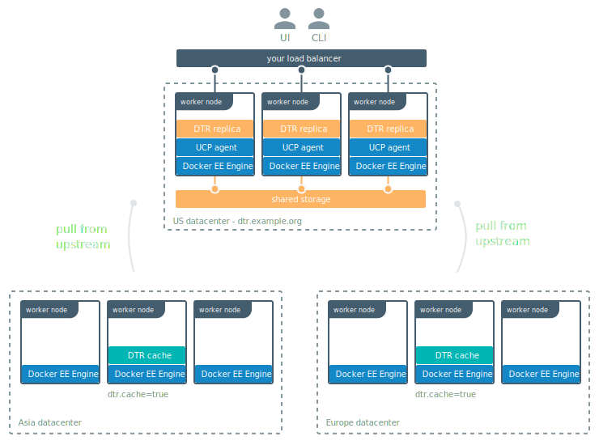

The main reason to use a DTR cache is so that users can pull images from
a service that's geographically closer to them.

In this example a company has developers spread across three locations: United
States, Asia, and Europe. Developers working in the US office can pull their
images from DTR without problem, but developers in the Asia and Europe offices
complain that it takes them a long time to pulls images.

To address that, you can deploy DTR caches in the Asia and Europe offices, so
that developers working from there can pull images much faster.

## Deployment overview

To deploy the DTR caches for this scenario, you need three datacenters:
* The US datacenter runs DTR configured for high availability.
* The Asia datacenter runs a DTR cache.
* The Europe datacenter runs another DTR cache.

Both caches are configured to fetch images from DTR.

## System requirements

Before deploying a DTR cache in a datacenter, make sure you:

* Provision multiple nodes and install Docker on them.
* Join the nodes into a Swarm.
* Have one or more dedicated worker nodes just for running the DTR cache.
* Have TLS certificates to use for securing the cache.
* Have a shared storage system, if you want the cache to be highly available.

If you only plan on running a DTR cache on this datacenter, you just need
[Docker EE Basic](https://www.docker.com/pricing), which only includes the
Docker Engine.

If you plan on running other workloads on this datacenter, consider deploying
[Docker EE Standard or Advanced](https://www.docker.com/pricing).
This way you can enforce fine-grain control over cluster resources, and makes it
easier to monitor and manage your applications.

## Ports used

You can customize the port used by the DTR cache, so you'll have to configure
your firewall rules to make sure users can access the cache using the port
you chose.

By default the documentation guides you in deploying caches that are exposed
on port 443/TCP using the swarm routing mesh.
