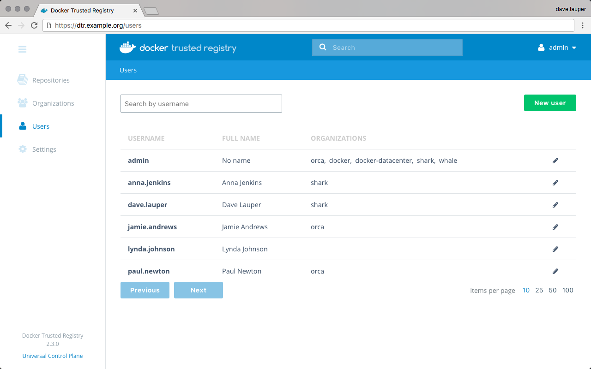

When using the built-in authentication, you can create users
to grant them fine-grained permissions.
Users are shared across UCP and DTR. When you create a new user in
Docker Universal Control Plane, that user becomes available in DTR and vice
versa.

To create a new user, go to the **DTR web UI**, and navigate to the **Users**
page.

{: .with-border}

Click the **New user** button, and fill-in the user information.

{: .with-border}

Check the **Trusted Registry admin** option, if you want to grant permissions
for the user to be a UCP and DTR administrator.

## Where to go next

* [Authentication and authorization](index.md)
* [Create and manage teams](create-and-manage-teams.md)
