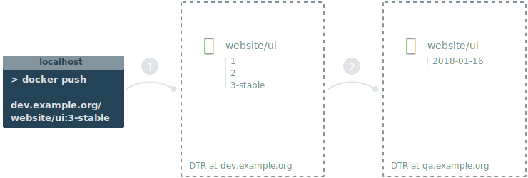
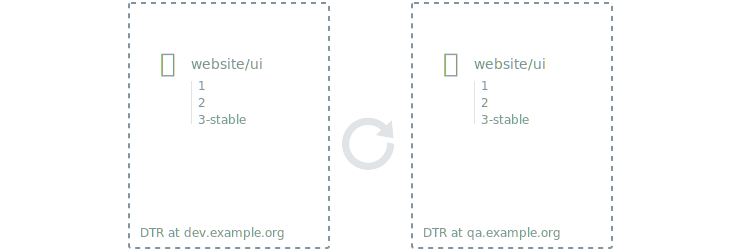

Docker Trusted Registry allows you to automatically promote and mirror images
based on a policy. This way you can create a Docker-centric development pipeline.

You can mix and match promotion policies, mirroring policies, and webhooks to
create flexible development pipelines that integrate with your existing
CI/CD systems.

## Promote an image using policies

One way to create a promotion pipeline is to automatically promote images
to another repository.

You start by defining a promotion policy that's specific to a repository. When
someone pushes an image to that repository, DTR checks if it complies with the
policy you set up and automatically pushes the image to another repository.

[Learn how to promote an image using policies](internal-promotion.md).

## Mirror images to another registry

You can also promote images between different DTR deployments. This not only
allows you to create promotion policies that span multiple DTRs, but also
allows you to mirror images for security and high availability.

You start by configuring a repository with a mirroring policy. When someone
pushes an image to that repository, DTR checks if the policy is met, and if so
pushes it to another DTR deployment or Docker Hub.

[Learn how to mirror images to another registry](push-mirror.md).

## Mirror images from another registry

Another option is to mirror images from another DTR deployment. You configure
a repository to poll for changes in a remote repository. All new images pushed
into the remote repository are then pulled into DTR.

This is an easy way to configure a mirror for high availability since you
won't need to change firewall rules that are in place for your environments.

[Learn how to mirror images from another registry](pull-mirror.md).
