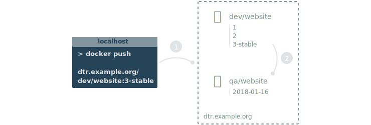
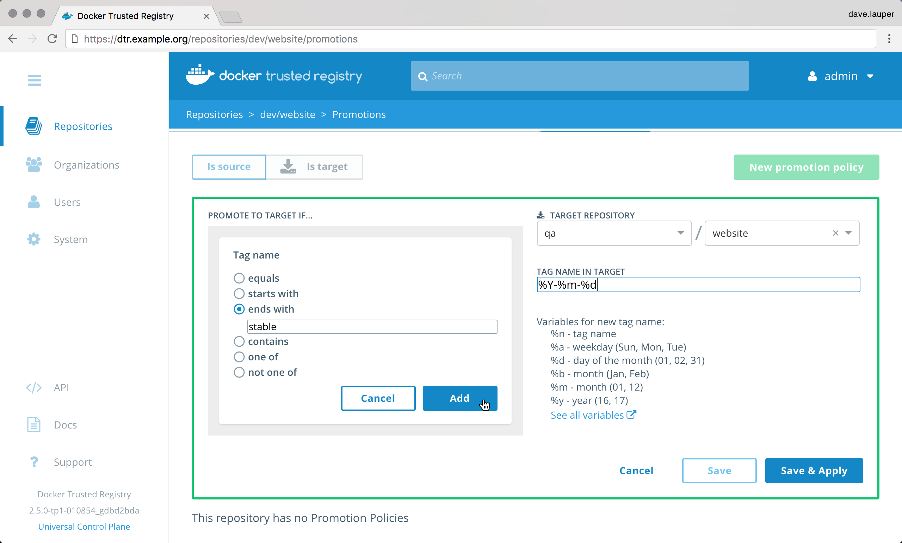

Docker Trusted Registry allows you to create image promotion pipelines based on
policies.

In this example we'll create an image promotion pipeline such that:

1. Developers iterate and push their builds to the `dev/website` repository.
2. When the team creates a stable build, they make sure their image is tagged
with `-stable`.
3. When a stable build is pushed to the `dev/website` repository, it will
automatically be promoted to `qa/website` so that the QA team can start testing.

With this promotion policy, the development team doesn't need access to the
QA repositories, and the QA team doesn't need access to the development
repositories.

## Configure your repository

Once you've [created the repository](../manage-images/index.md), navigate to
the **DTR web UI**, go to the **repository details** page, and choose
**Promotions**.

{: .with-border}

Click **New promotion policy**, and define the criteria that an image needs
to meet to be promoted.

DTR allows defining the following criteria:

| Name            | Description                                        |
|:----------------|:---------------------------------------------------|
| Tag name        | If the tag name contains                           |
| Component name  | If the image has a given component                 |
| Vulnerabilities | If the image has vulnerabilities                   |
| License         | If the image uses an intellectual property license |

Now you need to choose what happens to an image that meets all the criteria.

Select the **organization** and **repository** where the image is going to be
pushed. You can choose to keep the image tag, or transform the tag into
something more meaningful in the destination repository, by using a tag template.

In this example, if an image in the `dev/website` is tagged with a word that
ends in "stable", DTR will automatically push that image to the `qa/website`
repository. In the destination repository the image will be tagged with the
timestamp of when the image was promoted.

{: .with-border}

Everything is set up! Once the development team pushes an image that complies
with the policy, it automatically gets promoted.

{: .with-border}

## Where to go next

* [Mirror images to another registry](push-mirror.md)

