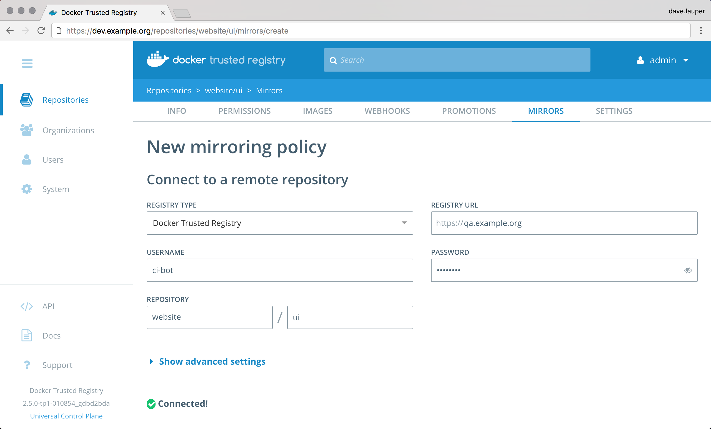
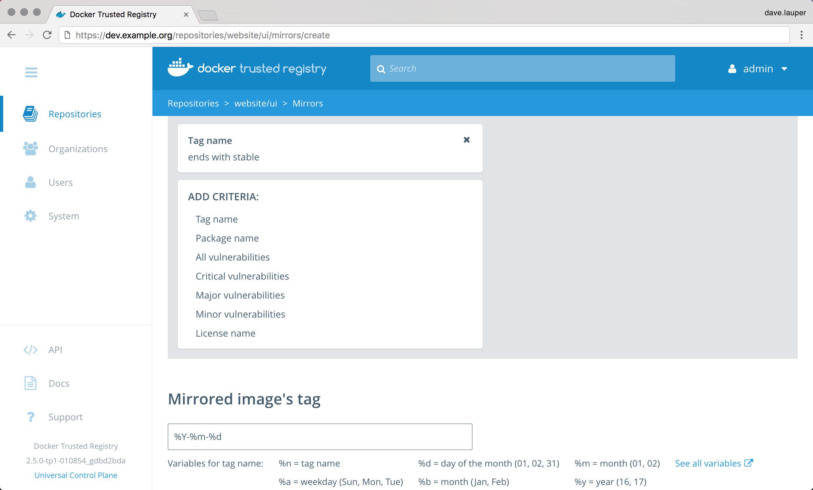
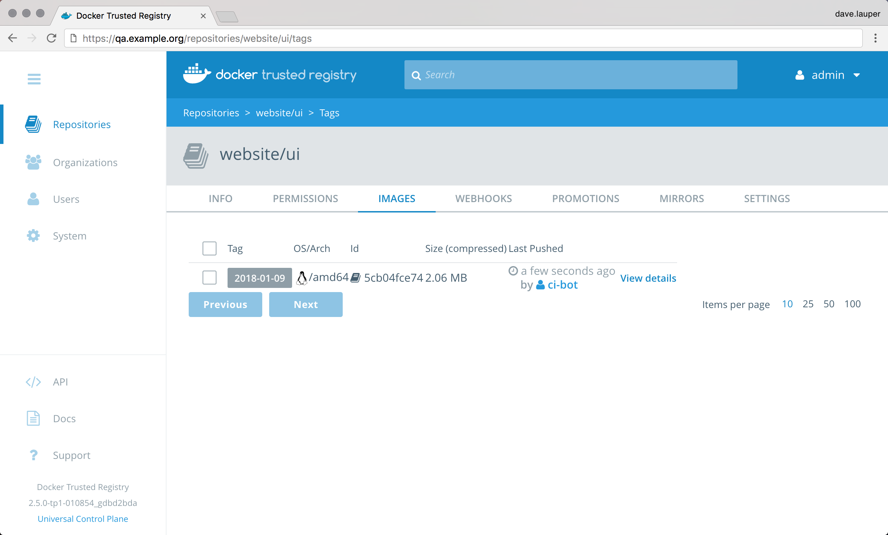

Docker Trusted Registry allows you to create mirroring policies for a repository.
When an image gets pushed to a repository and meets a certain criteria,
DTR automatically pushes it to repository in another DTR deployment or Docker
Hub.

This not only allows you to mirror images but also allows you to create
image promotion pipelines that span multiple DTR deployments and datacenters.

In this example we'll create an image mirroring policy such that:

1. Developers iterate and push their builds to `dev.example.org/website/ui`, the
`website/ui` repository in the DTR deployment dedicated to development.
2. When the team creates a stable build, they make sure their image is tagged
with `-stable`.
3. When a stable build is pushed to `dev.example.org/website/ui`, it will
automatically be pushed to `qa.example.org/website/ui`, mirroring the image and
promoting it to the next stage of development.

With this mirroring policy, the development team doesn't need access to the
QA cluster, and the QA team doesn't need access to the development
cluster.

The person setting this mirroring policy needs to have permissions to push
to the destination repository.

## Configure your repository

Once you've [created the repository](../manage-images/index.md), navigate to
the **DTR web UI**, go to the **repository details** page, and choose
**Mirrors**.

{: .with-border}

Click **New mirroring policy**, and define where the image will be pushed if
it meets the policy criteria. Make sure the account you use for the integration
has permissions to write in the destination repository.

In this example we'll push the image to the `website/ui` repository of a
DTR deployment available at `qa.example.org`. We also use a service account
that was created just for mirroring images between repositories.

If the destination DTR deployment is using self-signed TLS certificates or
certificates issued by your own certificate authority, click
**Show advanced settings** to provide the CA certificate used by the
DTR where the image will be pushed.

You can get that CA certificate by accessing `https://<destination-dtr>/ca`.

Once you're done, click **Connect** to test the integration.

{: .with-border}

Under **Mirror direction** choose **push to remote registry**. Then specify the
policy that will trigger the image to be pushed to the external registry.

DTR allows defining the following criteria:

| Name            | Description                                        |
|:----------------|:---------------------------------------------------|
| Tag name        | If the tag name contains                           |
| Component name  | If the image has a given component                 |
| Vulnerabilities | If the image has vulnerabilities                   |
| License         | If the image uses an intellectual property license |

Finally you can choose to keep the image tag, or transform the tag into
something more meaningful in the destination registry, by using a tag template.

{: .with-border}

In this example, if an image in the `website/ui` repository is tagged with
a word that ends in "stable", DTR will automatically push that image to
the DTR deployment available at `qa.example.org`. The image is pushed to the
`website/ui` repository and is tagged with the timestamp of when the image
was promoted.

Everything is set up! Once the development team pushes an image that complies
with the policy, it automatically gets promoted.

{: .with-border}

## Metadata persistence

When an image is pushed to another registry using a mirroring policy, scanning
and signing data is not persisted in the destination repository.

If you have scanning enable for the destination repository, DTR is going to scan
the image pushed. If you want the image to be signed, you need to do it manually.

## Where to go next

* [Mirror images from another registry](pull-mirror.md)
