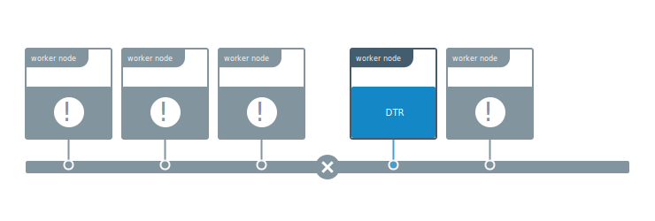

Docker Trusted Registry is a clustered application. You can join multiple
replicas for high availability.

For a DTR cluster to be healthy, a majority of its replicas (n/2 + 1) need to
be healthy and be able to communicate with the other replicas. This is also
known as maintaining quorum.

This means that there are three failure scenarios possible.

## Replica is unhealthy but cluster maintains quorum

One or more replicas are unhealthy, but the overall majority (n/2 + 1) is still
healthy and able to communicate with one another.

In this example the DTR cluster has five replicas but one of the nodes stopped
working, and the other has problems with the DTR overlay network.

Even though these two replicas are unhealthy the DTR cluster has a majority
of replicas still working, which means that the cluster is healthy.

In this case you should repair the unhealthy replicas, or remove them from
the cluster and join new ones.

[Learn how to repair a replica](repair-a-single-replica.md).

## The majority of replicas are unhealthy

A majority of replicas are unhealthy, making the cluster lose quorum, but at
least one replica is still healthy, or at least the data volumes for DTR are
accessible from that replica.

In this example the DTR cluster is unhealthy but since one replica is still
running it's possible to repair the cluster without having to restore from
a backup. This minimizes the amount of data loss.

[Learn how to do an emergency repair](repair-a-cluster.md).

## All replicas are unhealthy

This is a total disaster scenario where all DTR replicas were lost, causing
the data volumes for all DTR replicas to get corrupted or lost.

In a disaster scenario like this, you'll have to restore DTR from an existing
backup. Restoring from a backup should be only used as a last resort, since
doing an emergency repair might prevent some data loss.

[Learn how to restore from a backup](restore-from-backup.md).