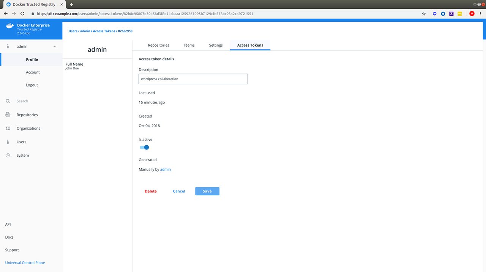

Docker Trusted Registry allows you to create and distribute access tokens to enable programmatic access to DTR. Access tokens are linked to a particular user account and duplicate whatever permissions that account has at time of use. If the account changes permissions, so will the token.

Access tokens are useful in cases such as building integrations since you can issue multiple tokens &ndash; one for each integration &ndash; and revoke them at any time.

## Create an access token

1. To create an access token for the first time, log in to `https://<dtr-url` with your UCP credentials.

2. Expand your **Profile** from the left navigation pane and select **Profile > Access Tokens**.

    {: .with-border}

3. Add a description for your token. Specify something which indicates where the token is going to be used, or set a purpose for the token. Administrators can also create tokens for other users.

{: .with-border}

## Modify an access token

Once the token is created, you will not be able to see it again. You do have the option to rename, deactivate or delete the token as needed. You can delete the token by selecting it and clicking **Delete**, or you can click **View Details**:

{: .with-border}

## Use the access token

You can use an access token anywhere that requires your DTR password.
As an example you can pass your access token to the `--password` or `-p` option when logging in from your Docker CLI client:

```bash
docker login dtr.example.org --username <username> --password <token>
```

To use the DTR API to list the repositories your user has access to:

```bash
curl --silent --insecure --user <username>:<token> dtr.example.org/api/v0/repositories
```

