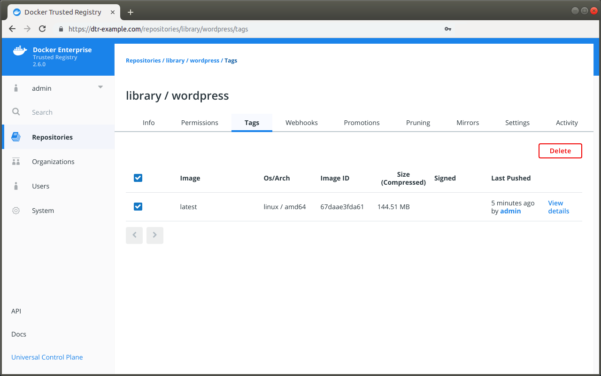

To delete an image, navigate to the **Tags** tab of the repository page on the DTR web interface.
In the **Tags** tab, select all the image
tags you want to delete, and click the **Delete** button.

{: .with-border}

You can also delete all image versions by deleting the repository. To delete a repository, navigate to **Settings** and click **Delete** under "Delete Repository".

## Delete signed images

DTR only allows deleting images if the image has not been signed. You first
need to delete all the trust data associated with the image before you are able to delete the image.

{: .with-border}

There are three steps to delete a signed image:

1. Find which roles signed the image.
2. Remove the trust data for each role.
3. The image is now unsigned, so you can delete it.

### Find which roles signed an image

To find which roles signed an image, you first need to learn which roles
are trusted to sign the image.

[Set up your Notary client](/ee/dtr/user/manage-images/sign-images/#configure-your-notary-client),
and run:

```
notary delegation list dtr-example.com/library/wordpress
```

In this example, the repository owner delegated trust to the
`targets/releases` and `targets/qa` roles:

```
ROLE                PATHS             KEY IDS                                                             THRESHOLD
----                -----             -------                                                             ---------
targets/releases    "" <all paths>    c3470c45cefde5447cf215d8b05832b0d0aceb6846dfa051db249d5a32ea9bc8    1
targets/qa          "" <all paths>    c3470c45cefde5447cf215d8b05832b0d0aceb6846dfa051db249d5a32ea9bc8    1
```

Now that you know which roles are allowed to sign images in this repository,
you can learn which roles actually signed it:

```
# Check if the image was signed by the "targets" role
notary list dtr-example.com/library/wordpress

# Check if the image was signed by a specific role
notary list dtr-example.com/library/wordpress --roles <role-name>
```

In this example the image was signed by three roles: `targets`,
`targets/releases`, and `targets/qa`.

### Remove trust data for a role

Once you know which roles signed an image, you'll be able to remove trust data
for those roles. Only users with private keys that have the roles are able
to do this operation.

For each role that signed the image, run:

```
notary remove dtr-example.com/library/wordpress <tag> \
  --roles <role-name> --publish
```

Once you've removed trust data for all roles, DTR shows the image as unsigned.
Then you can delete it.

## Where to go next

* [Pull and push images](pull-and-push-images.md)
* [Sign an image](sign-images/index.md)
