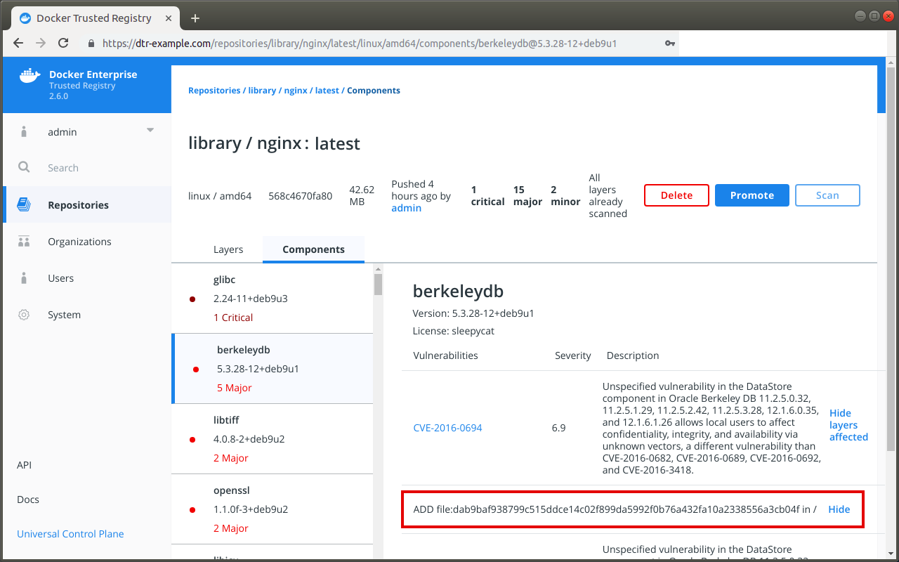

DTR scans images for vulnerabilities. At times, however, it may report image vulnerabilities that you know have been fixed, and whenever that happens the warning can be dismissed.

1. Access the DTR web interface.

2. Click **Repositories** in the left-hand menu, and locate the repository that has been scanned.

    {: .with-border}

3. Click **View details** to review the image scan results, and select **Components** to see the vulnerabilities for each component packaged in the image.

4. Select the component with the vulnerability you want to ignore, navigate to the vulnerability, and click **Hide**.

    {: .with-border}

    Once dismissed, the vulnerability is hidden system-wide and will no longer be reported as a vulnerability on affected images with the same layer IDs or digests. In addition, DTR will not reevaluate the promotion policies that have been set up for the repository.

    If after hiding a particular vulnerability you want the promotion policy for the image to be reevaluated, click **Promote**.

## Where to go next

* [Scan images for vulnerabilities](scan-images-for-vulnerabilities.md)
