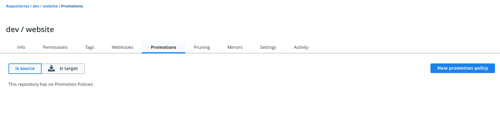
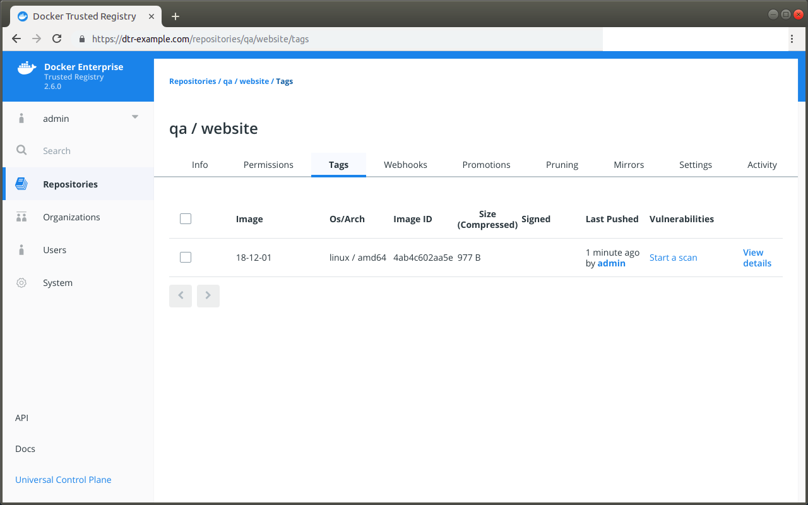

Docker Trusted Registry allows you to create image promotion pipelines based on
policies.

In this example we will create an image promotion pipeline such that:

1. Developers iterate and push their builds to the `dev/website` repository.
2. When the team creates a stable build, they make sure their image is tagged
with `-stable`.
3. When a stable build is pushed to the `dev/website` repository, it will
automatically be promoted to `qa/website` so that the QA team can start testing.

With this promotion policy, the development team doesn't need access to the
QA repositories, and the QA team doesn't need access to the development
repositories.

## Configure your repository

Once you've [created the repository](../manage-images/index.md), navigate to
the repository page on the DTR web interface, and select the
**Promotions** tab.

> Only administrators can globally create and edit promotion policies. By default 
> users can only create and edit promotion policies on repositories within their 
> user namespace. For more information on user permissions, see 
> [Authentication and Authorization](/ee/dtr/admin/manage-users/).

{: .with-border}

Click **New promotion policy**, and define the image promotion criteria.

DTR allows you to set your promotion policy based on the following image attributes:

| Name            | Description                                        | Example           |
|:----------------|:---------------------------------------------------| :----------------|
| Tag name        | Whether the tag name equals, starts with, ends with, contains, is one of, or is not one of your specified string values | Promote to Target if Tag name ends in `stable`|
| Component name  | Whether the image has a given component and the component name equals, starts with, ends with, contains, is one of, or is not one of your specified string values | Promote to Target if Component name starts with `b` |
| Vulnerabilities | Whether the image has vulnerabilities &ndash; critical, major, minor, or all &ndash; and your selected vulnerability filter is greater than or equals, greater than, equals, not equals, less than or equals, or less than your specified number | Promote to Target if Critical vulnerabilities = `3` |
| License         | Whether the image uses an intellectual property license and is one of or not one of your specified words | Promote to Target if License name = `docker` | 

Now you need to choose what happens to an image that meets all the criteria.

Select the target **organization** or **namespace** and **repository** where the image is going to be
pushed. You can choose to keep the image tag, or transform the tag into
something more meaningful in the destination repository, by using a tag template.

In this example, if an image in the `dev/website` is tagged with a word that
ends in "stable", DTR will automatically push that image to the `qa/website`
repository. In the destination repository the image will be tagged with the
timestamp of when the image was promoted.

{: .with-border}

Everything is set up! Once the development team pushes an image that complies
with the policy, it automatically gets promoted. To confirm, select the **Promotions** tab on the `dev/website` repository.

{: .with-border}

You can also review the newly pushed tag in the target repository by navigating to `qa/website` and selecting the **Tags** tab.

{: .with-border}

## Where to go next

* [Mirror images to another registry](push-mirror.md)

