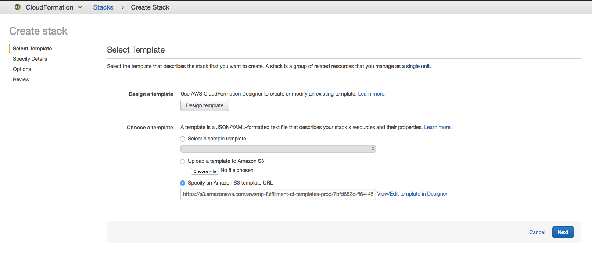
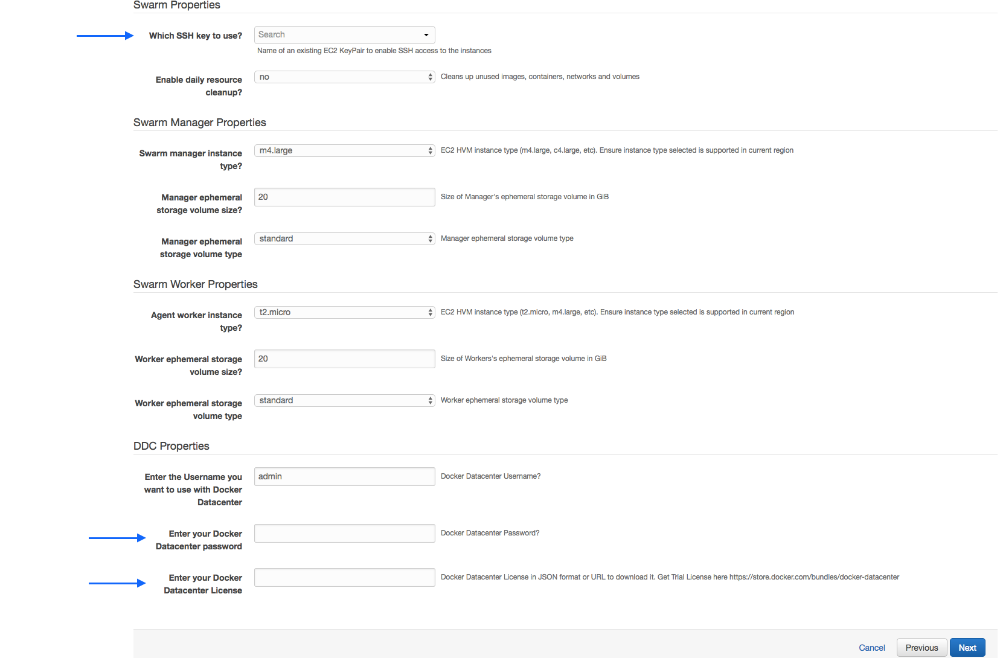
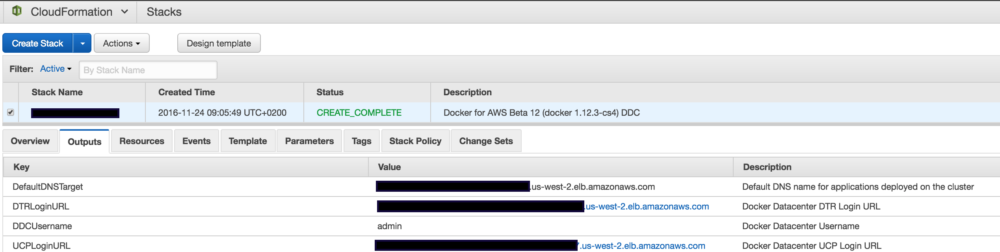
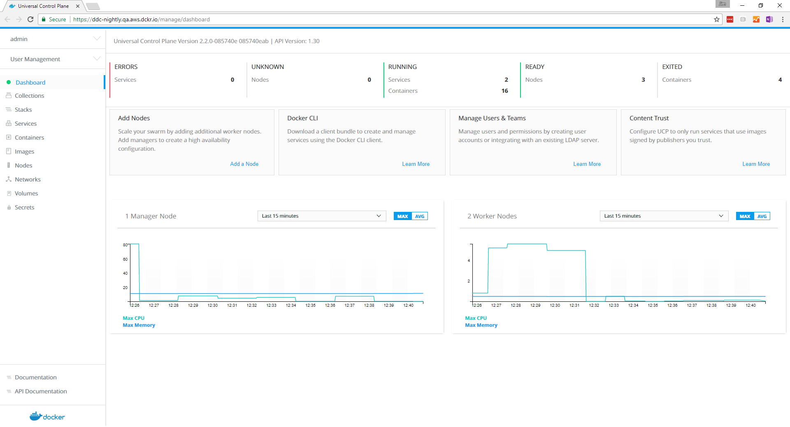
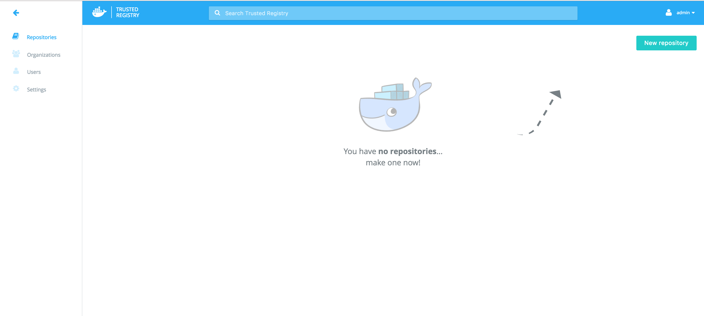
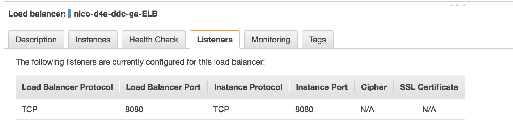
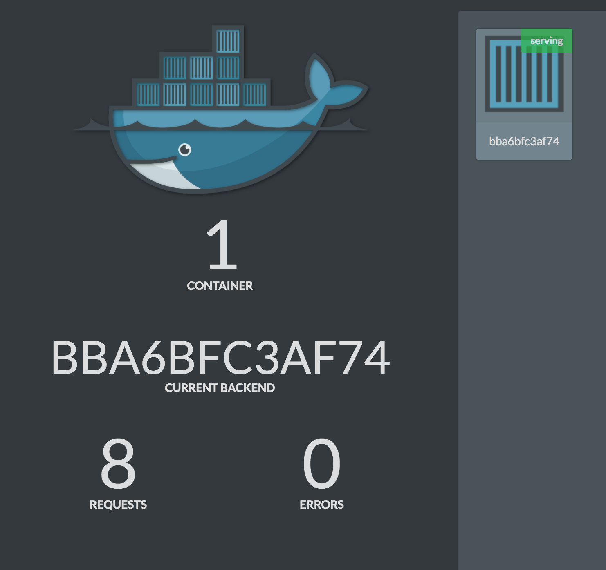
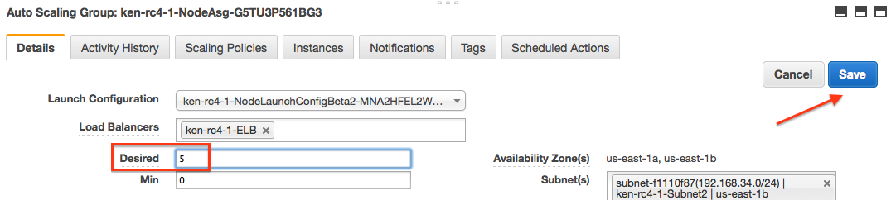
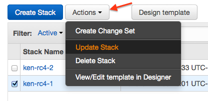

Docker EE on AWS (Standard/Advanced) is an one-click deployment on
AWS. It deploys multiple nodes with Docker Enterprise Edition, and then installs
highly available versions of Universal Control Plane and Docker Trusted
Registry.

## Prerequisites for deploying Docker EE for AWS

-   A [Docker Enterprise Edition](https://store.docker.com/editions/enterprise/docker-ee-trial?tab=description) license. You can get a 30-day free trial subscription from the [Docker Store](https://store.docker.com/editions/enterprise/docker-ee-trial?plan=free-trial&plan=free-trial&tab=description). For questions on licenses, contact [sales@docker.com](mailto:sales@docker.com).
- Access to an AWS account with permissions to use CloudFormation and creating the following objects
    - EC2 instances + Auto Scaling groups
    - IAM profiles
    - DynamoDB Tables
    - SQS Queue
    - VPC + subnets
    - ELB
    - CloudWatch Log Group
    - S3 Bucket
- SSH key in AWS in the region where you want to deploy (required to access the completed Docker install)
- AWS account that supports EC2-VPC

For more information about adding an SSH key pair to your account, please refer to the [Amazon EC2 Key Pairs docs](http://docs.aws.amazon.com/AWSEC2/latest/UserGuide/ec2-key-pairs.html).

## Provision the Docker EE for AWS CloudFormation Stack

1. **Find the Docker EE for AWS Standard/Advanced listing on the AWS Marketplace**
  - In a web browser, go to the [AWS Marketplace listing for Docker EE for AWS](https://aws.amazon.com/marketplace/pp/B06XCFDF9K) page.
  - Click on **Continue** to continue to the **Launch on EC2** dialog.
  - Choose your **Region** then click **Launch with CloudFormation Console**.
  - If not already logged in, you will be prompted to log into your AWS account.

2. **Create the Stack via CloudFormation**
  - You should now be in the AWS CloudFormation wizard (as seen below). Hit **next** to continue.
  

  - In the Specify Details page, fill out any **missing parameters** as seen below:
    - Your preferred SSH key to access the cluster nodes
    - Your desired administrator password
    - Your Docker Enterprise Edition license (optional, can be done later). This can be found on the [Docker Store](https://store.docker.com/?overlay=subscriptions) under your subscriptions. Copy and paste the contents of your `.lic` file into this dialog.

    
  - Click **Next** to continue to the options page. Leave this as-is.
  - Click **Next** to review your changes.
  - Finally, acknowledge any capabilities and click **Create** to finish:
  

## Accessing Docker EE for AWS (Standard/Advanced)

Once the stack is successfully created, you can access UCP and DTR URLs in the
output tab as follows:

{: .with-border}

When accessing UCP and DTR, log in using the username and password that you
provided when you launched the cloudformation stack. You should see the below
landing pages:


{: .with-border}

{: .with-border}

> **Note**: During the installation process, a self-signed certificate is generated
for both UCP and DTR. You can replace these certificates with your own
CA-signed certificate after the installation is complete. When you access UCP
and DTR URLs for the first time, you need to proceed insecurely (multiple times)
by accepting the provided certificate in the browser.

## Configuring Docker Datacenter DNS and Certificates 	

Most users would want to register their own DNS records with CA signed
certificates for both UCP and DTR instead of the randomly generated ELB DNS
names. To do that, please follow the instructions below:

1.  Create an A or CNAME DNS record for UCP and DTR pointing to the UCP and DTR
ELB DNS/IP. You can find the ELB names in the **Output** tab.
2.  Log in to DTR using the DTR ELB URL and go to **Settings** page.
3.  Update the **Domain** section with the your DNS and their respective
certificate. Make sure you click **Save** at the end.
4.  Log in to UCP using the UCP ELB URL and go to **Admin Settings** tab.
5.  Under the **Cluster Configuration** update **EXTERNAL SERVICE LOAD BALANCER**
with your custom UCP DNS name. Then click on **Update Settings**.
6.  Under the **Certificates** section, upload or paste your own certificates for
UCP. Then click on **Update**.
7.  Final step is to reconfigure DTR to use new UCP DNS and certificates.
You need to run a `reconfigure` operation from the CLI. This step can be done
from any Docker engine ( local or on the cloud) as long as you have
UCP [client bundle](../ucp/2.0/guides/access-ucp/cli-based-access.md).
Once you download the bundle and load it, run the following command:

    ```
    UCP_URL=<YOUR_NEW_UCP_DNS>
    DTR_URL=<YOUR_NEW_DTR_DNS>
    USERNAME=<YOUR_DDC_USERNAME>
    PASSWORD=<YOUR_DDC_PASSWORD>

    curl -k https://$UCP_URL/ca > ucp-ca.pem
    docker run -it --rm docker/dtr:2.1.0 \
      reconfigure \
      --ucp-url $UCP_URL \
      --ucp-username $USERNAME \
      --ucp-password $PASSWORD \
      --debug \
      --ucp-ca "$(cat ucp-ca.pem)" \
      --dtr-external-url https://$DTR_URL:443
    ```

    Once you run this Docker container, you'll be requested to choose a replica
    to reconfigure. Press **Enter** to proceed with the chosen one.

8.  Now you may access UCP and DTR with your own custom DNS names.

## Deploy and Access Your Applications on Docker Enterprise Edition

Now that you have configured your custom DNS for both UCP and DTR, you can
start deploying your applications via CLI (with the client bundle) or via the
UCP web console.

#### Swarm Mode/Services Based Applications (Docker Engine 1.12+)

If you are deploying swarm-mode services, Docker Datacenter on Docker for AWS
provides multiple advantages to easily deploy and access your application.

1.  **ELB Integration**

    When you create Swarm-mode services and publish a TCP/UDP port, Docker for
    AWS automatically reconfigures the application ELB (**DefaultExternalTarget**)
    listeners setting to allow traffic on these ports to pass to cluster nodes.
    For example, if you launch a service from CLI using client bundle and publish a
    TCP port for it, you'll see the ELB's **Listeners** configuration automatically
    get updated. Please see example below:

    a. Creating a service with a published port `8080` using CLI:

    ```
    $ docker service create --name demo -p 8080:8080 ehazlett/docker-demo:latest
    	6s09w6gxxfz7mkce9ybl6x3cr
    ```
    b. Notice the updated ELB configuration:

    {: .with-border}

    c. Access your application using **DefaultExternalTarget** DNS and published port:

    {: .with-border}


2.  **Swarm Mode Routing Mesh**

    Routing mesh is a new feature in Docker 1.12 that combines ipvs and
    iptables to create a powerful cluster-wide transport-layer (L4)
    load balancer. It allows all the Swarm nodes to accept connections on the
    services published ports. When any Swarm node receives traffic destined to
    the published TCP/UDP port of a running service, it forwards it to
    service's VIP using a pre-defined overlay network called ingress.

3.  **HTTP Routing Mesh**

    UCP now supports HTTP Routing Mesh (HRM) which is a new experimental
    feature to enable service discovery on the application layer (L7). HRM
    works with Swarm Mode Routing Mesh to link HTTP vhosts to L4 published
    services. Please use the
    [following documentation](https://success.docker.com/Datacenter/Apply/Docker_Reference_Architecture%3A_Universal_Control_Plane_2.0_Service_Discovery_and_Load_Balancing)
    for more details.

    Once you enable HRM, the ELB will be reconfigured automatically to forward
    application traffic to the worker nodes. You may use your custom
    application DNS names and map them to the **DefaultExternalTarget** DNS.
    For example, if you want to access the previous service using a proper DNS
    name like `foo.example.com`, all you need to do is enable HRM, create a
    CNAME records using **DefaultExternalTarget**'s DNS, and launch your
    service as follows:

    ```
    docker service create -p 8080 \
      --network ucp-hrm \
      --name demo-hrm-app \
      --label com.docker.ucp.mesh.http.8080=external_route=http://foo.example.com,internal_port=8080 \
      ehazlett/docker-demo:dcus
    ```


## How it Works

The solution uses an Amazon AWS CloudFormation template to create everything
that you need from scratch. The template first starts off by creating a new VPC
along with its subnets and security groups. Once the networking is set up, it
will create two Auto Scaling groups, one for the managers and one for the
workers, and set the desired capacity that was selected in the CloudFormation
setup form. The Managers will start up first and create a Swarm manager quorum
using Raft. The workers will then start up and join the swarm one by one, until
all of the workers are up and running. At this point you will have a number of
managers and workers in your swarm, that are ready to handle your application
deployments. It then bootstraps UCP controllers on manager nodes and UCP agents
on worker nodes. Next, it installs DTR on the manager nodes and configures it
to use an S3 bucket as an image storage backend. Three ELBs, one for UCP, one
for DTR and a third for your applications, are launched and automatically
configured to provide resilient loadbalancing across multiple AZs.
The application ELB gets automatically updated when services are launched or
removed. While UCP and DTR ELBs are configured for HTTPS only.

Both manager and worker nodes are part of separate ASG groups to allow you to
scale your cluster when needed. If you increase the number of instances running
in your worker Auto Scaling group (via the AWS console, or updating the
  CloudFormation configuration), the new nodes that will start up will
  automatically join the swarm. This architecture ensures that both manager
  and worker nodes are spread across multiple AZs for resiliency and
  high-availability. The template is adjustable and upgradeable meaning you can
  adjust your configuration (e.g instance types or Docker engine version).

  


## Cloudformation Parameters

Here are the required configuration parameters for the Cloudformation template:

**KeyName**
SSH key that will be used when you SSH into the manager nodes. The key needs to
be configured in the same region you launch the Cloudformation template in.

**InstanceType**
The EC2 instance type for your Worker nodes

**ManagerInstanceType**
The EC2 instance type for your Manager nodes. The larger your swarm, the larger
the instance size you should use.

**ClusterSize**
The number of Workers you want in your swarm (1-1000)

**ManagerSize**
The number of Managers in your swarm. You can pick either 3 or 5 managers

**DDCUsernameSet**
Docker Datacenter Username

**DDCPasswordSet**
Docker Datacenter Password

**License**
Docker Datacenter License in JSON format or an S3 URL to download it. You can
get a trial license [here](https://store.docker.com/bundles/docker-datacenter)

**EnableSystemPrune**

Enable if you want Docker for AWS to automatically cleanup unused space on your swarm nodes.

When enabled, `docker system prune` will run staggered every day, starting at 1:42AM UTC on both workers and managers. The prune times are staggered slightly so that not all nodes will be pruned at the same time. This limits resource spikes on the swarm.

Pruning removes the following:

- All stopped containers
- All volumes not used by at least one container
- All dangling images
- All unused networks

**WorkerDiskSize**
Size of Workers's ephemeral storage volume in GiB (20 - 1024).

**WorkerDiskType**
Worker ephemeral storage volume type ("standard", "gp2").

**ManagerDiskSize**
Size of Manager's ephemeral storage volume in GiB (20 - 1024)

**ManagerDiskType**
Manager ephemeral storage volume type ("standard", "gp2")

## System containers
Each node will have a few system containers running on them to help run your swarm cluster. In order for everything to run smoothly, please keep those containers running, and don't make any changes. If you make any changes, we can't guarantee that Docker EE for AWS will work correctly.

## Supported Regions

- ap-northeast-1
- ap-northeast-2
- ap-south-1
- ap-southeast-1
- ap-southeast-2
- eu-central-1
- eu-west-1
- sa-east-1
- us-east-1
- us-east-2
- us-west-1
- us-west-2

## AMIs
Docker Enterprise Edition for AWS currently only supports our custom AMI,
which is a highly optimized AMI built specifically for running Docker on AWS

#### Non-Swarm Mode Container Based Applications

If you are deploying non-swarm mode container-based applications, you can
follow [UCP docs](../ucp/2.0/guides/applications/index.md) to
deploy your applications. Once you deploy your application on UCP, you can
access them by using the specific worker node's public IP address and exposed
port.

Additionally, you can deploy Interlock on any or all of the worker nodes to
dynamically register your applications and loadbalance traffic to them using an
L7 reverse proxy (e.g NGINX). Once you successfully deploy Interlock and NGINX,
you can create DNS records for your applications using the
**DefaultExternalTarget** IP. Full documentations are available
[here](https://success.docker.com/Datacenter/Apply/Docker_Reference_Architecture%3A_Universal_Control_Plane_2.0_Service_Discovery_and_Load_Balancing#Non_Swarm_Mode_Containers).


## Scaling Workers

You can scale the worker count using the AWS Auto Scaling group. Docker will
automatically join or remove new instances to the Swarm.

There are currently two ways to scale your worker group. You can "update" your
stack, and change the number of workers in the CloudFormation template
parameters, or you can manually update the Auto Scaling group in the AWS console
for EC2 auto scaling groups.

Changing manager count live is **_not_** currently supported.

### AWS Console

Log in to the AWS console, and go to the EC2 dashboard. On the lower left hand
side select the "Auto Scaling Groups" link.

Look for the Auto Scaling group with the name that looks like
$STACK_NAME-NodeASG-* Where `$STACK_NAME` is the name of the stack you
created when filling out the CloudFormation template for Docker for AWS.
Once you find it, click the checkbox, next to the name. Then Click on the
"Edit" button on the lower detail pane.

{: .with-border}

Change the "Desired" field to the size of the worker pool that you would like,
and hit "Save".

{: .with-border}

This will take a few minutes and add the new workers to your swarm
automatically. To lower the number of workers back down, you just need to
update "Desired" again, with the lower number, and it will shrink the worker
pool until it reaches the new size.

### CloudFormation Update
Go to the CloudFormation management page, and click the checkbox next to the
stack you want to update. Then click on the action button at the top, and
select "Update Stack".

{: .with-border}

Pick "Use current template", and then click "Next". Fill out the same parameters
you have specified before, but this time, change your worker count to the new
count, click "Next". Answer the rest of the form questions. CloudFormation will
show you a preview of the changes it will make. Review the changes and if they
look good, click "Update". CloudFormation will change the worker pool size to
the new value you specified. It will take a few minutes (longer for a larger
increase / decrease of nodes), but when complete you will have your swarm
with the new worker pool size.
